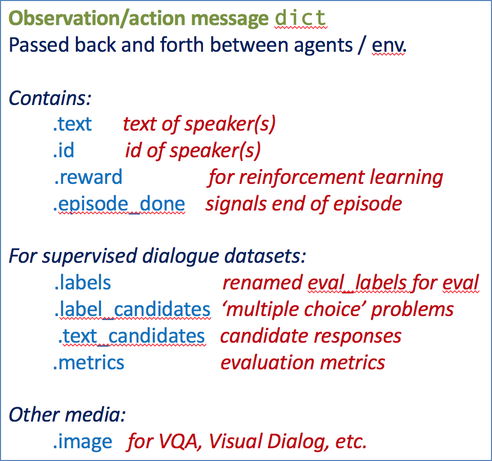

..
  Copyright (c) 2017-present, Facebook, Inc.
  All rights reserved.
  This source code is licensed under the BSD-style license found in the
  LICENSE file in the root directory of this source tree. An additional grant
  of patent rights can be found in the PATENTS file in the same directory.

What is ParlAI?
===============
**Author**: Alexander Holden Miller

It's a python-based platform for enabling dialog AI research.

Its goal is to provide researchers:

- a unified framework for training and testing dialog models
- multi-task training over many datasets at once
- seamless integration of Amazon Mechanical Turk for data collection and human evaluation

Install
-------
Follow the step by step guide on how to download and install ParlAI.

1. Clone ParlAI Repository:

.. code-block:: bash

    git clone https://github.com/facebookresearch/ParlAI.git ~/ParlAI

2. Install ParlAI:

.. code-block:: bash

    cd ~/ParlAI; python setup.py develop

3. Several models have additional requirements:

- DrQA and Seq2Seq require installing `PyTorch <http://pytorch.org/>`_.

- MemNN requires installing `Lua Torch <http://torch.ch/docs/getting-started.html>`_.

Getting Started
---------------

Agents
^^^^^^

The most basic concept in ParlAI is an Agent.
Agents can be humans, a simple bot which repeats back anything that it hears,
your perfectly-tuned neural network, a dataset being read out,
or anything else that might send messages or interact with its environment.

Agents have two primary methods they need to define:

.. code-block:: python

    def observe(self, observation)
    def act(self)

``observe`` notifies the agent of an action taken by another agent.

``act`` produces an action from the agent.

Observations are structured as a python `dict` with the following fields:

All of these fields are technically optional, and each task should use them
according to what kind of information is available in that task (for example,
not all tasks contain explicit rewards, or a set of candidate labels to choose from).

Teachers
^^^^^^^^

A Teacher is special type of agent. They also implement the ``act`` and ``observe``
functions like any agent does, but they also keep track of metrics which they
return via a ``report`` function, such as the number of questions they have posed
or how many times those questions have been answered correctly.

Datasets typically implement a subclass of Teacher, providing functions which
download the dataset from its source if necessary, read the file into the
right format, and provide an example with each call to the teacher's ``act``
function.

Exchanges between a student Agent and a bAbI task Teacher might look like the following dicts:

.. code-block:: python

    Teacher: {
        'text': 'Sam went to the kitchen\nPat gave Sam the milk\nWhere is the milk?',
        'labels': ['kitchen'],
        'label_candidates': ['hallway', 'kitchen', 'bathroom'],
        'episode_done': False  # indicates next example will be related to this one
    }
    Student: {
        'text': 'hallway'
    }
    Teacher: {
        'text': 'Sam went to the hallway\nPat went to the bathroom\nWhere is the milk?',
        'labels': ['hallway'],
        'label_candidates': ['hallway', 'kitchen', 'bathroom'],
        'episode_done': True
    }
    Student: {
        'text': 'hallway'
    }
    Teacher: {
        ... # starts next episode
    }
    ...

Worlds
^^^^^^

Worlds define the environment in which agents interact with one another. Worlds
must implement a ``parley`` method, which conducts one set of interactions with
each call.

A simple world included in ParlAI, which all of our currently included tasks use,
is the ``DialogPartnerWorld``. DialogPartnerWorld is initialized with two agents,
and with each call to ``parley``, one exchange is done between the agents, in
the following manner:

.. code-block:: python

    query = teacher.act()
    student.observe(query)
    reply = student.act()
    teacher.observe(reply)

Another simple world we include is MultiAgentDialogWorld, which is similar
but generalizes this to cycle between any number of agents in a round robin
fashion.

Advanced Worlds
^^^^^^^^^^^^^^^

We also include a few more advanced "container" worlds: in particular, we include both a
BatchWorld and a HogwildWorld. These worlds are automatically used when either
the ``numthreads`` parameter or the ``batchsize`` parameter are set to greater
than one. Some extra functionality is needed to get these to work on the side
of both the teacher and the learner, but we'll cover that in a different
tutorial.

Simple Display Loop
^^^^^^^^^^^^^^^^^^^

Now that we understand the basic, let's set up a simple loop which displays
whichever task we specify. A complete version of this for utility is included
in the ``examples`` directory (in ``display_data.py``), but we'll do this one from scratch.

First, a few imports:

.. code-block:: python

    from parlai.core.agents import Agent
    from parlai.core.params import ParlaiParser
    from parlai.core.worlds import create_task

The Agent class will be the parent class for our own agent, which we'll implement here.
The ``ParlaiParser`` provides a set of default command-line arguments and
parsing, and create_task allows us to automatically set up the right world and
teacher for a named task from the set of tasks available within ParlAI.

First, we'll define our agent, which just repeats back the correct answer if
available or else says "I don't know."

.. code-block:: python

    class RepeatLabelAgent(Agent):
        # #
        # initialize by setting id
        # #
        def __init__(self, opt):
            self.id = 'LabelAgent'
        # #
        # store observation for later, return it unmodified
        # #
        def observe(self, observation):
            self.observation = observation
            return observation
        # #
        # return label from before if available
        # #
        def act(self):
            reply = {'id': self.id}
            if 'labels' in self.observation:
                reply['text'] = ', '.join(self.observation['labels'])
            else:
                reply['text'] = "I don't know."
            return reply

Now that we have our our agent, we'll set up the display loop.

.. code-block:: python

    parser = ParlaiParser()
    opt = parser.parse_args()

    agent = RepeatLabelAgent(opt)
    world = create_task(opt, agent)

    for _ in range(10):
        world.parley()
        print(world.display())
        if world.epoch_done():
            print('EPOCH DONE')
            break

And that's it! The world.display() automatically cycles through each of the
world's agents and displays their last action. If you run this on the command
line, you can specify which task to show by setting '-t {task}'.

Tasks are specified in the following format:

* '-t babi' sets up the ``DefaultTeacher`` in 'parlai/core/tasks/babi/agents.py'.

* '-t babi:task1k' sets up the ``Task1kTeacher`` in the babi/agents.py file, which allows
  you to specify specific settings for certain tasks. For bAbI, this refers to the setting
  where there are only 1000 unique training examples per task.

* '-t babi:task1k:1' sends 1 as a parameter to ``Task1kTeacher``, which is interpreted
  by the Task1kTeacher to mean "I want task 1" (as opposed to the 19 other bAbI tasks).

* '-t babi,squad' sets up the ``DefaultTeacher`` for both babi and squad. Any number
  of tasks can be chained together with commas to load up each one of them.

* '-t #qa' specifies the 'qa' category, loading up all tasks with that category
  in the 'parlai/core/task_list.py' file.

Validation and Testing
^^^^^^^^^^^^^^^^^^^^^^

During validation and testing, the labels aren't provided to the agent. This
mode can be set from the command line with '-dt valid'.

Now, the agent no longer has anything to say. For datasets which provide a set
of candidates to choose from ('label_candidates' in the observation dict), we
can give our agent a chance of getting the answer correct by replying with one
of those.

Let's modify our agent's act function to select a random label candidate when
the labels aren't available:

.. code-block:: python

    import random

    def act(self):
        reply = {'id': self.id}
        if 'labels' in self.observation:
            reply['text'] = ', '.join(self.observation['labels'])
        elif 'label_candidates' in self.observation:
            cands = self.observation['label_candidates']
            reply['text'] = random.choice(cands)
        else:
            reply['text'] = "I don't know."
        return reply

Of course, we can do much better than randomly guessing. In another tutorial,
we'll set up a better agent which learns from the training data.
