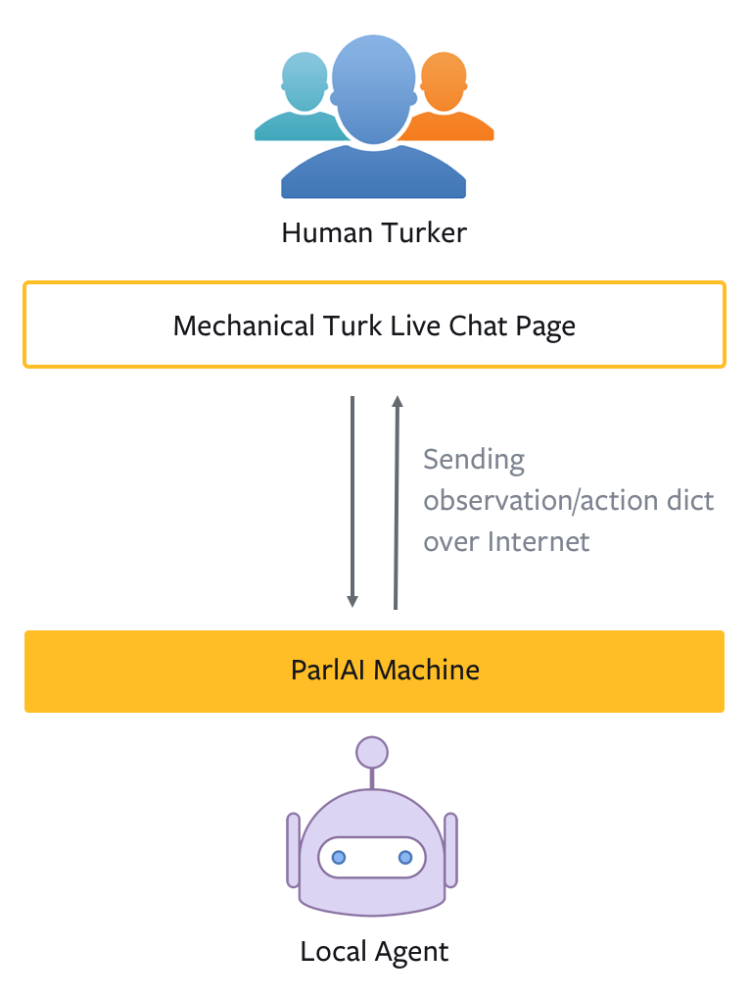

..
  Copyright (c) 2017-present, Facebook, Inc.
  All rights reserved.
  This source code is licensed under the BSD-style license found in the
  LICENSE file in the root directory of this source tree. An additional grant
  of patent rights can be found in the PATENTS file in the same directory.

Using Mechanical Turk
===============

In ParlAI, you can use Amazon Mechanical Turk for **data collection**, **training** and **evaluation** of your dialog model. 

Human Turkers are viewed as just another type of agent in ParlAI, and hence person-to-person, person-to-bot, or multiple people and bots in group chat can all talk to each other within the same framework. 

The human Turkers communicate in observation/action dict format, the same as all other agents in ParlAI. During the conversation, the message that human Turkers receive is rendered on the live chat webpage in a pretty printed format, similar to the following:

.. figure:: _static/img/mturk-small.png
   :align: center

   Example: Human Turker participating in a QA data collection task

General Concepts
---------------

   Diagram for a simple person-to-bot setup *

Each MTurk task has at least one human Turker that connects to ParlAI via the Mechanical Turk Live Chat interface. 

Each MTurk task must also have a local agent that runs on the ParlAI user's machine and drives the conversation with the Turker. In addition, the local agent is responsible for the following:

1. Pulling data from datasets, and sending them as conversation context to the Turker.
2. Feeding Turker's response into local dialog models, and sending model output back to Turker.
3. Logging any part of the conversation.

The logic of the local agent is implemented in its ``observe()`` and ``act()`` method.

``observe(observation)``
^^^^^^

When the Turker sends a response, the ``observe()`` method is called. The observation dict sent to this function contains all the information from the Turker, with the text the Turker sent in the 'text' field.

``act()``
^^^^^^

The local agent will be called ``act()`` first to send the first message of the conversation. Afterwards, each call to ``act()`` asks the local agent to send a new message to the Turker, until the local agent sends a message with ``episode_done`` set to ``True``, which indicates that the conversation will end after the local agent's next ``observe()``.

``conversation_id``
^^^^^^

Each local agent will have a unique integer ``self.conversation_id`` assigned to them, which corresponds to one HIT in the task. We can use this field to determine the context of the conversation if needed.

``turn_index``
^^^^^^

We can use ``self.turn_index`` to keep track of how many times the local agent has spoken in the conversation (i.e. how many times the local agent has been called ``act()``). This field is not initiated by default and need to be created by user. A sample usage is in  `QA Data Collection example <https://github.com/facebookresearch/ParlAI/blob/master/parlai/mturk/tasks/qa_data_collection/agents.py>`_.

Example Tasks
---------------

Currently we provide two examples of using Mechanical Turk with ParlAI:

- `QA Data Collection <https://github.com/facebookresearch/ParlAI/blob/master/parlai/mturk/tasks/qa_data_collection/>`_: collect questions and answers from Turkers, given a random Wikipedia paragraph from SQuAD.
- `Model Evaluator <https://github.com/facebookresearch/ParlAI/blob/master/parlai/mturk/tasks/model_evaluator/>`_: evaluate the information retrieval baseline model on the Reddit movie dialog dataset.

Task 1: Collecting Data
^^^^^^

One of the biggest use cases of Mechanical Turk is to collect natural language data from human Turkers. 

As an example, the `QA Data Collection task <https://github.com/facebookresearch/ParlAI/blob/master/parlai/mturk/tasks/qa_data_collection/>`_ does the following:

1. Pick a random Wikipedia paragraph from SQuAD dataset.
2. Ask a Turker to provide a question given the paragraph.
3. Ask the same Turker to provide an answer to their question.

There are two agents in this task: one is the human Turker, the other is the local QA data collection agent (herein called *QA agent*) running on the ParlAI user's machine. The purpose of QA agent is to drive the conversation by giving context and asking for response from the Turker at the right time. For example, after showing a Wikipedia paragraph, the agent should ask the Turker to provide a question. After receiving Turker's question, it should ask the Turker to provide an answer.

The flow of the task is hence determined by how ``observe()`` and ``act()`` are implemented in ``QADataCollectionAgent`` class in `agents.py <https://github.com/facebookresearch/ParlAI/blob/master/parlai/mturk/tasks/qa_data_collection/agents.py>`_ file. The QA agent uses ``turn_index`` to denote where it is in the conversation with Turker. One *turn* means that the QA agent has spoken (``act()``) once. 
Remember that in ParlAI MTurk, every conversation always starts with the local agent speaking (in this task, the QA agent), at which point the ``turn_index`` will be ``0``. 

The flow of the task is as follows:

Initialization:

1. QA agent is called ``__init__()``, which loads SQuAD dataset's `DefaultTeacher <https://github.com/facebookresearch/ParlAI/blob/master/parlai/tasks/squad/agents.py#L78>`_.

At first turn (``turn_index == 0``):

1. QA agent is called ``act()``, which sets ``turn_index`` to 0, and returns a random Wikipedia paragraph from SQuAD dataset with a prompt asking for Turker's question. 
2. Turker receives QA agent's Wikipedia paragraph and the prompt, and then asks a question.
3. QA agent is called ``observe()``, and receives Turker's question.

At second turn (``turn_index == 1``):

1. QA agent is called ``act()`` again, which sets ``turn_index`` to 1, and returns a message asking for Turker's answer to their own question (with ``episode_done`` set to ``True``).
2. Turker receives QA agent's prompt, and then provides the answer.
3. QA agent is called ``observe()``, and receives Turker's answer.

After two turns, the task is finished, and the Turker's work is submitted for your review.

Task 2: Evaluating a Dialog Model
^^^^^^

You can easily evaluate your dialog model's performance with human Turkers using ParlAI. As an example, the `Model Evaluator task <https://github.com/facebookresearch/ParlAI/blob/master/parlai/mturk/tasks/model_evaluator/>`_ does the following:

1. Initialize a ParlAI world with a dialog model agent (`ir_baseline <https://github.com/facebookresearch/ParlAI/blob/master/parlai/agents/ir_baseline/agents.py#L111>`_) and a dataset (`MovieDD-Reddit <https://github.com/facebookresearch/ParlAI/blob/master/parlai/tasks/moviedialog/agents.py#L57>`_).
2. Let all the agents in the world ``observe()`` and ``act()`` once, by calling ``parley()`` on the world.
3. Ask the human Turker to rate the dialog model agent's response from 0-10.

There are also two agents in this task: one is the human Turker, the other is the local Model Evaluator agent (herein called *evaluator agent*) running on the ParlAI user's machine. The purpose of evaluator agent is to initialize the dialog model and the world, get context and response from the dialog model by calling ``parley()`` on the world, and then ask for rating from the Turker.

The flow of the task is hence determined by how ``observe()`` and ``act()`` are implemented in ``ModelEvaluatorAgent`` class in `agents.py <https://github.com/facebookresearch/ParlAI/blob/master/parlai/mturk/tasks/model_evaluator/agents.py>`_ file. Note that since the evaluator agent only speaks once asking for Turker's rating, it doesn't need to use ``turn_index`` to keep track of the turns. 

The flow of the task is as follows:

Initialization:

1. Evaluator agent is called ``__init__()``, which creates a world with a dialog model agent (`ir_baseline <https://github.com/facebookresearch/ParlAI/blob/master/parlai/agents/ir_baseline/agents.py#L111>`_) and a dataset (`MovieDD-Reddit <https://github.com/facebookresearch/ParlAI/blob/master/parlai/tasks/moviedialog/agents.py#L57>`_).

At first turn:

1. Evaluator agent is called ``act()``, which calls ``parley()`` once on the world, gets both the context and the dialog model's response, and returns a message asking the Turker to rate the response (with ``episode_done`` set to ``True``).
2. Turker receives evaluator agent's prompt, and provides their rating.
3. Evaluator agent is called ``observe()``, and receives Turker's rating.

After one turn, the task is finished, and the Turker's work is submitted for your review.

Creating Your Own Task
---------------

ParlAI provides a generic MTurk dialog interface that one can use to implement any kind of dialog tasks. To create your own task, start with reading the tutorials on the provided examples, and then copy and modify the example ``agents.py`` and ``task_config.py`` files to create your task. 

A few things to keep in mind:

1. Each conversation always starts with the local agent speaking first. (Its ``act()`` method is automatically called at the beginning of the conversation.)
2. To end a conversation, you should set ``episode_done`` to ``True`` when returning a message from ``act()``, which means the agent expects ``observe()`` to be called next and then the conversation will end.
3. You can provide a different context to each of the conversations (identified by ``self.conversation_id`` field), hence ensuring that the context that each Turker responds to is unique.
4. Make sure to test your dialog task using MTurk's sandbox mode before pushing it live, by using the ``--sandbox`` flag when running `run_mturk.py <https://github.com/facebookresearch/ParlAI/blob/master/parlai/mturk/run_mturk.py>`_.

Running a Task
---------------

To run an MTurk task, first ensure that the task directory is in `parlai/mturk/tasks/ <https://github.com/facebookresearch/ParlAI/blob/master/parlai/mturk/tasks/>`_. Then, run `run_mturk.py <https://github.com/facebookresearch/ParlAI/blob/master/parlai/mturk/run_mturk.py>`_ with proper flags:

.. code-block:: python

    python run_mturk.py -t <task_name> -nh <num_hits> -r <reward> [--sandbox]/[--live] --verbose

E.g. to create 2 HITs for the `QA Data Collection <https://github.com/facebookresearch/ParlAI/blob/master/parlai/mturk/tasks/qa_data_collection/>`_ example, with $0.05 for each HIT, running in MTurk sandbox mode:

.. code-block:: python

    python run_mturk.py -t qa_data_collection -nh 2 -r 0.05 --sandbox --verbose

Please make sure to test your task in MTurk sandbox mode first (``--sandbox``) before pushing it live (``--live``).

We also encourage you to always have ``--verbose`` on to keep a close eye on the conversation progress. However, if you are running a large number of HITs, turning it off can be helpful for avoiding excessive output.

Reviewing Turker's Work
---------------

After all HITs are completed, you will be provided a webpage link to review them. 

If you don't take any action in 4 weeks, all HITs will be auto-approved and Turkers will be paid.

-------

\* Turker icon credit: `Amazon Mechanical Turk <https://requester.mturk.com/>`_. Robot icon credit: `Icons8 <https://icons8.com/>`_.