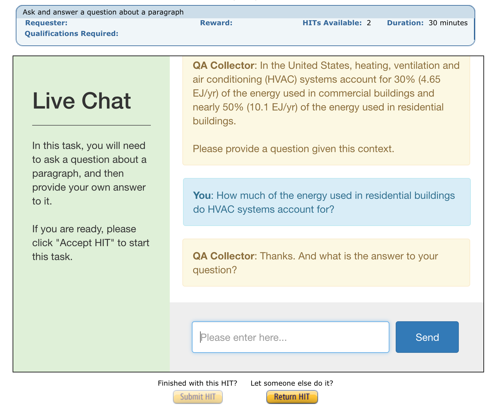

..
  Copyright (c) 2017-present, Facebook, Inc.
  All rights reserved.
  This source code is licensed under the BSD-style license found in the
  LICENSE file in the root directory of this source tree. An additional grant
  of patent rights can be found in the PATENTS file in the same directory.

Using Mechanical Turk
=====================
**Authors**: Will Feng, Jack Urbanek

In ParlAI, you can use Amazon Mechanical Turk for **data collection**, **training** and **evaluation** of your dialog model.

Human Turkers are viewed as just another type of agent in ParlAI, and hence person-to-person, person-to-bot, or multiple people and bots in group chat can all talk to each other within the same framework.

The human Turkers communicate in observation/action dict format, the same as all other agents in ParlAI. During the conversation, the message that human Turkers receive is rendered on the live chat webpage in a pretty printed format, similar to the following:

   *Example: Human Turker participating in a QA data collection task*

Each MTurk task has at least one human Turker that connects to ParlAI via the Mechanical Turk Live Chat interface, encapsulated as an ``MTurkAgent`` object.

Each MTurk task also consists of a ``World`` where all agents live and interact within.

Example Tasks
-------------

We provide a few examples of using Mechanical Turk with ParlAI:

- `QA Data Collection <https://github.com/facebookresearch/ParlAI/blob/master/parlai/mturk/tasks/qa_data_collection/>`__: collect questions and answers from Turkers, given a random Wikipedia paragraph from SQuAD.
- `Model Evaluator <https://github.com/facebookresearch/ParlAI/blob/master/parlai/mturk/tasks/model_evaluator/>`__: ask Turkers to evaluate the information retrieval baseline model on the Reddit movie dialog dataset.
- `Multi-Agent Dialog <https://github.com/facebookresearch/ParlAI/blob/master/parlai/mturk/tasks/multi_agent_dialog/>`__: round-robin chat between a local human agent and two Turkers.
- `Deal or No Deal <https://github.com/facebookresearch/ParlAI/tree/master/parlai/mturk/tasks/dealnodeal/>`__: negotiation chat between two agents over how to fairly divide a fixed set of items when each agent values the items differently.
- `Qualification Flow Example <https://github.com/facebookresearch/ParlAI/tree/master/parlai/mturk/tasks/qualification_flow_example>`__: filter out workers from working on more instances of your task if they fail to complete a test instance properly.

Task 1: Collecting Data
^^^^^^^^^^^^^^^^^^^^^^^

One of the biggest use cases of Mechanical Turk is to collect natural language data from human Turkers.

As an example, the `QA Data Collection task <https://github.com/facebookresearch/ParlAI/blob/master/parlai/mturk/tasks/qa_data_collection/>`__ does the following:

1. Pick a random Wikipedia paragraph from SQuAD dataset.
2. Ask a Turker to provide a question given the paragraph.
3. Ask the same Turker to provide an answer to their question.

In ``QADataCollectionWorld``, there are two agents: one is the human Turker (``MTurkAgent``), the other is the task agent (``DefaultTeacher`` from SQuAD) that provides the Wikipedia paragraph.

The ``QADataCollectionWorld`` uses ``turn_index`` to denote what stage the conversation is at. One *turn* means that ``world.parley()`` has been called once.

After two turns, the task is finished, and the Turker's work is submitted for your review.

Task 2: Evaluating a Dialog Model
^^^^^^^^^^^^^^^^^^^^^^^^^^^^^^^^^

You can easily evaluate your dialog model's performance with human Turkers using ParlAI. As an example, the `Model Evaluator task <https://github.com/facebookresearch/ParlAI/blob/master/parlai/mturk/tasks/model_evaluator/>`__ does the following:

1. Initialize a task world with a dialog model agent (`ir_baseline <https://github.com/facebookresearch/ParlAI/blob/master/parlai/agents/ir_baseline/ir_baseline.py#L98>`__) and a dataset (`MovieDD-Reddit <https://github.com/facebookresearch/ParlAI/blob/master/parlai/tasks/moviedialog/agents.py#L57>`__).
2. Let all the agents in the task world ``observe()`` and ``act()`` once, by calling ``parley()`` on the world.
3. Ask the human Turker to rate the dialog model agent's response on a scale of 0-10.

In ``ModelEvaluatorWorld``, there are two main components: one is the ``task_world`` that contains the task and the dialog model we are evaluating, the other is the ``MTurkAgent`` which is an interface to the human Turker.

Note that since the human Turker speaks only once to provide the rating, the ``ModelEvaluatorWorld`` doesn't need to use ``turn_index`` to keep track of the turns.

After one turn, the task is finished, and the Turker's work is submitted for your review.

Task 3: Multi-Agent Dialog
^^^^^^^^^^^^^^^^^^^^^^^^^^

ParlAI supports dialogs between multiple agents, whether they are local ParlAI agents or human Turkers. In the `Multi-Agent Dialog task <https://github.com/facebookresearch/ParlAI/tree/master/parlai/mturk/tasks/multi_agent_dialog/>`__, one local human agents and two Turkers engage in a round-robin chat, until the first local human agent sends a message ending with ``[DONE]``, after which other agents will send a final message and the task is concluded.

This task uses the ``MultiAgentDialogWorld`` which is already implemented in ``parlai.core.worlds``.

Task 4: Advanced Functionality - Deal or No Deal
^^^^^^^^^^^^^^^^^^^^^^^^^^^^^^^^^^^^^^^^^^^^^^^^

ParlAI is able to support more than just generic chat. The `Deal or No Deal task <https://github.com/facebookresearch/ParlAI/tree/master/parlai/mturk/tasks/dealnodeal/>`__ provides additional functionality over the regular chat window to allow users to view the items they are dividing, select an allocation, and then submit a deal.

This task leverages the ability to override base functionality of the core.html page using ``task_config.py``. Javascript is added here to replace the task description with additional buttons and UI elements that are required for the more complicated task. These trigger within an overridden handle_new_message function, which will only fire after an agent has entered the chat.
In general it is easier/preferred to use a custom webpage as described in step 4 of "Creating Your Own Task", though this is an alternate that can be used if you specifically only want to show additional components in the task description pane of the chat window.

Task 5: Advanced Functionality - MTurk Qualification Flow
^^^^^^^^^^^^^^^^^^^^^^^^^^^^^^^^^^^^^^^^^^^^^^^^^^^^^^^^^

ParlAI MTurk is able to support filtering users through a form of qualification system. The `Qualification Flow task <https://github.com/facebookresearch/ParlAI/tree/master/parlai/mturk/tasks/qualification_flow_example>`__ demos this functionality using a simple "addition" task.

In this task, all users see a test version of the task on the first time they enter it and a real version every subsequent time, however users that fail to pass the test version are assigned a qualification that prevents them from working on the task again. Thus ParlAI users are able to filter out workers from the very beginning who don't necessarily meet the specifications you are going for.
This is preferred to filtering out workers using the onboarding world for tasks that require a full instance's worth of work to verify a worker's readiness.

Creating Your Own Task
----------------------

ParlAI provides a generic MTurk dialog interface that one can use to implement any kind of dialog tasks. To create your own task, start with reading the tutorials on the provided examples, and then copy and modify the example ``worlds.py``, ``run.py`` and ``task_config.py`` files to create your task.

A few things to keep in mind:

1. To end a conversation, you should check to see if an action has ``episode_done`` set to ``True``, as this signals that the world should start returning ``True`` for the ``episode_done`` function.
2. In ``run.py``, You can use ``hit_index`` and ``assignment_index`` to differentiate between different HITs and assignments, and change the content of the task accordingly.
3. Make sure to test your dialog task using MTurk's sandbox mode before pushing it live, by using the ``--sandbox`` flag (enabled by default) when running ``run.py``.
4. [Optional] If you want to show a custom webpage (instead of the default one) for any of your MTurk agents, you can create an ``html`` folder within your task directory, and then create the ``<mturk_agent_id>_cover_page.html`` and ``<mturk_agent_id>_index.html`` files within the ``html`` directory. In those files, you can extend from ``core.html`` and override any code blocks that you want to change. (Please look at `parlai/mturk/core/html/mturk_index.html <https://github.com/facebookresearch/ParlAI/blob/master/parlai/mturk/core/server/html/mturk_index.html>`__ as an example.) These agent-specific templates will automatically be shown to the Turkers in the next run.

Running a Task
--------------

If you have not used Mechanical Turk before, you will need an MTurk Requester Account and an AWS account (these are two separate accounts). Follow the steps below:

- Sign up for an AWS account at `aws.amazon.com <https://aws.amazon.com/>`__

- Sign up for an MTurk account at `requester.mturk.com <https://requester.mturk.com/>`__

- Go to the developer tab (`https://requester.mturk.com/developer <https://requester.mturk.com/developer>`__) and link your AWS account to your MTurk account (Step 2 on that screen)

- MTurk also has a “Sandbox” which is a test version of the MTurk marketplace. You can use it to test publishing and completing tasks without paying any money. ParlAI supports the Sandbox. To use the Sandbox, you need to sign up for a `Sandbox account <http://requestersandbox.mturk.com/>`__. You will then also need to `link your AWS account <http://requestersandbox.mturk.com/developer>`__ to your Sandbox account. In order to test faster, you will also want to create a `Sandbox Worker account <http://workersandbox.mturk.com/>`__. You can then view tasks your publish from ParlAI and complete them yourself.

- ParlAI's MTurk functionality requires a free heroku account which can be obtained `here <https://signup.heroku.com/>`__. Running any ParlAI MTurk operation will walk you through linking the two.

Then, to run an MTurk task, first ensure that the task directory is in `parlai/mturk/tasks/ <https://github.com/facebookresearch/ParlAI/blob/master/parlai/mturk/tasks/>`__. Then, run its ``run.py`` file with proper flags:

.. code-block:: console

    python run.py -nc <num_conversations> -r <reward> [--sandbox]/[--live]

E.g. to create 2 conversations for the `QA Data Collection <https://github.com/facebookresearch/ParlAI/blob/master/parlai/mturk/tasks/qa_data_collection/>`__ example with a reward of $0.05 per assignment in sandbox mode, first go into the task directory and then run:

.. code-block:: console

    python run.py -nc 2 -r 0.05 --sandbox

Please make sure to test your task in MTurk sandbox mode first (``--sandbox``) before pushing it live (``--live``).

Additional flags can be used for more specific purposes.

- ``--unique`` ensures that an Turker is only able to complete one assignment, thus ensuring each assignment is completed by a unique person.

- ``--unique-qual-name <name>`` lets you use the above functionality across more than one task. Workers will only be able to complete a task launched with this flag for a given `<name>` once.

- ``--allowed-conversations <num>`` prevents a Turker from entering more than <num> conversations at once (by using multiple windows/tabs). This defaults to 0, which is unlimited.

- ``--count-complete`` only counts completed assignments towards the num_conversations requested. This may lead to more conversations being had than requested (and thus higher costs for instances where one Turker disconnects and we pay the other) but it ensures that if you request 1,000 conversations you end up with at least 1,000 completed data points.

Handling Turker Disconnects
---------------------------
Sometimes you may find that a task you have created is leading to a lot of workers disconnecting in the middle of a conversation, or that a few people are disconnecting repeatedly. ParlAI MTurk offers two kinds of blocks to stop these workers from doing your hits.

- soft blocks can be created by using the ``--block-qualification <name>`` flag with a name that you want to associate to your ParlAI tasks. Any user that hits the disconnect cap for a HIT with this flag active will not be able to participate in any HITs using this flag.

- hard blocks can be used by setting the ``--hard-block`` flag. Soft blocks in general are preferred, as Turkers can be block-averse (as it may affect their reputation) and sometimes the disconnects are out of their control. This will prevent any Turkers that hit the disconnect cap with this flag active from participating in any of your future HITs of any type.

Reviewing Turker's Work
-----------------------

After all HITs are completed, you can review the work through Amazon's online interface. You can also programmatically review work using the commands available in the `MTurkManager` class.

If you don't take any action in 4 weeks, all HITs will be auto-approved and Turkers will be paid.

-------

\* Turker icon credit: `Amazon Mechanical Turk <https://requester.mturk.com/>`__. Robot icon credit: `Icons8 <https://icons8.com/>`__.
