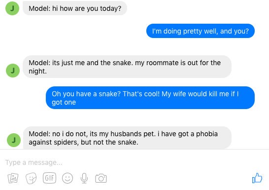

..
  Copyright (c) Facebook, Inc. and its affiliates.
  This source code is licensed under the MIT license found in the
  LICENSE file in the root directory of this source tree.

Using Facebook Messenger
========================
**Authors**: Jack Urbanek

In ParlAI, you can allow people on Facebook to participate in a ParlAI world as an agent.

Facebookers can be viewed as another type of agent in ParlAI, and hence person-to-person, person-to-bot, or multiple people and bots in group chat can all talk to each other within the same framework.

Facebook agents communicate in observation/action dict format, the same as all other agents in ParlAI. During the conversation, messages are delivered to a person's inbox from the page that you have set up for ParlAI.

   
   *Sample chat with a PersonaChat model over messenger*

Each messenger task has at least one messenger agent that connects to ParlAI using the Facebook messenger Send/Receive API, encapsulated as a ``MessengerAgent`` object.

Each messenger task also consists of a ``World`` where all agents live and interact within.

Messenger tasks can be grouped together within an ``Overworld`` which can spawn the subtasks and allow people to pick between multiple conversations.

Example Tasks
-------------

We provide three examples of using Facebook Messenger with ParlAI:

- `Generic Chatbot <https://github.com/facebookresearch/ParlAI/blob/master/parlai/messenger/tasks/chatbot/>`__: Allow messenger conversations with any ParlAI models, for instance the `PersonaChat <https://github.com/facebookresearch/ParlAI/tree/master/projects/personachat>`__ model.
- `QA Data Collection <https://github.com/facebookresearch/ParlAI/blob/master/parlai/messenger/tasks/qa_data_collection/>`__: collect questions and answers from people, given a random Wikipedia paragraph from SQuAD.
- `Overworld Demo <https://github.com/facebookresearch/ParlAI/blob/master/parlai/messenger/tasks/overworld_demo/>`__: let people select between three different subtasks, namely an echo bot, a demo of onboarding data collection, and a random chat.

Task 1: Testing a Model
^^^^^^^^^^^^^^^^^^^^^^^
Oftentimes it's important to host a created model against humans to evaluate how well it is performing on a number of metrics. This generic ChatBot world allows you to attach a model to a page, and then users who interact with that page will be paired into a conversation with that bot.

As it is currently implemented, the collected conversations can be observed and rated manually by the ParlAI user. It's possible to imagine requesting that the human participant rate their conversational partner at the end of the conversation as another way to evaluate the model.

To run a bot with this world, you'll need to provide the `run.py` command with the same model opts you would use elsewhere in a ParlAI environment.
For instance, after downloading the personachat models you can run:

.. code-block:: bash

    python run.py --model projects.personachat.kvmemnn.kvmemnn:Kvmemnn --model_file models:personachat/kvmemnn/kvmemnn/persona-self_rephraseTrn-True_rephraseTst-False_lr-0.1_esz-500_margin-0.1_tfidf-False_shareEmb-True_hops1_lins0_model

This code will allow users to talk with a bot in conversations like the one displayed above.

Task 2: Collecting Training Data
^^^^^^^^^^^^^^^^^^^^^^^^^^^^^^^^

One of the biggest use cases of Messenger in ParlAI is to connect people and collect natural language data.

As an example, the `QA Data Collection task <https://github.com/facebookresearch/ParlAI/blob/master/parlai/messenger/tasks/qa_data_collection/>`__ does the following:

1. Pick a random Wikipedia paragraph from SQuAD dataset.
2. Ask a person to provide a question given the paragraph.
3. Ask the person to provide an answer to their question.

In ``QADataCollectionWorld``, there are two agents: one is the person (``MessengerAgent``), the other is the task agent (``DefaultTeacher`` from SQuAD) that provides the Wikipedia paragraph.

The ``QADataCollectionWorld`` uses ``turn_index`` to denote what stage the conversation is at. One *turn* means that ``world.parley()`` has been called once.

After two turns, the task is finished, and the person's work can be saved during the ``World.shutdown()`` call.

Task 3: Exposing People to Multiple Tasks
^^^^^^^^^^^^^^^^^^^^^^^^^^^^^^^^^^^^^^^^^

ParlAI messenger can also be used to create a multi-function world that users can choose multiple tasks or variations for. This can be used to expose multiple versions of a chatbot you want to test, to allow users to choose what kinds of tasks they do, amongst other things.

As an example, the `Overworld Demo <https://github.com/facebookresearch/ParlAI/blob/master/parlai/messenger/tasks/overworld_demo/>`__ displays three separate tasks connected together by an overworld.

.. figure:: _static/img/messenger-example.png
   :align: center

- The ``echo`` task is a simple example of an echo bot, and shows the functionality and flow of a simple single-person world.
- The ``onboard data`` task is an example that shows how an onboarding world can collect information that is later exposed in the active task world.
- The ``chat`` task is an example of a task that requires multiple users, and shows how many people can be connected together in an instance of a world and then returned to the overworld upon completion of a task.

Creating Your Own Task
----------------------

To create your own task, start with reading the tutorials on the provided examples, and then copy and modify the example ``worlds.py`` and ``run.py`` files to create your task.

A few things to keep in mind:

1. A conversation ends when a call between ``parley`` calls to ``episode_done`` returns True.
2. Your world can utilize the complete set of `Facebook Messenger Templates <https://developers.facebook.com/docs/messenger-platform/send-messages/templates>`__ by putting the formatted data in the 'payload' field of the observed action.
3. Quick replies can be attached to any action, the ``MessengerOverworld`` of the `Overworld Demo <https://github.com/facebookresearch/ParlAI/blob/master/parlai/messenger/tasks/overworld_demo/>`__ displays this functionality.
4. Tasks with an overworld should return the name of the world that they want to queue a user into from the ``parley`` call in which the user makes that selection to enter a world.
5. Tasks with no overworld will immediately attempt to put a user into the queue for the default task onboarding world or actual task world (if no onboarding world exists), and will do so again following the completion of a world (via ``episode_done``).
6. To collect the conversation, data should be collected during every ``parley`` and saved during the ``world.shutdown`` call. You must inform the user of the fact that the data is being collected as well as your intended use.

Running a Task
--------------

- ParlAI's Messenger functionality requires a free heroku account which can be obtained `here <https://signup.heroku.com/>`__. Running any ParlAI Messenger operation will walk you through linking the two.

- Running and testing a bot on the `Facebook Messenger Platform <https://developers.facebook.com/docs/messenger-platform>`__ for yourself will require following the guide to set up a `Facebook App <https://developers.facebook.com/docs/messenger-platform/getting-started/app-setup>`__ for messenger. Skip the set up your webhook step, as ParlAI will do it for you.

- When the guide asks you to configure your webhook URL, you're ready to run the task. This can be done by running the ``run.py`` file in with python.

- After the heroku server is setup, the script will print out your webhook URL to the console, this should be used to continue the tutorial. The default verify token is ``Messenger4ParlAI``.

- On the first run, the page will ask you for a "Page Access Token," which is also referred to on the messenger setup page. Paste this in to finish the setup. You should now be able to communicate with your ParlAI world by messaging your page.

- To open up your bot for the world to use, you'll need to submit your bot for approval from the `Developer Dashboard <https://developers.facebook.com/apps/>`__.

**Note:** When running a new task from a different directory, the webhook url will change. You will need to update this in the developer console from the webhook settings using "edit subscription." Your Page Access token should not need to be changed unless you want to use a different page.

Additional flags can be used:

- ``--password <value>`` requires that a user sends the message contained in `value` to the bot in order to access the rest of the communications.

- ``--force-page-token`` forces the script to request a new page token from you, allowing you to switch what page you're running your bot on.

- ``--verbose`` and ``--debug`` should be used before reporting problems that arise that appear unrelated to your world, as they expose more of the internal state of the messenger manager.
