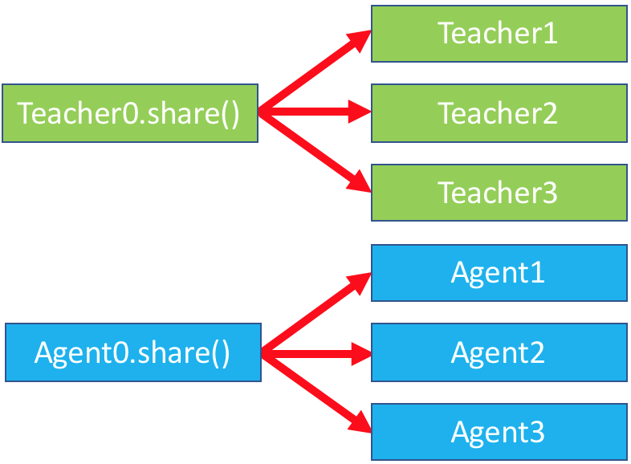

Worlds, Sharing & Batching
==========================

__Authors__: Alexander Holden Miller, Kurt Shuster, Stephen Roller

:::{important} Before you begin
If you are unfamiliar with the basics of displaying data or calling train or
evaluate on a model, please first see the [getting started](tutorial_basic)
section. If you are interested in creating a task, please see
[that section](tutorial_task).
:::

Introduction
------------

This document discusses the overview of [__Worlds__](parlai.core.worlds.World), a
core concept within ParlAI. It aims to be a high level overview of
_how_ some concepts are implemented in ParlAI, so that you can know what's
happening behind the scenes, but you are unlikely to write any custom worlds
yourself.

Worlds are where agents live, and the world defines the communication flow
between agents.  If you are familiar with
[Reinforcement Learning](https://en.wikipedia.org/wiki/Reinforcement_learning),
Worlds are roughly analogous to environments.

At a most basic level, worlds simply house agents and pass messages between
each of them. Each message pass happens as a __Parley__. For example, the
[DialogPartnerWorld](parlai.core.worlds.DialogPartnerWorld) contains this rough
pseudo-code as its parley:

:::{note}
This is only pseudo-code, but the
[real code](https://github.com/facebookresearch/ParlAI/blob/master/parlai/core/worlds.py)
is reasonably easy to read, even for newcomers.
:::

```python
class SimpleWorld(World):
    def __init__(opt, agents):
        self.teacher, self.model = agents

    def parley():
        # produce an example dataset item
        teacher_act = self.teacher.act()
        # perform preprocessing, vectorizing, etc.
        self.model.observe(teacher_act)
        # produce a model response
        model_act = self.model.act()
        # compute any metrics of the response
        self.teacher.observe(model_act)
```

This is represented by the following image:

<center>

</center>


The parley method is usually run in a loop, until we run out of examples:

```python
while not world.epoch_done():
    world.parley()
```

This simple loop structure is powerful, and allows us to present a unified view
of all agents, whether they are [datasets](tutorial_task), [models](core/agents),
or humans connected via a [chat service](tutorial\_chat_service):
there is always a __world__ and it facilitates agents passing messages back
and forth.

However, this loop may be inefficient. Modern hardware like GPUs and learning
algorithms like Stochastic Gradient Descent benefit from _batching_, or
processing multiple items at the same time.

In the remainder of this document, we will cover how Batching works, and eventually
discuss the implementation of Dynamic Batching.

## Agent Sharing

_Agent Sharing_ is the primary mechanism by which we implement batching, model
serving, and many other ParlAI features.  Agent sharing works by creating
_clones_ of an Agent. Each clone of an Agent has _shared state_ and
_independent state_. Independent state includes things like the current
dialogue context (conversation history, which is different for every batch
element). Shared state includes things like the model weights.

```python
agent_original = Agent(opt)
agent_copy1 = agent_original.clone()
agent_copy2 = agent_original.clone()
agent_copy3 = agent_original.clone()
```

Clones are why most agents have this rough structure in their initialization
procedures.

```python
class PseudoAgent(Agent):
    def __init__(self, opt: Opt, shared: dict = None):
        super().__init__(opt, shared)
        if shared is None:
            # When shared is None, we are the original, and we need to
            # initialize any state
            self.model = self.build_model()
        else:
            # When shared is NOT None, we are a clone.
            # Use the shared dict to set any variables. this is where we
            # incorporate any shared state
            self.model = shared['model']

    def share(self):
        # This is used to create the "shared" dictionary that clones will
        # receive in initialization. Make sure you enumerate everything
        # that needs to be seen in all clones!

        # You will probably never call this method yourself. Rather, it is
        # called automatically by `clone()`
        shared = super().share()
        shared['model'] = self.model
        return shared
```

:::{note} Real implementations
The above is really just a very simple example. You may find it illuminating to
read the implementation of
[UnigramAgent](https://github.com/facebookresearch/ParlAI/blob/master/parlai/agents/unigram/unigram.py)
or even [TorchAgent](parlai.core.torch_agent.TorchAgent).
:::


:::{note} Usefulness
The above pseudo-code is likely to be used frequently as a user of ParlAI.
Some things are automatically shared by our abstractions (like models and
optimizers), but some users may have to include extra sharing.
:::

Each clone of a model is relatively cheap to create: the only new memory used
is the dialogue context. The share object enables us to reuse memory for
expensive objects, like neural network weights.

At a glance, creating these clones may seem strange. Why do we create all these
copies? Differentiating between shared and independent state lets us write our
agents with _independence_ in mind. Agents only need to __focus on a single
conversation__, maintaining and manipulating the state for just that conversation.
Every clone will be maintaining _separate conversations_, so when we implement
a new dataset or model, we only focus on one conversation at a time.

This is what makes up the fundamental backend behind batching or chat services:
each clone of the agent only has to focus on one conversation at a time, with
only specific spots for synchronization. In the next section, we'll
take a look at how this is used in Batching.

:::{note} When do I clone?
Note that while cloning is fundamental to the inner workings of ParlAI, it is
rare that you will need to call clone yourself, unless you are creating
custom worlds or backends.
:::

## Batching

:::{warning} Already implemented in `TorchAgent`.
If you're implementing your own custom Neural Network model, you don't need to
worry about this, except at a high level. This is all handled for you by
`TorchAgent`.
:::

Equipped with the ability to create clones, we can use this to implement
Batching. For a batchsize of 3, we will create 3 clones of the Teacher, and 3
clones of the Agent. Each of these clones will maintain their own separate,
independent conversations. Naively, this could be implemented with a simple
for loop:

```python
class NaiveBatchWorld(World):
    def __init__(self, opt, agents):
        # store the originals
        self.teacher, self.model = agents
        # make batchsize copies of all the models
        self.teacher_copies = []
        self.model_copies = []
        self.batchsize = opt['batchsize']
        for i in range(self.batchsize):
            self.teacher_copies.append(self.teacher.clone())
            self.model_copies.append(self.model.clone())

```
This initialization code is then represented by this graphic:

<center>

</center>

We continue with the implementation of parley:

```python
    def parley(self):
        for i in range(self.batchsize):
            # produce an example dataset item
            teacher_act = self.teacher_copies[i].act()
            # perform preprocessing, vectorizing, etc.
            self.model_copies[i].observe(teacher_act)
            # produce a model response
            model_act = self.model_copies[i].act()
            # compute any metrics of the response
            self.teacher_copies[i].observe(model_act)   
```

<center>

</center>

However, this is inefficient, and prevents us from utilizing the amazing
vectorization capabilities of modern GPUs. Instead, we'll implement a special
`batch_act method`. This method will instead handle all the acts at once

```python
class BatchWorld(World):
    def __init__(self, opt, agents):
        # store the originals
        self.teacher, self.model = agents
        # make batchsize copies of all the models
        self.teacher_copies = []
        self.model_copies = []
        self.batchsize = opt['batchsize']
        for i in range(self.batchsize):
            self.teacher_copies.append(self.teacher.clone())
            self.model_copies.append(self.model.clone())

    def parley(self):
        observations = []
        for i in range(self.batchsize):
            # produce an example dataset item
            teacher_act = self.teacher_copies[i].act()
            # perform preprocessing, vectorizing, etc.
            observation[i] = self.model_copies[i].observe(teacher_act)

        # now batch_act can efficiently do everything on the GPU
        model_acts = self.model.batch_act(observations)

        # return the results of the batch_act back to individual conversations
        for i in range(self.batchsize):
            # self_observe is how we tell each copy what their individual
            # actions are
            self.model_copies[i].self_observe(model_acts[i])
            # compute any metrics of the response
            self.teacher_copies[i].observe(model_acts[i])
```

This logic is more complicated, but enables us to efficiently implement batched
operations. The new logic can be encapsulated in this graph:

<center>

</center>


:::{tip} Implementing batch\_act and act
Tip: if you implement `batch_act()`, your `act()` method can just call
`batch_act()` and pass the observation it is supposed to process in a
list of length 1.
:::

## Dynamic Batching

:::{note}
This is only a sketch. The real code is more complicated, but advanced users
may be interested in
[reading it](https://github.com/facebookresearch/ParlAI/blob/master/parlai/core/worlds.py).
:::

As a final diversion, we'll discuss at a high level of how Dynamic Batching
(also known as adaptive batching) is implemented. Dynamic Batching is supported
by all TorchAgents by default and can give you a
[2-3x speedup in training](tutorial_fast).

Dynamic batching is used to _maximize the usage of GPUs_ by grouping similarly
length examples so they occur at the same time. Intuitively, to maximize usage
of GPU memory, we can either process _a few very long conversations_ or we can
process _many short conversations_. If we can do this artfully, we will be able
to maximize throughput and minimize waste from
[padding tokens](https://d2l.ai/chapter_recurrent-neural-networks/text-preprocessing.html).
Padding tokens occur whenever one conversation is much longer than another,
so we must _pad_ the batch with empty tokens to make our tensors full rectangles.

As a simple algorithm for minimizing padding, we can simply "group" similarly
length examples so they are processed at the same time. To do this, we will
maintain a sort of buffer of many possible conversations.

Let's imagine we have a buffer of 12 conversations going on at once, and a
batchsize of 3.  Each of the conversations is in the following state:

ID | Batch #|  Message | # Words
---|--------|----------|-------
0  |   0    |  Frankly, my dear, I don't give a damn. | 8
1  |   0    |  I'm going to make him an offer he can't refuse. |      10
2  |   0    |  Mama always said life was like a box of chocolates. You never know what you're gonna get. |      17
3  |   1    |  Here's Johnny! |       2
4  |   1    |  Expecto patronum! | 2
5  |   1    |  Do you wish me a good morning, or mean that it is a good morning whether I want it or not; or that you feel good this morning; or that it is a morning to be good on? |      38
6  |   2    |  I'm walking here! I'm walking here! |       6
7  |   2    |  You are without a doubt the worst pirate I've ever heard of.  |      12
8  |   2    |  May the Force be with you. |       6
9  |   3    |  A million dollars isn't cool. You know what's cool? A billion dollars. |      12
10 |   3    |  I'm as mad as hell, and I'm not going to take this anymore! |      13
11 |   3    |  I'm king of the world! |       5

Naively processing each of these conversations in order will result in very
uneven batches: the very long LOTR quote is combined with our shortest
utterances. Instead, we can organize our conversations so that like-lengthed
are next to each other. This will save processing time and minimize packing.

ID | Batch #|  Message | # Words
---|--------|----------|-------
3  |   0    |  Here's Johnny! |       2
4  |   0    |  Expecto patronum! | 2
11 |   0    |  I'm king of the world! |       5
6  |   1    |  I'm walking here! I'm walking here! |       6
8  |   1    |  May the Force be with you. |       6
0  |   1    |  Frankly, my dear, I don't give a damn. | 8
1  |   2    |  I'm going to make him an offer he can't refuse. |      10
7  |   2    |  You are without a doubt the worst pirate I've ever heard of.  |      12
9  |   2    |  A million dollars isn't cool. You know what's cool? A billion dollars. |      12
10 |   3    |  I'm as mad as hell, and I'm not going to take this anymore! |      13
2  |   3    |  Mama always said life was like a box of chocolates. You never know what you're gonna get. |      17
5  |   3    |  Do you wish me a good morning, or mean that it is a good morning whether I want it or not; or that you feel good this morning; or that it is a morning to be good on? |      38

This is called the __batchsort__ algorithm. Note that our batch size remains
fixed at 4, but we've grouped our worst examples so that they happen at the
same time.

:::{tip}
You can use this your training or evaluation runs with `-dynb batchsort` or
`--dynamic-batching batchsort`.
:::

:::{note}
Notice how the conversations no longer play in order. ParlAI handles all of this
extra complexity for you. Remember, you only need to implement state tracking
for _individual_ conversations, and along with `batch\_act`.
:::

But we can take this even one step further, and implement fully dynamic batching.
In dynamic batching, we grow our batches so that the number of _words_ per batch
stays relatively fixed. This means we can process many short conversations at
the same time. Let's imagine we set the number of total number of words per batch
to be 80.

ID | Batch #|  Message | # Words
---|--------|----------|-------
5  |   0    |  Do you wish me a good morning, or mean that it is a good morning whether I want it or not; or that you feel good this morning; or that it is a morning to be good on? |      38
2  |   0    |  Mama always said life was like a box of chocolates. You never know what you're gonna get. |      17
10 |   0    |  I'm as mad as hell, and I'm not going to take this anymore! |      13
9  |   0    |  A million dollars isn't cool. You know what's cool? A billion dollars. |      12
7  |   1    |  You are without a doubt the worst pirate I've ever heard of.  |      12
1  |   1    |  I'm going to make him an offer he can't refuse. |      10
0  |   1    |  Frankly, my dear, I don't give a damn. | 8
6  |   1    |  I'm walking here! I'm walking here! |       6
8  |   1    |  May the Force be with you. |       6
11 |   1    |  I'm king of the world! |       5
3  |   1    |  Here's Johnny! |       2
4  |   1    |  Expecto patronum! | 2

With this algorithm, we tried to get as close to 80 words as possible, without
going over. The first batch ends up with exactly 80 words. The batch ends up
with only 51. But we've now reduced the number of batches we need to process
from 4 to only 2! This is the trick of how dynamic batching can provide
[massive speed ups](tutorial_fast).

:::{tip}
You can use this mode with `-dynb full` or `--dynamic-batching full`.
:::

