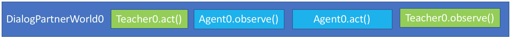
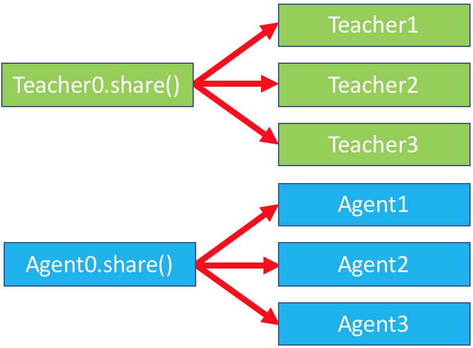
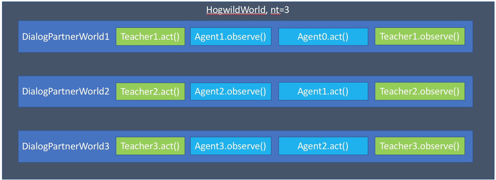
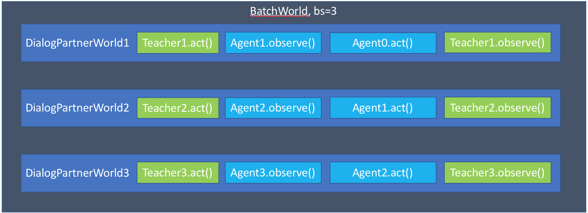
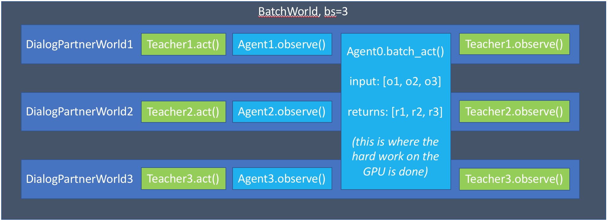
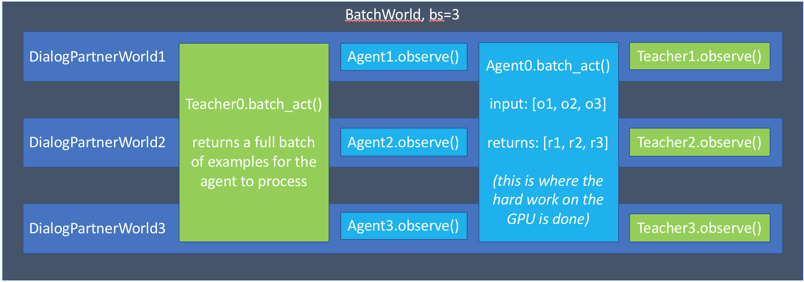

..
  Copyright (c) Facebook, Inc. and its affiliates.
  This source code is licensed under the MIT license found in the
  LICENSE file in the root directory of this source tree.

Data Handling, Batching, and Hogwild
====================================
**Authors**: Alexander Holden Miller, Kurt Shuster

.. note::
    If you are unfamiliar with the basics of displaying data or
    calling train or evaluate on a model, please first see
    the `getting started <tutorial_basic.html>`_ section.
    If you are interested in creating a task, please see
    `that section <tutorial_task.html>`_.

Introduction
^^^^^^^^^^^^

This tutorial will cover the details of:

1) `hogwild (multiprocessing) <#id1>`_;

2) `batched data <#batching>`_; and

3) `handling large datasets using PyTorch Data Loaders <#multiprocessed-pytorch-dataloader>`_

With relatively small modifications to a basic agent, it will be able to support
multithreading and batching. If you need extra speed or are using a very large
dataset which does not fit in memory, we can use a multiprocessed pytorch
dataloader for improved performance.

First, let's consider a diagram of the basic flow of DialogPartnerWorld,
a simple world with two conversing agents.

The teacher generates a message, which is shown to the agent.
The agent generates a reply, which is seen by the teacher.

Expanding to batching / hogwild using share()
~~~~~~~~~~~~~~~~~~~~~~~~~~~~~~~~~~~~~~~~~~~~~

For all tasks one might make,
there's one function we need to support for both hogwild and batching: ``share()``.
This function should provide whatever is needed to set up a "copy" of the original
instance of the agent for either each row of a batch or each thread in hogwild.

The same function is used for both batching and hogwild, since most agents only
use one or the other. However, an agent may check the ``numthreads`` and/or
``batchsize`` options to adjust its behavior if it wants to support both, and
we do support doing both batching and hogwild at the same time if the agent
desires.

We create shared agents by instantiating them in the following way:

.. code-block:: python

    Agent0 = Agent(opt)
    ...
    Agent1 = Agent(opt, Agent0.share())
    Agent2 = Agent(opt, Agent0.share())
    Agent3 = Agent(opt, Agent0.share())

Hogwild (multiprocessing)
^^^^^^^^^^^^^^^^^^^^^^^^^
Hogwild is initialized in the following way:

1. We set up a starting instance of the world: that is, we use ``create_task``
   to set up a base world with the appropriate agents and tasks.
2. We pass this world to a ``HogwildWorld``, which sets up a number of
   synchronization primitives
3. We launch ``numthreads`` threads, each initialized from a ``share()``'d
   version of the world and the agents therein.
4. Once these threads and their world copies are all launched, we return control back

Now that this world is set up, every time we call parley on it, it will release
one of its threads to do a parley with its copy of the original base world.

There's some added complexity in the implementation of the class to manage
synchronization primitives, but the Hogwild world should generally behave just
like a regular World, so you shouldn't need to worry about it. If you do want
to check out the implementation, look for HogwildWorld in the `core/worlds.py file
<https://github.com/facebookresearch/ParlAI/blob/master/parlai/core/worlds.py>`_.

Sharing needs to be implemented properly within all these agents and worlds so
all the proper information is shared and synced between the threads. We'll take
a look at the common setup needs for each of those.

Hogwild Teachers
~~~~~~~~~~~~~~~~
The default setup for teachers include creating a Metrics object to track
different metrics, including the number of examples shown, accuracy, and f1.
The default ``share()`` method automatically sets up a thread-safe version of
these metrics if needed--children can go ahead and access these metrics as normal.

Teachers using dynamic data can most likely proceed as normal, without syncing
any information outside of the metrics class. However, fixed datasets need
mechanisms built in to make sure that they don't do validation or testing
examples more or less than once to ensure consistent results.

Fortunately, the FixedDialogTeacher has this all built in already,
so merely extending that class provides all the needed functionality.

Hogwild Models
~~~~~~~~~~~~~~
For models using hogwild training, the primary concern is to share a thread-safe
version of the model. This process will vary based on which framework you're
using, but we'll include a few tips for PyTorch here.

First, check out the best practices here:
http://pytorch.org/docs/master/notes/multiprocessing.html

The primary things to remember are
1. call ``model.share_memory()`` and include your model in the ``share()`` function
2. make sure to switch the multiprocessing start method if CUDA is enabled

You can see an example of this in the `Starspace model
<https://github.com/facebookresearch/ParlAI/blob/master/parlai/agents/starspace/starspace.py>`_.
This model uses multiple CPU threads for faster training, and does not use GPUs at all.

Showing only the code relevant to model sharing, we see:

.. code-block:: python

    def __init__(self, opt, shared=None):
        if shared:
            torch.set_num_threads(1)  # otherwise torch uses multiple cores for computation
            self.model = shared['model']  # don't set up model again yourself
        else:
            self.model = Starspace(opt, len(self.dict), self.dict)
            self.model.share_memory()

    def share(self):
        shared = super().share()
        shared['model'] = self.model
        return shared

Batching
^^^^^^^^
Batching is set up in the following way (the first step is the same as Hogwild):

1. We set up a starting instance of the world: that is, we use ``create_task``
   to set up a base world with the appropriate agents and tasks.
2. We pass this world to a ``BatchWorld``.
3. We create ``batchsize`` worlds, each initialized from a ``share()``'d
   version of the world and the agents therein.

Now, every time we call ``parley`` on this BatchWorld, we will complete ``batchsize`` examples.
Note that this is different than the behavior of HogwildWorld, where only a
single example is executed for each call to parley.

.. note::
    So far, our diagram is exactly the same as Hogwild. We'll see how it can
    change below when agents implement the ``batch_act`` function
    (as GPU-based models will).

There's a few more complex steps to actually completing a parley in this world.

1. Call ``parley_init`` on each shared world, if the world has it implemented.
   Most classes don't need this--we currently only use it for our ``MultiWorld``,
   which handles the case when one specifies multiple separate tasks to launch
   (e.g. "-t babi,squad"). This does any pre-parley setup, here choosing which
   sub-tasks to use in the next parley.
2. Then, iterate over the number of agents involved in the task. For most tasks,
   this is just two agents: the teacher (task) and the student (model). For each
   agent, we do two steps:

   a. Call ``BatchWorld.batch_act()``. This method first checks if the **original**
      instance of the agent (not the copies) has a function named ``batch_act``
      implemented and does not have an attribute ``use_batch_act`` set to ``False``.
      This function is described more below. If condition is not met,
      the BatchWorld's ``batch_act`` method iterates through each agent copy in the
      batch and calls the ``act()`` method for that instance.
      This is the default behavior in most circumstances, and allows agents to
      immediately work for batching without any extra work--the batch_act method
      is merely for improved efficiency.
   b. Call ``BatchWorld.batch_observe()``. This method goes through every **other**
      agent, and tries to call the ``observe()`` method on those agents. This gives
      other agents (usually, just the one other agent) the chance to see the action
      of the agent whose turn it is to act currently.

Next, we'll look at how teachers and models can take advantage of the setup
above to improve performance.

Batched Models
~~~~~~~~~~~~~~
Finally, models need to be able to handle observations arriving in batches.

The first key concept to remember is that, if the model agent implements
``batch_act()``, **act will not be called** as long as ``batchsize`` > 1.

However, copies of the agent will still be created, and the ``observe`` method
of each one will be called. This allows each copy to maintain a state related
to a single row in the batch. Remember, since each row in the batch is represented
by a separate world, they are completely unrelated. This means that the model
only needs to be set up in the original instance, and need not be shared with
its copies.

The ``observe()`` method returns a (possibly modified) version of the observation
it sees, which are collected into a list for the agent's ``batch_act()`` method.

Now, the agent can process the entire batch at once. This is especially helpful
for GPU-based models, which prefer to process more examples at a time.

Tip: if you implement ``batch_act()``, your ``act()`` method can just call ``batchact()``
and pass the observation it is supposed to process in a list of length 1.

Of course, this also means that we can use batch_act in both the task and the
agent code:

Multiprocessed Pytorch Dataloader
^^^^^^^^^^^^^^^^^^^^^^^^^^^^^^^^^
When a dataset is very large, or requires a lot of preprocessing before a model
can use it, you can use our ``PytorchDataTeacher``, which utilizes multiprocessed
dataloading for streaming data from disk (rather than loading it into memory).
That system can take your task as input, and make it fast to load, or you can
roll your own specific setups if you need more control.

For large datasets, where it is best to stream from disk during training
rather than load initially into memory, we provide a teacher that utilizes pytorch data loading.

(Note: the module `here <https://github.com/facebookresearch/ParlAI/blob/master/parlai/core/pytorch_data_teacher.py>`__
contains all of the code discussed in this tutorial)

Pytorch Dataloading Intro
~~~~~~~~~~~~~~~~~~~~~~~~~
A Pytorch ``DataLoader`` is a dataloading mechanism that provides multiprocessed
loading of data from disk (as described `here <http://pytorch.org/tutorials/beginner/data_loading_tutorial.html>`__).
A ``DataLoader`` can be initialized with a variety of different options; the only
ones that concern us are ``dataset`` and ``collate_fn``.

The ``dataset`` is a
Pytorch ``Dataset`` (as described `here <http://pytorch.org/tutorials/beginner/data_loading_tutorial.html>`__),
which is a class that implements two functions: ``__getitem__(self, idx)`` and ``__len__(self)``.
As is readily apparent, the ``__getitem__`` method is given an ``idx`` and returns the
data item at that ``idx``, while the ``__len__`` method returns the length of the underlying dataset.
With a ``dataset``, the ``DataLoader`` then takes care of everything else.

The ``collate_fn`` is simply a way of formatting a batch of returned data items;
Pytorch provides a default ``collate_fn`` that turns data into tensors, but there
are many ways that one could want to batch data from the ``Dataset``.

Pytorch Dataloading in ParlAI
~~~~~~~~~~~~~~~~~~~~~~~~~~~~~

Implementation
++++++++++++++
The `PytorchDataTeacher <https://github.com/facebookresearch/ParlAI/blob/master/parlai/core/pytorch_data_teacher.py>`_
provides two default ``Datasets`` and a default ``collate_fn`` as specified above.

1. ``StreamDataset`` - this is the ``Dataset`` that we provide to the
``DataLoader`` when ``--datatype`` is set to ``[train|valid|test]:stream``.
The dataset is meant for streaming data - that is, data that
does not need to (or cannot) be loaded into memory before starting training, e.g.
datasets with millions of text examples, or datasets with thousands of images.

    a) ``__getitem__(self, idx)`` returns ``(index, ep)``, where ``index`` is the
        ``idx`` argument, and ``ep`` is the episode at that index in the dataset.
    b) ``__len__(self)``. returns the length of the dataset.

2. ``ParlAIDataset`` - when ``stream`` is not in the ``--datatype``, ParlAI defaults
to this ``Dataset``, which provides random access into the dataset. Its ``__getitem__``
and ``__len__`` methods are functionally the same as the ``StreamDataset``.

3. ``default_collate`` - this function simply returns a list of ``(index, ep)``
pairs as they are returned from the ``__getitem__`` function above.

How to Use
++++++++++
The ``PytorchDataTeacher`` can be used with any dataset/task currently provided
on the ParlAI platform. There are two ways you can utilize the ``PytorchDataTeacher``
for your specific task. One involves using the ``ParlAIDataset`` or ``StreamDataset`` that we have
provided; the other involves writing your own dataset. Each will be covered
step by step below. The important thing to know is that in the first case you **only**
need to write a teacher; in the second case, you **only** need to write a ``Dataset``.

PyTorch ParlAIDataset/StreamDataset
***********************************
1. Ensure that there is an appropriate teacher that already exists, which
can read the data saved on disk and produce an action/observation dict for any
agent.

2. Build the data such that it can be used by the ``ParlAIDataset`` or ``StreamDataset``. There
are two ways of doing this:

  a) Run the following command::

      python examples/build_pytorch_data.py -pyt <TEACHER> --datatype <DATATYPE>

  b) The following are the parameters to specify:

      1) ``-pyt/--pytorch-teacher-task`` - This is simply the teacher of the task that you
          are using with the ``PytorchDataTeacher``

      2) ``--datatype`` - This is one of ``train, valid, test``, depending on
            what data you would like to use.

  c) **(Recommended)** Simply run ``examples/train_model.py`` with the same
     arguments listed above; this will build the data first before running
     the training loop. **(Important)** If you'd like to use the ``StreamDataset``,
     specify e.g. ``-dt train:stream``, otherwise the teacher will default
     to ``ParlAIDataset``

3. (*Preprocessing*) Sometimes, the preprocessing for the agent takes a considerable
amount of time in itself, and you want the data to simply be loaded preprocessed.
If you specify the ``--preprocess`` command line argument to be ``true``, then
the model/agent specified in the command line parameters will have its ``observe``
function called on each example; the data will then be saved for use specifically
with that model (setting this flag to ``true`` and then using another agent
will result in the data needing to be rebuilt).

4. Finally, specify the task with ``-pyt`` instead of ``-t``

**Example**

The following is an example of how the above steps could be applied to
use this teacher with the ``bAbI`` dataset:

1. The ``bAbI`` teacher (``Task1kTeacher``) is implemented such that it can
read the ``bAbI`` data, and provide an action/observation dict to send to the agent.

2. Suppose the ``Task1kTeacher`` teacher sets its ``self.datafile`` to the
appropriate datafile. Also, suppose we want the ``seq2seq`` model to preprocess the data before we save it.
Then, you can build the pytorch data with one of the following commands:

    a) (Build before training)::

        python examples/build_pytorch_data.py -m seq2seq -pyt
        babi:task10k:1 --pytorch-preprocess true

    b) **Recommended**::

        python examples/train_model.py
        -pyt babi:task10k:1 -m seq2seq --pytorch-preprocess true

3. To specify a datafile rather than using the ``self.datafile`` attribute,
e.g. the validation set file, simply add the following:
``--datafile data/bAbI/tasks_1-20_v1-2/en-valid-10k-nosf/qa1_valid.txt``

Your Own PyTorch Dataset
************************
1. To use your own method of retrieving data (rather than the streaming data option),
you can simply subclass the Pytorch ``Dataset`` class (as specified `here <http://pytorch.org/tutorials/beginner/data_loading_tutorial.html>`_).
You can add this class anywhere you would like; a good place would be in the
``agents.py`` file for the task you are writing a ``Dataset`` for.

2. **(Optional)** The default ``collate_fn`` that will be used is the one
specified above in the ``PytorchDataTeacher``. If you would like to specify your
own ``collate_fn``, you can implement a static method ``collate`` in the **agent**
to which you will be providing the data. This function takes one argument, ``batch``, which
is a list of data items returned by your custom ``Dataset``, and returns a
collated batch. Alternatively, you can also implement the method in the **dataset**.

3. Finally, instead of setting ``-t`` on the command line, you need to specify the ``Dataset``
with ``-pytd``: ``-pytd`` dataset_task:DatasetClassName``, where
``dataset_class`` is the agents file where your ``Dataset`` is written. If you
name your custom dataset ``DefaultDataset``, then you do not need to specify the
``DatasetClassName``.

**Example**

An example of the above method is used for the VQA V1 task, with the
``mlb_vqa`` agent. Here is how it works in this example:

1. In the `VQA V1 agents file <https://github.com/facebookresearch/ParlAI/blob/master/parlai/tasks/vqa_v1/agents.py>`_,
there exists a ``VQADataset``, which subclasses ``Dataset`` (with the appropriate ``__len__`` and ``__getitem__`` methods).

2. In the `MLB VQA model file <https://github.com/facebookresearch/ParlAI/blob/master/parlai/agents/mlb_vqa/mlb_vqa.py>`_,
there is an implementation of ``collate`` that returns a processed batch of examples from the
list of examples provided by the ``VQADataset``.

3. Finally, to use the ``PytorchDataTeacher`` with the custom ``Dataset`` and
``collate``, run the following command::

  python examples/train_model.py -m mlb_vqa -pytd vqa_v1

PyTorch Batch Sorting and Squashing
~~~~~~~~~~~~~~~~~~~~~~~~~~~~~~~~~~~
One of the benefits of using the ``StreamDataset`` described above when
using the ``PytorchDataTeacher`` is that you can achieve the benefits of
batch sorting and squashing (that is, reducing padding in batches by
providing the models with similarly sized batches) without having
to load the whole dataset into memory. We provide an on-the-fly
batch sorter that uses aggressive caching to create and provide
batches of similarly sized examples to models nearly as quickly (if not as quickly) as
can be provided without sorting.

To use the batch sorting method, just specify the following command line
argument:

1. ``-pybsrt`` - set this parameter to ``true`` to enable batch sorting

Additional arguments that may be of interest to you:

1. ``--batch-sort-field`` - this specifies the field on which the examples will
be sorted into batches. The default is 'text', and thus batch sorting will
return batches with similarly sized 'text' fields.

2. ``--batch-length-range`` - this indicates the degree of variation allowed in
a batch; e.g., by how many characters each example in a cache will, at most, deviate.
A ``--batch-length-range`` of 5 would mean that each example in the batch
would differ by no more than 5 characters (in a text-based dataset).

Explanation and Benefits of Batch Sorting
+++++++++++++++++++++++++++++++++++++++++

Batch sorting can help training by
reducing the amount of zero-padding in tensors constructed from batches of text.
This technique alone sped up the time to train on a single epoch of WMT De-En
with a simple convolutional architecture by approximately 4x.
See `this paper <https://arxiv.org/abs/1706.05765>`__ for an analysis of the
impact of different strategies on speed and convergence.

In order to reduce the zero-padding in examples, the ``PytorchDataTeacher``
squashes episodes into a single example
if there are multiple examples in each episode. For every example
in an episode, a separate squashed episode will be created from the examples up
to and including the current example.

The squashing can be controlled by two command-line arguments, which set
whether the labels are included in the squashing (you want them for dialog,
but you might not for question-answering),
as well as how many examples from the past should be included.

:param pytorch-include-labels: (bool, default True) whether to include labels in the context.
:param pytorch-context-length: (int, default -1) how many past examples in the episode to
                       include in the context for the current one. default -1 is all.
                       note that some datasets have **very** long episodes (e.g.
                       OpenSubtitles has episodes with hundreds of examples), so
                       setting context-length to a smaller value can limit the
                       context to an approachable amount of information for the model
                       as well as limiting memory usage.

After doing the squashing, the ``PytorchDataTeacher`` will return
batches where each batch contains examples of similar size (where size is determined
by the number of spaces in the example).

Let's look at a quick example to make sure the flattening is clear.
Consider the following "conversation", where the ``x``'s represent 'text' fields
and the ``y``'s represent labels in a continuous conversation between two agents.

.. code-block:: python

  x1 y1
  x2 y2
  x3 y3
  x4 y4

Without batching, these examples will be presented to the agent over four parleys:

.. code-block:: python

    {'text': x1, 'labels': [y1], 'episode_done': False}
    {'text': x2, 'labels': [y2], 'episode_done': False}
    {'text': x3, 'labels': [y3], 'episode_done': False}
    {'text': x4, 'labels': [y4], 'episode_done': True}

Using the flattening strategy above, with ``pytorch-context-length`` set to -1 and
``pytorch-include-labels`` set to False (not recommended for conversations),
in separate rows of a batch we'd get:

.. code-block:: python

    {'text': x1,                'labels': [y1], 'episode_done': True}
    {'text': x1 + x2,           'labels': [y2], 'episode_done': True}
    {'text': x1 + x2 + x3,      'labels': [y3], 'episode_done': True}
    {'text': x1 + x2 + x3 + x4, 'labels': [y4], 'episode_done': True}

If we change ``pytorch-context-length`` to 3 and ``pytorch-include-labels`` to True:

.. code-block:: python

    {'text': x1,           'labels': [y1], 'episode_done': True}
    {'text': x1 + y1 + x2, 'labels': [y2], 'episode_done': True}
    {'text': x2 + y2 + x3, 'labels': [y3], 'episode_done': True}
    {'text': x3 + y3 + x4, 'labels': [y4], 'episode_done': True}

PytorchDataTeacher Multitask Training
~~~~~~~~~~~~~~~~~~~~~~~~~~~~~~~~~~~~~
The ``PytorchDataTeacher`` can be used with mutltitask training in a very similar
way to the standard ParlAI multitasking. There are three simple ways of doing this.

1. If you do not have any ``Datasets`` written for the specified tasks, simply
write ``-pyt <task1>,<task2>,...`` on the command line. For example, you could
run the following command to multitask on SQuAD and bAbI::

  python examples/train_model.py -pyt squad,babi:task1k:1 ...

2. If you only have ``Datasets`` written for the specified tasks, simply write
``-pytd <dataset1>,<dataset2>,..`` on the command line. For example, you could
run the following command to multitask on COCO Captioning and Flickr30k::

  python examples/train_model.py -pytd coco_caption,flickr30k ...

3. If you have a mix of ``Datasets`` and regular teachers, you can specify
the ``Datasets`` after the ``-pytd`` flag and the regular teachers after the
``-pyt`` flag. For example, if you wanted to multitask train on SQuAD and
Flickr30k, you could run the following command::

  python examples/train_model.py -pytd flickr30k -pyt squad
