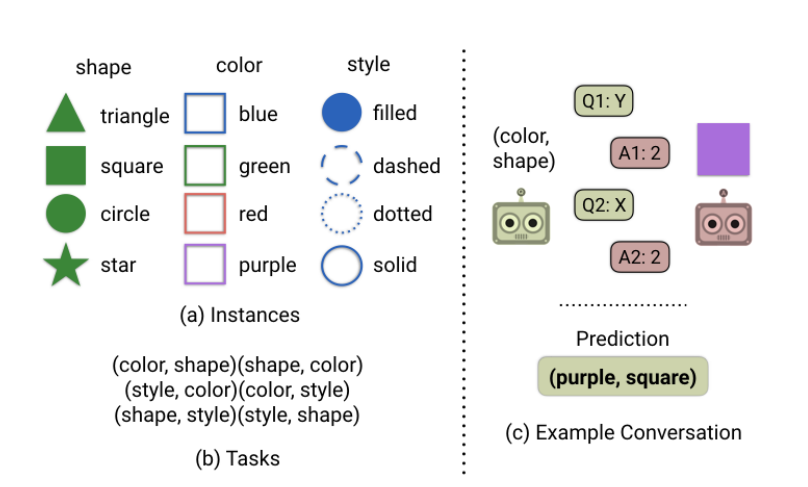

..
  Copyright (c) Facebook, Inc. and its affiliates.
  This source code is licensed under the MIT license found in the
  LICENSE file in the root directory of this source tree.

agents.coopgame_agent
==========================================================

Collection of agents participating in cooperative goal-based conversational
games. One such game, named Task n' Talk is described in the paper "Natural
Language Does Not Emerge 'Naturally' in Multi-Agent Dialog `(Kottur et al. 2017)
<https://arxiv.org/abs/1706.08502>`_". General properties of such cooperative
games are:

- **Two agents**: Questioner and Answerer, occasionally may be more.
- **Information Asymmetry**:
    - Answerer agent has information about visual content (real/synthetic
      image), but doesn't know the goal of conversation.
    - Questioner agent is blind and has a goal unknown to the answerer agent.
      It asks questions in order to accomplish the goal. At the end of dialog
      episode, it makes a prediction.
- **Same reward**: Both the agents can observe their own, as well as others'
  actions. At the end of dialog episode, both agents are given same reward
  based on questioner's prediction. Hence both must *cooperate* to maximize
  the reward.

Specifically for Task n' Talk (taken from Kottur et al. 2017):

**Information Asymmetry:** Answerer has an image described by attributes.
Questioner cannot see the image, and has a task of finding two attributes of
the image.

Please refer to the source code for the agent for more information and
documentation.

Building-block Modules
^^^^^^^^^^^^^^^^^^^^^^

These are set of modules essential for agents in cooperative and goal-based
conversational games. These agents use following modules, each module can be
subclassed and replaced in agent according to need. All modules are extended
from ``torch.nn.Module``.

Please refer to the modules code for more information and documentation.
