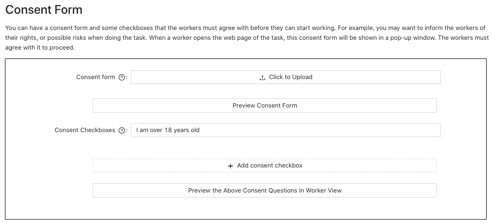
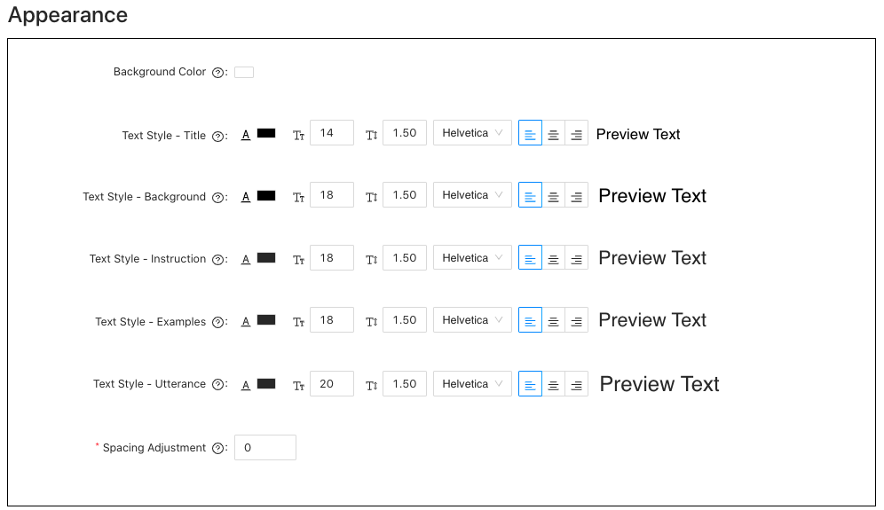

# DialCrowd
DialCrowd is a dialogue crowdsourcing toolkit that helps requesters write clear HITs, view and analyze results, and obtain higher-quality data. This integration allows for the requester interface, worker interface, and analysis interface to be integrated into ParlAI so requesters can have access to ParlAI's tools with DialCrowd's tools.

## Example Walkthrough

### Configuration


We start with a general configuration section. Here, you can indicate the background for your study, general instructions, enable markdown, specify the time each HIT should take, the payment per HIT, number of utterances per HIT, number of annotations per utterance, and number of sentences per page on the HIT. You can also upload your data in .txt format where each new line is a new utterance to be annotated.

***


Then, we have the task units for quality control section. Here, you can specify how many duplicate task units as well as how many golden task units you would like each worker to annotate (we suggest less than 10% of each HIT be quality control units).

***


We allow you to upload a consent form for the workers that they will have to agree to before accessing the HIT. This form allows you to inform workers of possible risks and also asks for their explicit consent for participation in your data collection.

***


For each of your intents, we provide areas where you can add any additional instructions for each intent, as well as add examples and counterexamples along with explanations. It is important to provide illustrative examples for the workers, so they will be able to provide the annotations according to the definitions you set.

***


This allows workers to provide feedback in an open-response input box so that you may improve future iterations of your task.

***


You can customize the colors, fonts, and text size associated with your HIT to highlight any important information.

### Annotation Page

We show the worker the background for your study, as well as the instructions and the table of intents with their respective definitions, examples, counterexamples, and explanations. 

***


Each worker will have a dropdown menu with all the intents, as well as an option to reshow the instructions and examples if they wish to refer back. A confidence score is also provided so that if workers are unsure, they can indicate that.

### Results Page

We track workers' times for each annotation, as well as provide the average time taken per annotation, if the annotations had any abnormality (ex. a worker selecting one intent for all utterances), agreement, agreement with the golden questions, and inter-user agreement.

***


We calculate Fleiss' kappa for each of the questions, as well as overall kappa.

***


We then provide a graph of the time taken by each worker for the HIT, so you are able to pinpoint and check the results of any workers that may have spent an extremely long or short time on the HIT.

## Usage

### Configuration

Run `./config.sh`

This will walk you through configuring the task (instructions, examples, payment, etc.).

### Preview Task Locally

```
python run.py
```

If you want to modify the webpage, and see the update on-the-time, you can run the following command:
```
python run.py mephisto.blueprint.link_task_source=true
```
and
```
cd webapp
npm run dev:watch
```

### Push the Task to AMT Sandbox

1. Obtain the API tokens by following instructions in [the webpage](https://requestersandbox.mturk.com/developer).
2. Register the API tokens:
```
mephisto register mturk_sandbox name=mturk_sandbox access_key_id=[KEY_ID] secret_access_key=[SECRET_KEY]
```
3. Execute:
```
python run.py mephisto/architect=heroku mephisto/provider=mturk_sandbox mephisto.provider.requester_name=mturk_sandbox
```

Troubleshooting:

1. If you register an incorrect token, you may need to remove the database used by Mephisto and register a correct one again. Check `Mephisto/data/` for more information.
2. If `python run.py` fails due to some Heroku related error, you can try to run `heroku login` before running `python run.py`. You may also check whether you have quota to create a new instance on Heroku.

### Results Page

In `webapp-results/server.js`, configure mephisto_path to the path of the Mephisto results of your task, and configure workers to an array of the `<task_run_id>/<assignment_id>/<agent_id>`'s.

Run `./configquality.sh`

This will show the resulting data along with quality control metrics (outliers due to time, duplicate data checks, Fleiss' Kappa calculation, etc).

## Code Structure

### Configuration Page

- `config.sh`: Build the front-end webpage; launch the backend; open the browser.
- `webapp-config/`: Source for the configuration webpage.
- `webapp-config/server.js`: A tiny backend to host the webpage.

### Annotation Page

- `webapp/`: Source for the annotation webpage.

### Quality Check Page

- `webapp-results/`: Source for the quality check page
- `webapp-results/server.js`: A tiny backend to host the webpage and pull results from Mephisto local files.

#### Frontend

- `webapp/src/components/task_components.jsx`: The DialCrowd component `WorkerCategory` is used at this place.
- `webapp/src/components/dialcrowd/worker_category.js`: `WorkerCategory` is defined here.

The `WorkerCategory` element takes in three attributes passed by ParlAI:

- `taskData`: The data to be annotate in this HIT. It is provided by the ParlAI backend.
- `taskConfig`: The task config loaded by ParlAI backend.
- `onSubmit`: A function that takes in a argument. The data specified by the argument will be passed to ParlAI and will be saved in the backend. When running locally with `python run.py`, this function does not save anything but only shows a pop-up window. When running on AMT, this function will not show the pop-up window, and data will be passed to the backend and will be saved.

#### Backend (ParlAI Scripts)

- `dialcrowd_blueprint.py`: Loading data/configuration files. The data is loaded to `self.raw_data` in the `DialCrowdStaticBlueprintArgs`. The configuration file is loaded in the function `DialCrowdStaticBlueprintArgs.get_frontend_args`. The return value of `DialCrowdStaticBlueprintArgs` will be the data passed to the `taskConfig` attribute of `WorkerCategory`.


#### Configurations

- `task_config/config.json`: Configuration file from DialCrowd.
- `hydra_configs/conf/example.yaml`: Configuration used by ParlAI.
- `data.jsonl`: Place to save the data. The format is as followed:

```json
{"id": 1, "sentences": ["please tell me my in-person transactions for the last three days using my debit card"], "category": []}
{"id": 2, "sentences": ["send $5 from savings to checking"], "category": []}
{"id": 3, "sentences": ["is there enough money in my bank of hawaii for vacation"], "category": []}
{"id": 4, "sentences": ["i need to pay my cable bill"], "category": []}
{"id": 5, "sentences": ["read my bill balances"], "category": []}
{"id": 6, "sentences": ["please tell me all of my recent transactions"], "category": []}
{"id": 7, "sentences": ["please transfer $100 from my checking to my savings account"], "category": []}
{"id": 8, "sentences": ["could you check my bank balance for me"], "category": []}
{"id": 9, "sentences": ["i need help paying my electric bill"], "category": []}
{"id": 10, "sentences": ["what is the amount of balance i have to pay on my bill"], "category": []}
```


## Note on DB

`<mephisto_root_dir>/data/data/runs/NO_PROJECT/<task_run_id>/<assignment_id>/<agent_id>/agent_data.json`.

Information about pushed tasks can be found in `Mephisto/data/database.db`, which is a SqlLite database.

Information about the tasks can be found in the table `assignments`. It includes `task_run_id`, which can be used to locate the directory containing the annotations done by the workers.

## Contributers

Jessica Huynh, Ting-Rui Chiang, Kyusong Lee
Carnegie Mellon University 2022