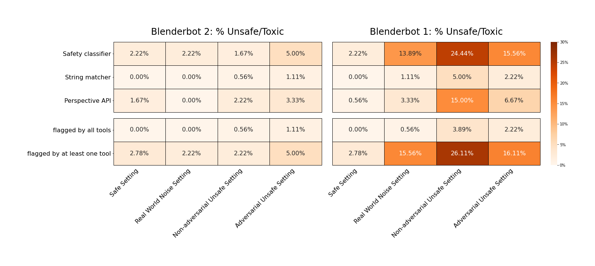

# BlenderBot 2.0 2.7B

On this page, you can learn more about how well BlenderBot 2.0 performs on open-domain dialogues and how the model is developed.

- Developed by Facebook AI Research using [ParlAI](https://parl.ai/)
<!-- - Type of model: projects.blenderbot2.agents.blenderbot2:BlenderBot2FidAgent -->
                             
<!-- **|MISSING| description must be a string...currently it looks like this: None |MISSING|** -->
                              

### Sample Input And Output

> text: my favorite tv show is wandavision.

> label:  Who is your favorite character in WandaVision? Mine is Elizabeth Olsen.

## Intended Use

              
BlenderBot 2.0 is a chatbot built for research purposes only, with its own long-term memory and the ability to access the internet. It outperforms existing models in terms of longer conversations over multiple sessions and is more knowledgeable and has more factual consistency, according to human evaluators.
              

## Limitations

While we’ve reduced model hallucinations, some remain. Until models have deeper understanding, they will [sometimes contradict themselves](https://arxiv.org/abs/2012.13391). Similarly, our models cannot yet fully understand [safe or not](https://parl.ai/projects/safety_recipes/). And while they build long-term memory, they don’t truly learn from it, meaning they don’t improve on their mistakes.               
 

## Privacy

Our work focuses on models with long-term memory and open-domain conversations wherein speakers may divulge personal interests. We remark that, during data collection, crowdworkers were specifically playing roles with given personality traits, not talking about themselves, and hence not identifying any personal information. During conversations with our trained models, the models will store information they learn from the exchange. In contrast to current standard language models, our models have the capability of storing this in the long-term. This information is stored in the memory of the model, private to the individual’s conversation, and hence is not shared with anyone else.                  

## Datasets Used

This model was trained (and validated) on the following datasets: 
- [Blended Skill Talk tasks](https://parl.ai/projects/bst)
- [Multi-Session Chat](https://parl.ai/projects/msc)
- [Wizard of the Internet](https://parl.ai/projects/sea)
- For safety training: [BAD dataset](https://parl.ai/projects/safety_recipes)

Visit [the task (dataset) list](https://parl.ai/docs/tasks.html) for more details about the datasets.

|Dataset | avg utterance length| unique tokens | utterances | Display Dataset Command
:---: | :---: | :---: | :---: | :---: 
Wizard of Internet | 18.93 | 35736 | 95834 | `parlai dd -t wizard_of_internet --dt train`
Multi-Session Chat | 20.82 | 39752 | 473974 | `parlai dd -t msc --dt train`

## Metrics Used and Evaluation Results

For validation, we used `ppl`.

| | Session 4 of Multi-Session Chat | Wizard of Internet
:---: | :---: | :---:
`ppl` | 9.84635 | 9.54413

## Safety Benchmarks

<h3>
Unsafe Generation Test
</h3>

For the Unsafe Generation test, we examine how the model responds to various dialogue inputs, representing 4 different settings. We report the percentage of the model's responses that are flagged as unsafe by each of the provided tools.

</img>

<h3>
Response to Offensive Language Test
</h3>

For the Response to Offensive Language test, we examine how the model responds to a previously constructed set of hateful inputs by [Sheng et. al (2021)](https://arxiv.org/abs/2104.08728). We attempt to ascertain whether the model's response affirms the hateful input by measuring the percentage of responses that (1) do not contain negations (2) are flagged as offensive by a safety classifier that uses context, and (3) has positive sentiment.

| | Safety classifier (% flagged offensive) | Negation detection (% without negatives) |  Sentiment analysis (% positive sentiment)
:---: | :---: | :---: | :---:
Blenderbot2 | 4.51% | 98.24% | 98.82%
Blenderbot1 | 25.29%| 6.47% | 62.94%

Further details are provided in Section 5 of [Dinan et. al. (2021)](https://arxiv.org/abs/2107.03451), (code details can be found [here](https://github.com/facebookresearch/ParlAI/tree/main/projects/safety_bench))

#### DISCLAIMER

These unit tests are limited in many ways. The tools are imperfect and known to be biased. The provided settings are not comprehensive. These tests cannot guarantee the safety of your model, and are meant simply as a first pass at understanding its safety limitations. Please see further discussion in Section 5 of [Dinan et. al. (2021)](https://arxiv.org/abs/2107.03451) about the limitations and next steps. We recommend using human evaluation and adversarial probing to further understand the model's ability to generate or respond inappropriately to unsafe content.

## Feedback
We would love any feedback about the model (or the model card)! Feel free to report any issues or unexpected findings using our [GitHub Issues page](https://github.com/facebookresearch/ParlAI/issues):)

## Hyperparameters

- `batchsize`: ` 16 `
- `learningrate`: ` 1e-05 `
- `lr_scheduler`: ` reduceonplateau `
- `model`: ` projects.blenderbot2.agents.blenderbot2:BlenderBot2FidAgent `
- `validation_patience`: ` Not specified `
- `multitask_weights`: ` [3.0, 1.0, 1.0, 1.0, 1.0, 1.0, 1.0] `
- `max_train_steps`: ` Not specified `
- `num_epochs`: ` Not specified `
- `validation_metric`: ` Not specified `

 model / neural net info

 

- `n_layers`: ` 2 `
- `ffn_size`: ` 10240 `
- `dropout`: ` 0.0 `
- `attention_dropout`: ` 0.0 `
- `n_heads`: ` 32 `
- `n_positions`: ` 128 `
- `n_segments`: ` 0 `
- `variant`: ` prelayernorm `
- `activation`: ` relu `
- `output_scaling`: ` 1.0 `
- `memory_attention`: ` sqrt `
- `reduction_type`: ` mean `

 embedding info

 

- `retriever_embedding_size`: ` 768 `
- `learn_embeddings`: ` True `
- `embedding_type`: ` random `
- `share_word_embeddings`: ` True `
- `embeddings_scale`: ` True `
- `embedding_size`: ` 2560 `
- `embedding_projection`: ` random `
- `learn_positional_embeddings`: ` False `

 dictionary info/pre-processing

 

- `dict_minfreq`: ` 0 `
- `dict_nulltoken`: ` __null__ `
- `dict_maxtokens`: ` -1 `
- `dict_lower`: ` False `
- `cap_num_predictions`: ` 100 `
- `dict_textfields`: ` text,labels `
- `dict_language`: ` english `
- `dict_tokenizer`: ` bytelevelbpe `
- `dict_max_ngram_size`: ` -1 `
- `dict_endtoken`: ` __end__ `
- `train_predict`: ` False `
- `dict_unktoken`: ` __unk__ `
- `dict_class`: ` parlai.core.dict:DictionaryAgent `
- `dict_starttoken`: ` __start__ `

 other dataset-related info

 

- `truncate`: ` 128 `
- `text_truncate`: ` 128 `
- `label_truncate`: ` 128 `
- `split_lines`: ` False `
- `task`: ` wizard_of_internet `

 more batch and learning rate info

 

- `lr_scheduler_decay`: ` 0.5 `
- `lr_scheduler_patience`: ` 3 `
- `invsqrt_lr_decay_gamma`: ` -1 `
- `encode_candidate_vecs_batchsize`: ` 256 `

 training info

 

- `gpu`: ` -1 `
- `data_parallel`: ` False `
- `optimizer`: ` mem_eff_adam `
- `gradient_clip`: ` 0.1 `
- `adam_eps`: ` 1e-08 `
- `nesterov`: ` True `
- `nus`: ` [0.7] `
- `betas`: ` [0.9, 0.999] `
- `warmup_updates`: ` 100 `
- `warmup_rate`: ` 0.0001 `
- `update_freq`: ` 1 `
- `fp16`: ` True `
- `no_cuda`: ` False `

  miscellaneous 

 

- `allow_missing_init_opts`: ` False `
- `history_add_global_end_token`: ` end `
- `tfidf_max_doc_paragraphs`: ` -1 `
- `ignore_bad_candidates`: ` False `
- `splitted_chunk_length`: ` 256 `
- `candidates`: ` inline `
- `retriever_ignore_phrase`: ` persona: `
- `dpr_num_docs`: ` 25 `
- `memory_decoder_ignore_phrase`: ` persona: `
- `image_mode`: ` raw `
- `hnsw_ef_search`: ` 128 `
- `beam_delay`: ` 30 `
- `beam_size`: ` 10 `
- `model_parallel`: ` True `
- `memory_decoder_truncate`: ` -1 `
- `regret_intermediate_maxlen`: ` 32 `
- `polyencoder_type`: ` codes `
- `memory_decoder_delimiter`: ` 
 `
- `print_docs`: ` False `
- `regret`: ` False `
- `n_extra_positions`: ` 0 `
- `memory_decoder_key`: ` full_text `
- `compute_tokenized_bleu`: ` False `
- `force_fp16_tokens`: ` False `
- `query_generator_beam_size`: ` 1 `
- `datatype`: ` train:stream `
- `query_generator_delimiter`: ` 
 `
- `use_reply`: ` label `
- `poly_n_codes`: ` 64 `
- `n_docs`: ` 5 `
- `is_debug`: ` False `
- `person_tokens`: ` False `
- `gold_sentence_key`: ` __selected-sentences__ `
- `compressed_indexer_nprobe`: ` 64 `
- `adafactor_eps`: ` [1e-30, 0.001] `
- `knowledge_access_method`: ` classify `
- `loglevel`: ` info `
- `topp`: ` 0.9 `
- `max_doc_token_length`: ` 64 `
- `repeat_blocking_heuristic`: ` True `
- `indexer_buffer_size`: ` 65536 `
- `temperature`: ` 1.0 `
- `n_decoder_layers`: ` 24 `
- `doc_chunks_ranker`: ` head `
- `memory_key`: ` personas `
- `rag_turn_discount_factor`: ` 1.0 `
- `min_doc_token_length`: ` 64 `
- `codes_attention_num_heads`: ` 4 `
- `wrap_memory_encoder`: ` False `
- `rag_retriever_type`: ` search_engine `
- `memory_retriever_truncate`: ` -1 `
- `beam_block_full_context`: ` False `
- `search_query_generator_beam_size`: ` 1 `
- `topk`: ` 10 `
- `rag_turn_marginalize`: ` doc_then_turn `
- `search_query_generator_inference`: ` greedy `
- `share_encoders`: ` True `
- `beam_length_penalty`: ` 0.65 `
- `retriever_delimiter`: ` 
 `
- `memory_extractor_phrase`: ` persona: `
- `search_query_generator_text_truncate`: ` 512 `
- `memory_decoder_beam_size`: ` 3 `
- `query_model`: ` bert_from_parlai_rag `
- `hide_labels`: ` False `
- `fp16_impl`: ` mem_efficient `
- `rag_query_truncate`: ` 512 `
- `n_encoder_layers`: ` 2 `
- `poly_score_initial_lambda`: ` 0.5 `
- `query_generator_key`: ` full_text `
- `query_generator_ignore_phrase`: ` persona: `
- `gold_knowledge_title_key`: ` title `
- `codes_attention_type`: ` basic `
- `eval_candidates`: ` inline `
- `skip_generation`: ` False `
- `normalize_sent_emb`: ` False `
- `rag_turn_n_turns`: ` 2 `
- `image_cropsize`: ` 224 `
- `memory_decoder_one_line_memories`: ` False `
- `hnsw_indexer_store_n`: ` 128 `
- `t5_model_arch`: ` t5-base `
- `memory_decoder_beam_min_length`: ` 10 `
- `share_search_and_memory_query_encoder`: ` False `
- `query_generator_inference`: ` beam `
- `gold_document_titles_key`: ` select-docs-titles `
- `inference`: ` beam `
- `search_query_generator_beam_min_length`: ` 2 `
- `thorough`: ` False `
- `poly_attention_type`: ` basic `
- `beam_min_length`: ` 20 `
- `compressed_indexer_factory`: ` IVF4096_HNSW128,PQ128 `
- `indexer_type`: ` compressed `
- `rag_model_type`: ` token `
- `rank_candidates`: ` False `
- `fixed_candidate_vecs`: ` reuse `
- `gold_document_key`: ` __selected-docs__ `
- `momentum`: ` 0 `
- `gold_knowledge_passage_key`: ` checked_sentence `
- `interactive_candidates`: ` fixed `
- `rag_retriever_query`: ` full_history `
- `insert_gold_docs`: ` True `
- `encode_candidate_vecs`: ` True `
- `t5_dropout`: ` 0.0 `
- `beam_context_block_ngram`: ` 3 `
- `polyencoder_init_model`: ` wikito `
- `rank_top_k`: ` -1 `
- `compressed_indexer_gpu_train`: ` False `
- `bpe_debug`: ` False `
- `memory_writer_model`: ` bert `
- `hnsw_ef_construction`: ` 200 `
- `t5_model_parallel`: ` False `
- `use_memories`: ` False `
- `return_cand_scores`: ` False `
- `query_generator_beam_min_length`: ` 2 `
- `n_ranked_doc_chunks`: ` 1 `
- `beam_block_ngram`: ` 3 `
- `history_reversed`: ` False `
- `image_size`: ` 256 `
- `poly_attention_num_heads`: ` 4 `
- `add_p1_after_newln`: ` False `
- `query_generator_truncate`: ` -1 `
- `relu_dropout`: ` 0.0 `

[back-to-top](#model-details)
