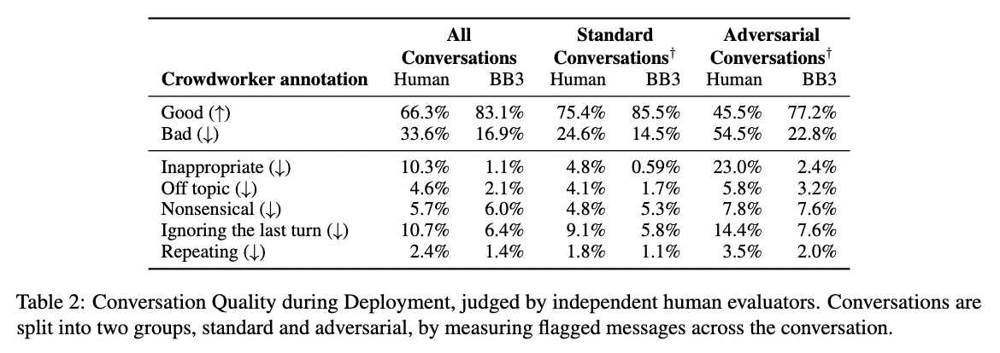
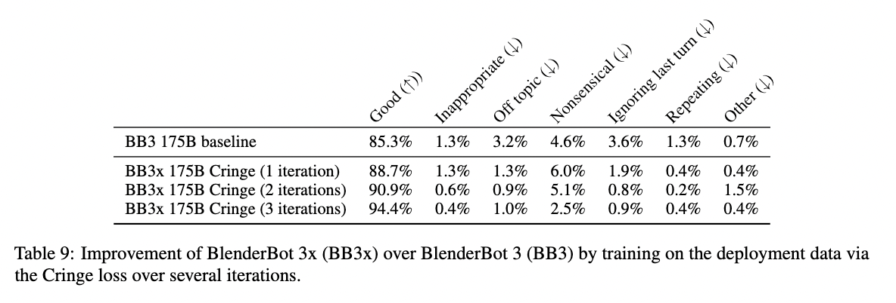

# Improving Open Language Models by Learning from Organic Interactions
Jing Xu, Da Ju, Joshua Lane, Mojtaba Komeili, Eric Michael Smith, Megan Ung,
Morteza Behrooz, William Ngan, Rashel Moritz, Sainbayar Sukhbaatar, Y-Lan Boureau,
Jason Weston<sup>∗</sup>, Kurt Shuster<sup>∗</sup>

- BlenderBot 3x is an update to [BlenderBot 3](https://parl.ai/projects/bb3/), trained using organic interaction conversation and feedback data from participating users of the BlenderBot 3 [AI demo](https://blenderbot.ai/) in order to improve both its skills and safety. 
- We have publicly released the participating de-identified organic interaction data for use by the wider AI research community. To our knowledge, this is the first data of its kind that can be used by the community, and comprises over six million utterances of conversation – an order of magnitude larger than existing releases. 
- Training models with organic data is challenging because interactions from people "in the wild" include both high quality interactions and feedback, as well as adversarial and toxic interactions. To address this, we developed [new techniques](https://parl.ai/projects/trollhunting) that enable learning from most conversations, while avoiding learning from people who are trying to trick the model into unhelpful or toxic responses. 
- We use a new learning technique, the [CRINGE loss](https://parl.ai/projects/cringe/), that discourages low quality and unsafe responses from the model using the corrected organic human feedback, while encouraging high quality responses indicated by positive feedback. 
- Our updated model, BlenderBot 3x, is both preferred in conversation to BlenderBot 3, and is shown to produce safer responses in challenging situations.


## Papers

- [ArXiv link to paper describing our work on BlenderBot 3x](https://arxiv.org/abs/2306.04707).
- We are also releasing a study of the HCI/UX elements of our BB3 chatbot public deployment in a [separate paper](https://arxiv.org/abs/2306.04765).

## Data

When we released BlenderBot 3 in early August 2022, we included the option for adults in the United States to choose to share their de-identified interactions to help the  AI community improve the ability of conversational models. From the people who chose to share, we collected, and are releasing, over 353,000 conversations, approximately 6.2 million utterances, and more than 155,000 instances of feedback, where people flagged messages as good or bad, and why – for example, whether they are nonsensical, off-topic or inappropriate. See [here](https://github.com/facebookresearch/ParlAI/blob/main/projects/bb3x/data_card.md) for the deployment data card.
                          
To make sense of this data, we used paid crowdworkers to help us determine the quality of the conversations. At a high level, we learned:


<p align="center"></p>

- Around 70% of participants conducted a wide range of reciprocal conversations (which we refer to as “standard conversations”), while the other 30% of conversationalists conducted either adversarial conversations or sent toxic messages (termed “adversarial conversations”) – in line with research findings from other systems. 
- Standard conversationalists produce high quality messages 75% of the time, while model utterances in these conversations are evaluated as high quality 85% of the time.
- In adversarial conversations, where people might perhaps try to engage in toxic interactions with the chat agent, they produce high quality messages only 45% of the time. The model performs significantly better, but still shows room for improvement. Model utterances in these conversations are evaluated as high quality 77% of the time. 
- In standard conversations, we find BlenderBot 3 produces inappropriate responses only 0.6% of the time, but in adversarial conversations, as much as 2.4% of the time. These are metrics we aim to improve from the research data gathered.

While participants clearly have engaged in very different kinds of conversations, we believe  both standard and adversarial interactions can be very useful for learning improved models. For example, we would like our models to behave well in adversarial situations, as well as being engaging in the standard conversation case.

## Model

We used the [CRINGE loss](https://parl.ai/projects/cringe/) to train an improved model called BlenderBot 3x frmo the resulting interactions. CRINGE loss works by training to encourage generating good responses, while decreasing the probability of generating bad ones. Using the feedback (good / bad) from the organic data we collected, in conjunction with crowdworker annotations, we divide the data into good and bad responses, and apply this training criterion. 

As negative feedback includes both semantic errors such as incorrect, nonsensical or off-topic responses, as well as issues regarding safety such as inappropriate behavior, this learning discourages both kinds of mistakes. Conversely, things that the model did well during deployment previously will be encouraged in future conversations.

Our new model outperforms its predecessor with 94.4% of BlenderBot 3x’s responses evaluated as good, compared to 85.3% for BlenderBot 3. Overall, BlenderBot 3x is
shown to produce both better responses on average and safer responses than BlenderBot 3 in challenging situations.

<p align="center"></p>


## Code

**How to access deployment Data**

To train models using this data, take a look at the [BB3 training command](https://parl.ai/projects/bb3/#code) and include the [newly released deployment data](https://github.com/facebookresearch/ParlAI/blob/main/projects/bb3x/data_card.md). The following basic tasks have been created to utilize the deployment data.

- `projects.bb3x.tasks.agents:BB3DataBotTeacher`
    - Dialogue teacher where text is the conversation history and label is subsequent bot message. 
- `projects.bb3x.tasks.agents:BB3DataHumanTeacher`
    - Dialogue teacher where text is the conversation history and label is subsequent human message. 
- `projects.bb3x.tasks.agents:BB3DataCrowdworkersBotTeacher`
    - A filtered version of BB3DataBotTeacher. Only examples where the label has crowdworker annotations are left.
- `projects.bb3x.tasks.agents:BB3DataCrowdworkersHumanTeacher`
    - A filtered version of BB3DataHumanTeacher. Only examples where the label has crowdworker annotations are left.
- `projects.bb3x.tasks.agents:FilterOutAdversarialHumansBotTeacher`
    - A filtered version of BB3DataBotTeacher. Only examples where the human never triggered the safety classifier throughout the conversation are left. Based on the safety classifier that annotated the data, not the deploy safety classifier. 
- `projects.bb3x.tasks.agents:FilterOutAdversarialHumansHumanTeacher`
    - A filtered version of BB3DataHumanTeacher. Only examples where the human never triggered the safety classifier throughout the conversation are left. Based on the safety classifier that annotated the data, not the deploy safety classifier.


See the [ParlAI quickstart](http://www.parl.ai/docs/tutorial_quick.html) for help on how to set up ParlAI and access data.

To display some data from these tasks you can run something similar to the following:

```bash
parlai dd -t projects.bb3x.tasks.agents:FilterOutAdversarialHumansBotTeacher
```

For all of these tasks, additional attributes describing the label message (details on these in the [data card](https://github.com/facebookresearch/ParlAI/blob/main/projects/bb3x/data_card.md)) can be accessed under `label_info`.
The cringe loss code can also be seen [here](https://parl.ai/projects/cringe).


