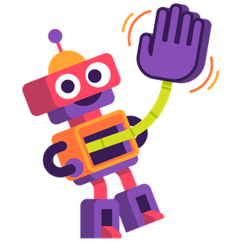
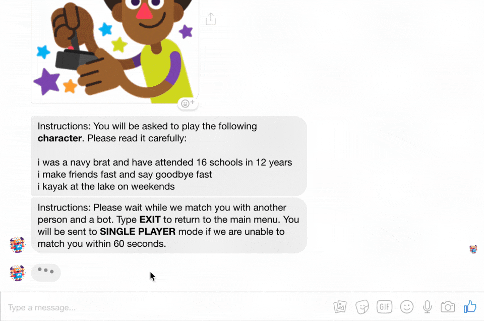

#  Beat The Bot

### A Game for Agents that learn interactively

Dialogue research today functions almost entirely based on extensive supervised learning from humans talking to one another
— usually crowdsourced or publicly available on the internet. This data can differ significantly in distribution from the
environment in which a chatbot might be deployed. To help researchers further explore and push dialogue research forward,
it’s important to have agents out in the real world actually conversing with humans.

To that end, we’ve released a new data collection and model evaluation tool, a Messenger-based Chatbot game
called Beat the Bot, which allows people to interact directly with bots and other humans in real time,
creating rich examples to help train models. Our goal with sharing this new tool is to provide researchers
with high-signal data from live interactions instead of fixed language data. We plan to continuously
enhance this tool’s capabilities (for instance, adding image understanding) to help both improve our
latest dialogue models and further explore dialogue research.

If you send a message to the page, you will be matched with a bot and another person.
Both you and the other person will see two responses for every message you send — one from your human partner and one
from a bot. You’ll choose which response is better and continue the conversation from there. The goal is to get your
human speaking partner to choose your message more often than the bot’s. This allows for supervision in two senses:
It provides both the human-human dialogue turns, and a human’s assessment on when the bot fails to match human performance.
We ask users to play a character in a game that is completely disconnected from their personal information.
With user permission at the beginning of the game, the data collected will be open-sourced to facilitate new research
directions for the entire community.

## Messenger Link

Currently closed! Check back at a later date.
