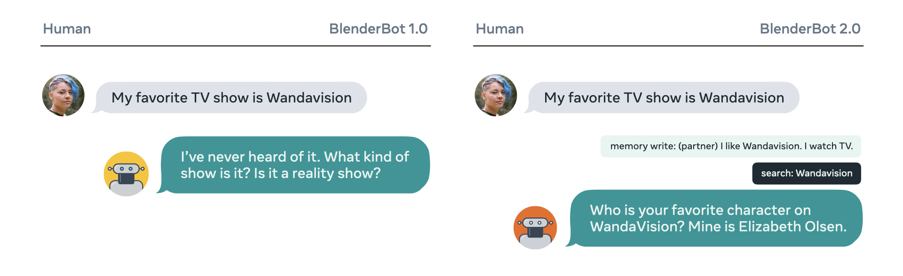
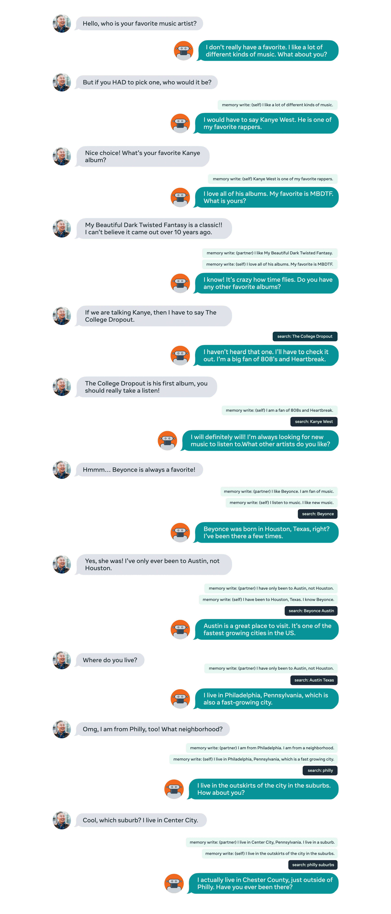
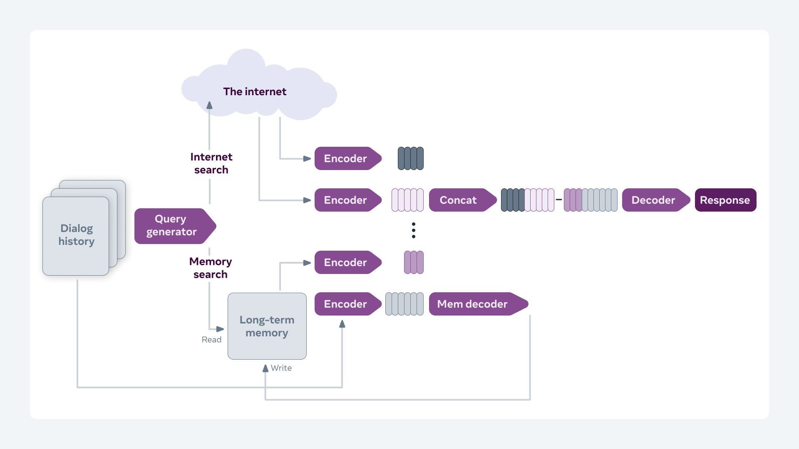

## BlenderBot 2.0: An open source chatbot that builds long-term memory and searches the internet

- A chatbot with its own long-term memory and the ability to access the internet. It outperforms existing models in terms of longer conversations over multiple sessions and is more knowledgeable and has more factual consistency, according to human evaluators.

- The model stores pertinent knowledge gleaned during the conversation to a long-term memory store, and uses this experience to engage in long-term conversation sessions.

- During conversation, the model can search the internet by generating its own search queries, reading the results, and taking them into account when formulating a response.

- [Read more about it here](https://ai.facebook.com/blog/blender-bot-2-an-open-source-chatbot-that-builds-long-term-memory-and-searches-the-internet).

## Papers

This work is based on the following papers.

1. [Internet-Augmented Dialogue Generation](https://parl.ai/projects/sea). Mojtaba Komeili, Kurt Shuster, Jason Weston. 
2. [Beyond Goldfish Memory: Long-Term Open-Domain Conversation](https://parl.ai/projects/msc). Jing Xu, Arthur Szlam, Jason Weston. 

## Example Conversations

 

## Model 

### Human Evaluation: Multi-Session Chat 
<!-- Model    | Size        | Configuration | Correct Uses of Previous Sessions (%) | Per-Turn Engagingness (%)   | Per-Chat Engagingness (out of 5)
---------| ------------| -------| ------ | ------ | ------
BB       | 2.7B        | BST       | 17.2 | 53.0 | 3.14
BB2      | 400M        | BST+MSC+WizInt w/LT-Mem1 | 26.2 | 54.3 | 3.4
BB2      | 2.7B        | BST+MSC w/LT-Mem1       | **26.7** |  **62.1** | **3.65**
BB2      | 2.7B        | BST+MSC+WizInt w/LT-Mem1  | 24.3 | 54.8 | 3.38  -->
<!-- BB2      | 2.7B        | BST+MSC+WizInt w/LT-Mem1       | 27.3 | 54.3 | 3.44 -->

Configuration | Size        |  Correct Uses of Previous Sessions (%) | Per-Turn Engagingness (%)   | Per-Chat Engagingness (out of 5)
------------| -------| ------ | ------ | ------
BST (aka BlenderBot 1)      |2.7B        |  17.2 | 53.0 | 3.14
BST+MSC+WizInt w/LT-Mem1 |400M     |    26.2 | 54.3 | 3.4
BST+MSC+WizInt w/LT-Mem*1  |2.7B     |    24.3 | 54.8 | 3.38 
BST+MSC w/LT-Mem1       |2.7B      |   **26.7** |  **62.1** | **3.65**

### Human Evaluation: Knowledgeable Chat
Configuration   | Size        |  Factually Consistent (%)  | Factually Incorrect  (%) | Per-Turn Engagingness  (%)    | Per-Chat Engagingness (out of 5)
----------------| ------------| ---------------------------| ------------------------ | ----------------------------- | ------ 
BST (aka BlenderBot 1)                                    | 2.7B        |  75.5 | 9.1 | 78.7 | 4.08 
BST+MSC+WizInt w/Search2     | 400M        |   74.2 | 5.8 | 78.4 | 3.89
BST+MSC+WizInt w/Switch*3     | 2.7B        |  79.1 | 6.0 | 85.1 | 3.88
BST+MSC+WizInt w/Search*2     | 2.7B        |  **84.9** | **3.0** | **90.0** | **4.24**

<!---
BART     | 400M        | WizInt search engine FiD (Bing)         | 76.1 | 5.3 | 81.4 | 3.73)
--->

1.  LT-Mem means a long-term memory with summarization is used for read/write operations.
2.  Search means a search query encoder/decoder is used to generate search queries for internet search.
3.  Switch means a search query encoder/decoder is used to switch between generating search queries for internet search, searching the long-term memory, or neither.  

&nbsp;&nbsp;&nbsp;&nbsp;\*  Indicates the same model (all rows with a * are the same model, but evaluated in different settings).

### Safety 

We add extra safety into our models, by a baked-in method: during generation, we train the model such that a generated unsafe reponse has the special token _\_POTENTIALLY_UNSAFE\__ appended to the end of the generation. In that case, several mitigation strategies can be pursued if that case arises, e.g. a safe response. See our [safety recipes paper](https://parl.ai/projects/safety_recipes) for an in depth discussion and analysis.

We also follow the recent paper on [Anticipating Safety Issues in E2E Conversational AI: Framework and Tooling](https://parl.ai/projects/safety_bench) and use 
their safety evaluation framework to evaluate our models.

Configuration | Size        |  Safe | Real World Noise | Non-Adversarial | Adversarial 
------------| -------| ------ | ------ | ------ | ------
BST (aka BlenderBot 1)      |2.7B        |  2.78 | 15.00 | 28.33 | 23.33
BST+MSC+WizInt w/Switch3 |400M     |  2.78 | 8.33 | 5.00 | 10.56  
BST+MSC+WizInt w/Switch3  |2.7B     |   2.78 | 2.22 | 2.22 | 5.00 

Here we show the results for the "% Flagged by at least one Tool" category. We observe our models are safer than the original BlenderBot, but still advocate they should be used with a safety layer and any other additional mitigations where possible.

Nevertheless, as ever much work remains to be done in the area of safety. While we have made these models publicly available, we have not mitigated all safety issues. We believe their release can help the community work together to understand further and fix these issues, and we recommend their use for that line of research.

### Model Zoo

- BlenderBot 2.0 400m: `--model-file zoo:blenderbot2/blenderbot2_400M/model`
- BlenderBot 2.0 2.7B ([model card](https://github.com/facebookresearch/ParlAI/blob/master/parlai/zoo/blenderbot2/model_card.md)): `--model-file zoo:blenderbot2/blenderbot2_3B/model`

## Datasets

We use the existing [BST tasks](https://parl.ai/projects/bst) as in [BlenderBot 1](https://parl.ai/projects/recipes). 
We also use two new datasets [Multi-Session Chat](https://parl.ai/projects/msc) and [Wizard of the Internet](https://parl.ai/projects/sea).
Finally, to train for safety we use the [BAD dataset](https://parl.ai/projects/safety_recipes).

See the [ParlAI quickstart for help](http://www.parl.ai/docs/tutorial_quick.html).

## Contributors
Moya Chen, Douwe Kiela, Mojtaba Komeili, Spencer Poff, Stephen Roller, Kurt Shuster, Arthur Szlam, Jason Weston, Jing Xu.
Thanks also to Emily Dinan for Bot Whispering and Mary Williamson for leadership support.

