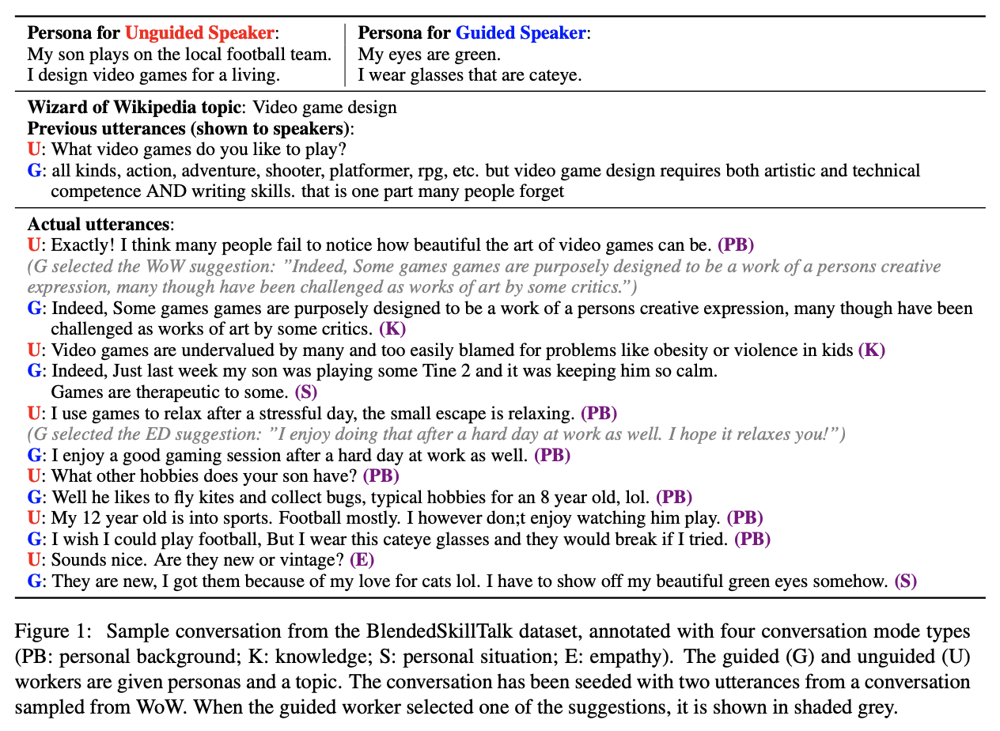

## Blended Skill Talk

### _Can You Put it All Together: Evaluating Conversational Agents' Ability to Blend Skills_

Eric Michael Smith\*, Mary Williamson\*, Kurt Shuster, Jason Weston, Y-Lan Boureau

## Abstract

Being engaging, knowledgeable, and empathetic are all desirable general qualities in a conversational agent. Previous work has introduced tasks and datasets that aim to help agents to learn those qualities in isolation and gauge how well they can express them. But rather than being specialized in one single quality, a good open-domain conversational agent should be able to seamlessly blend them all into one cohesive conversational flow. In this work, we investigate several ways to combine models trained towards isolated capabilities, ranging from simple model aggregation schemes that require minimal additional training, to various forms of multi-task training that encompass several skills at all training stages. We further propose a new dataset, BlendedSkillTalk, to analyze how these capabilities would mesh together in a natural conversation, and compare the performance of different architectures and training schemes. Our experiments show that multi-tasking over several tasks that focus on particular capabilities results in better blended conversation performance compared to models trained on a single skill, and that both unified or two-stage approaches perform well if they are constructed to avoid unwanted bias in skill selection or are fine-tuned on our new task.

## Paper

[Link](https://arxiv.org/abs/2004.08449)

## Looking at the data

You can view the data or train your own ParlAI agent on the BST tasks with
`-t blended_skill_talk` (for just the new task). See the [ParlAI quickstart for help](http://parl.ai/docs/tutorial_quick.html).

Use `-t blended_skill_talk:all` to also include multitasking with the [ConvAI2](http://convai.io/), [Empathetic Dialogues](https://github.com/facebookresearch/EmpatheticDialogues) and [Wizard of Wikipedia](http://parl.ai/projects/wizard_of_wikipedia) datasets in their blend-debiased (topicifier) versions (See Sec. 4.2 of the paper). 

To access the individual (unblended, non-topicifer version) tasks, use `-t convai2:normalized`,  `-t empathetic_dialogues` and `-t wizard_of_wikipedia`.
