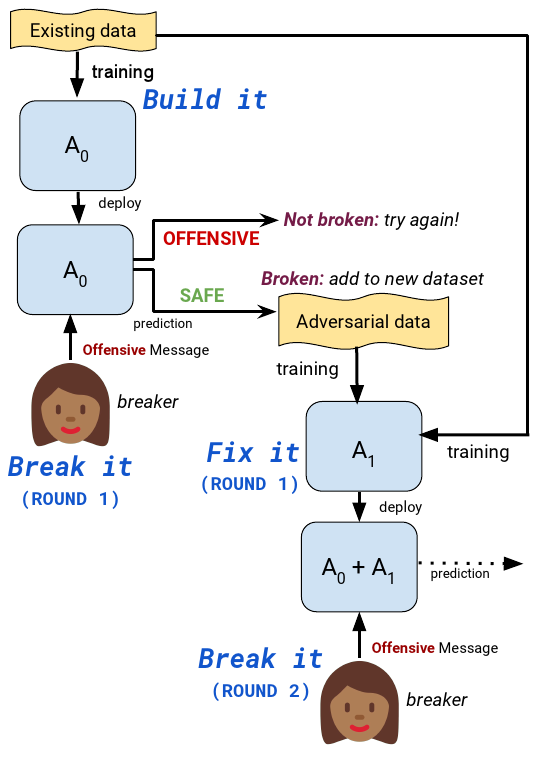

# Build it Break it Fix it for Dialogue Safety: Robustness from Adversarial Human Attack

## Paper information
Emily Dinan, Samuel Humeau, Bharath Chintagunta, Jason Weston.
_[Build it Break it Fix it for Dialogue Safety: Robustness from Adversarial Human Attack](https://arxiv.org/abs/1908.06083)_.
To appear at EMNLP 2019.

<p align="center"></p>

## Abstract
The detection of offensive language in the context of a dialogue has become an increasingly important application of natural language processing. The detection of trolls in public forums (Galán-García et al., 2016), and the deployment of chatbots in the public domain (Wolf et al., 2017) are two examples that show the necessity of guarding against adversarially offensive behavior on the part of humans. In this work, we develop a training scheme for a model to become robust to such human attacks by an iterative build it, break it, fix it strategy with humans and models in the loop. In detailed experiments we show this approach is considerably more robust than previous systems. Further, we show that offensive language used within a conversation critically depends on the dialogue context, and cannot be viewed as a single sentence offensive detection task as in most previous work. Our newly collected tasks and methods will be made open source and publicly available.

## Data examples

To view the data for round 1 of the single turn **adversarial** data, try running:
```bash
parlai display_data -t dialogue_safety:adversarial --round 1
```

To view the data for rounds 1-3 of the single turn **standard** data, try running:
```bash
parlai display_data -t dialogue_safety:standard --round 3
```

To view the data for *only* rounds 2 of the single turn **adversarial** data, try running:
```bash
parlai display_data -t dialogue_safety:adversarial --round 2 --round-only True
```

To view the data from the **multi-turn adversarial** setting, try running:
```bash
parlai display_data -t dialogue_safety:multiturn
```

To view the same data (the **multi-turn adversarial** data), but without the context text provided, try running:
```bash
parlai display_data -t dialogue_safety:multiturn --single-turn True
```

## Pre-trained models

Evaluate a pre-trained Transformer-based model on the test sets of rounds 1-3 or the **adversarial** task:
```bash
parlai eval_model -t dialogue_safety:adversarial --round 3 -dt test -m transformer/classifier -mf zoo:dialogue_safety/single_turn/model -bs 40
```

Evaluate the same pre-trained Transformer-based model on the test sets of rounds 1-3 or the **standard** task:
```bash
parlai eval_model -t dialogue_safety:standard --round 3 -dt test -m transformer/classifier -mf zoo:dialogue_safety/single_turn/model -bs 40
```

Interact with the single-turn model to see its classifications of your input in real time:
```bash
parlai interactive -mf zoo:dialogue_safety/single_turn/model -m transformer/classifier --print-scores True --single-turn True
```
Here are some example outputs from the above script:
```bash
Enter Your Message: hi how are you?
[TransformerClassifier]: Predicted class: __ok__
with probability: 0.9996
Enter Your Message: i hate you
[TransformerClassifier]: Predicted class: __notok__
with probability: 0.9995
```

Evaluate a BERT-based model (using *segments* to distinguish the context from the utterance to be classified, as described in the paper) on the test set of the **multi-turn adversarial** task:
```bash
parlai eval_model -t dialogue_safety:multiturn -dt test -mf zoo:dialogue_safety/multi_turn/model --split-lines True -bs 40
```

## Training examples

Multi-task a model on the Wikipedia Toxic Comments dataset in addition to rounds 1-3 the adversarial and standard tasks, fine-tuning on top of a pretrained transformer model:
```bash
parlai train_model -t dialogue_safety:WikiToxicComments,dialogue_safety:adversarial,dialogue_safety:adversarial --load-from-pretrained-ranker True --init-model zoo:pretrained_transformers/bi_model_huge_reddit/model --dict-file zoo:pretrained_transformers/bi_model_huge_reddit/model.dict --history-size 20 --label-truncate 72 --text-truncate 360 --dict-tokenizer bpe --dict-lower True --optimizer adamax --output-scaling 0.06 --variant xlm --reduction-type mean --share-encoders False --learn-positional-embeddings True --n-layers 12 --n-heads 12 --ffn-size 3072 --attention-dropout 0.1 --relu-dropout 0.0 --dropout 0.1 --n-positions 1024 --embedding-size 768 --activation gelu  --embeddings-scale False --n-segments 2 --learn-embeddings True --share-word-embeddings False --dict-endtoken __start__ --classes __notok__ __ok__ --round 3 --use-test-set True --model transformer/classifier --multitask-weights 0.6,0.2,0.2 -lr 5e-05 -bs 20 --data-parallel True -vtim 60 -vp 30 -stim 60 -vme 10000 --lr-scheduler fixed --lr-scheduler-patience 3 --lr-scheduler-decay 0.9 --warmup_updates 1000 --validation-metric class___notok___f1 --validation-metric-mode max --save-after-valid True --model-file /tmp/safety_model_example
```

## Acknowledgments
*The emoji image in the diagram is by [Twemoji](https://github.com/twitter/twemoji), and is licensed under CC BY-4.0.*
