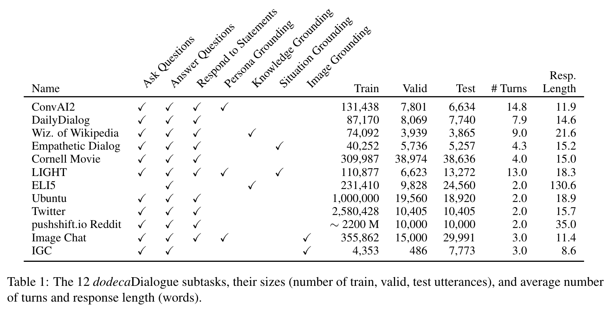
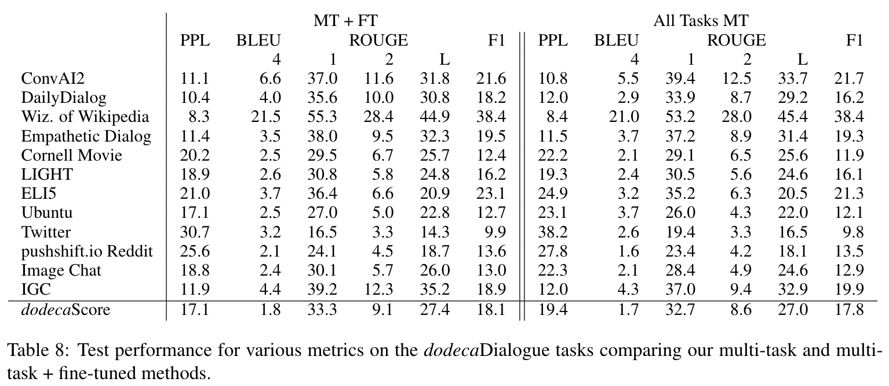
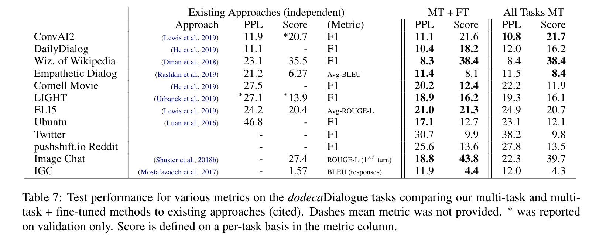
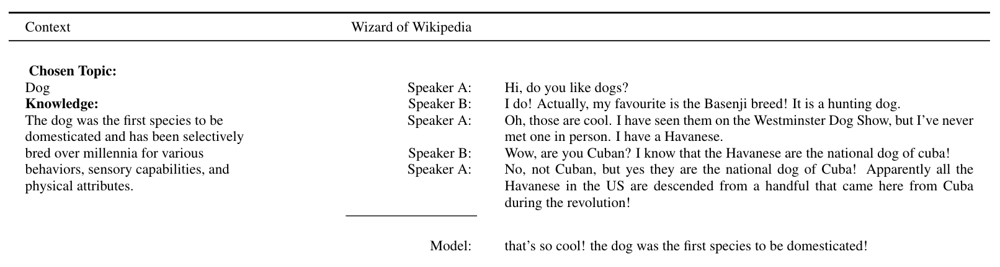
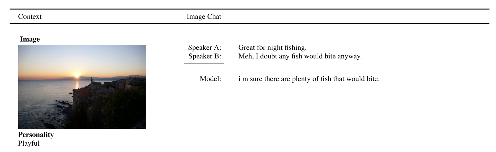

## The Dialogue Dodecathlon

### _Open-Domain Knowledge and Image Grounded Conversational Agents_

Kurt Shuster, Da Ju, Stephen Roller, Emily Dinan, Y-Lan Boureau, Jason Weston

## Abstract

We introduce  dodecaDialogue:  a set of 12 tasks which measure if a conversational agent can communicate
engagingly with personality and empathy, ask questions, answer questions by utilizing knowledge resources,
discuss topics and situations, and perceive and converse about images. By multi-tasking on such a broad
large-scale set of data we hope to both move towards and measure progress in producing a single unified agent
that can perceive, reason and converse with humans in an open-domain setting. We show that such multi-tasking
improves over a BERT pre-trained baseline, largely due to multi-tasking with very large dialogue datasets in
a similar domain, and that the multi-tasking in general provides gains to both text and image-based tasks using
several metrics in both the fine-tune and task transfer settings. We obtain state-of-the-art results on many
of the tasks, providing a strong baseline for this challenge.

## Paper

[Link](https://arxiv.org/abs/1911.03768)

## dodecaDialogue Subtasks

<p align="center"></p>

## Baseline Results

<p align="center"></p>

## Baseline Compared to Existing Approaches

<p align="center"></p>

## Model Examples

<p align="center"></p>

<p align="center"></p>

## Pretrained Models

We release 14 models via the [ParlAI Model Zoo](https://www.parl.ai/docs/zoo.html). 

- One model, `base_model`, contains model weights from pre-training on pushshift.io Reddit. 
- One model is the `all_tasks_mt` model, which was multi-task trained on all 12 dodecaDialogue tasks (starting from the `base_model` weights). 
- Twelve models are the `all_tasks_mt` model fine-tuned on each of the 12 dodecaDialogue tasks individually, and are named accordingly.

We provide a few commands below for using these models; for more details regarding all remaining models, please see the commands in the [ParlAI Model Zoo](https://www.parl.ai/docs/zoo.html)

### Chatting with a Model

You can chat with any of the 14 models by simply using our interactive script.

For example, to chat with the the `all_tasks_mt` model, simply run the following command:

```bash
parlai interactive -mf zoo:dodecadialogue/all_tasks_mt/model \
--inference beam --beam-size 3 --beam-min-length 10 --beam-block-ngram 3 --beam-context-block-ngram 3
```

You can play around with the beam-search parameters or even the `inference` parameter (`beam`, `nucleus`, etc.) for varied results.

### Evaluating a Pre-trained Model

You can also evaluate any of the pre-trained models on their respective tasks.

To evaluate the `all_tasks_mt` model on all of the provided dodecaDialogue tasks in ParlAI, simply run the following command:

```bash
parlai eval_model -mf zoo:dodecadialogue/all_tasks_mt/model -t "#Dodeca" \
--prepend-personality True --prepend-gold-knowledge True
```

### Training a Model from the Pre-trained Base Model

We currently host 10 of the 12 dodecaDialogue tasks in ParlAI, with plans to host all 12.

To train a pre-trained model on these tasks, simply run the following command:

```bash
parlai train_model -t "#Dodeca" --model image_seq2seq\
--prepend-gold-knowledge true --prepend-personality true \
-mf /tmp/dodeca_model --init-model zoo:dodecadialogue/base_model/model \
--dict-file zoo:dodecadialogue/dict/dodeca.dict --dict-tokenizer bpe --dict-lower true \
-bs 32 -eps 0.5 --betas 0.9,0.999 --warmup-updates 2000 --gradient-clip 0.1 --fp16 false \
-esz 512 --ffn-size 2048 --n-heads 16 --n-layers 8 --variant xlm --activation gelu \
--n-positions 512 --text-truncate 512 --label-truncate 128 \
\ -lr 7e-6 --lr-scheduler reduceonplateau --optimizer adamax --dropout 0.1 \
--validation-every-n-secs 3600 --validation-metric ppl --validation-metric-mode min \
--validation-patience 10  --embeddings-scale true --learn-positional-embeddings true \
```
