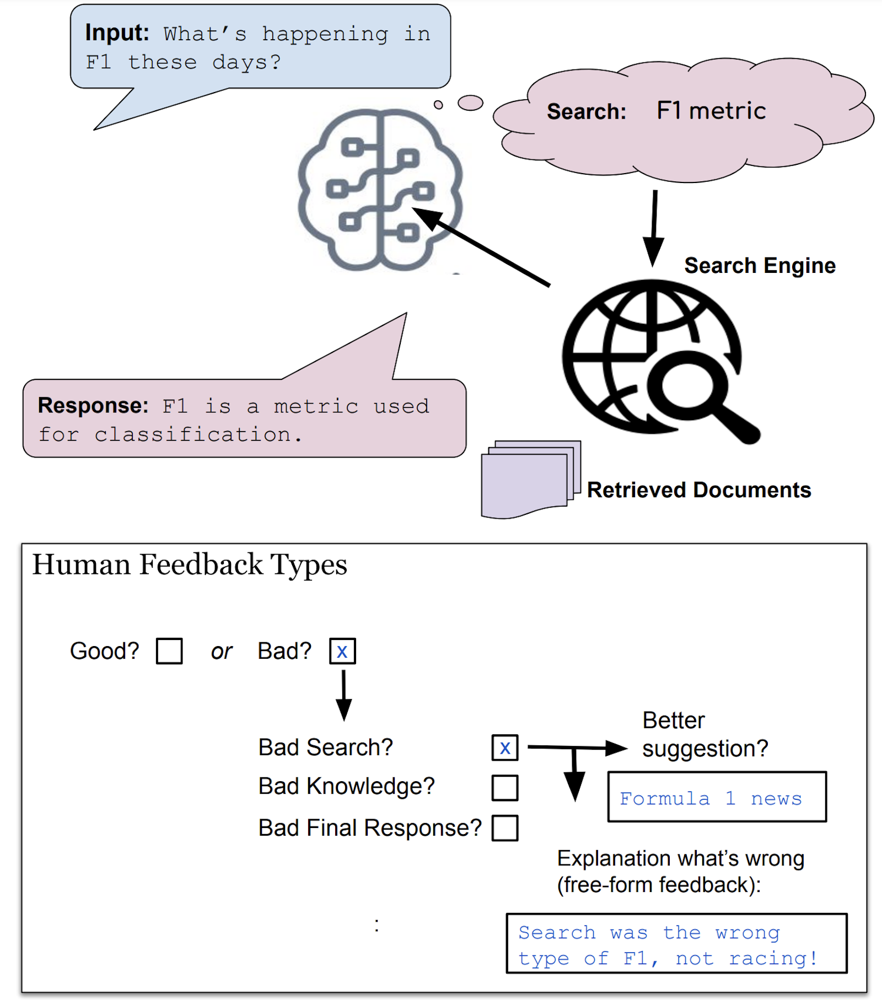

# Learning New Skills after Deployment: _Improving open-domain internet-driven dialogue with human feedback_

Jing Xu, Megan Ung, Mojtaba Komeili, Kushal Arora, Y-Lan Boureau, Jason Weston

## Abstract

Frozen models trained to mimic static datasets can never improve their performance. Models that can employ internet-retrieval for up-to-date information and obtain feedback from humans during deployment provide the promise of both adapting to new information, and improving their performance. In this work we study how to improve internet-driven conversational skills in such a learning framework. We collect deployment data, which we make publicly available, of human interactions, and collect various types of human feedback – including binary quality measurements, free-form text feedback, and fine-grained reasons for failure. We then study various algorithms for improving from such feedback, including standard supervised learning, rejection sampling, model-guiding and reward-based learning, in order to make recommendations on which type of feed- back and algorithms work best. We find the recently introduced DIRECTOR model (Arora et al., 2022) shows significant improvements over other existing approaches.


|  |
|:--:|
| **Using human feedback to improve open-domain internet-driven dialogue agents.** We compare various types of feedback (and corresponding learning algorithms) in this work, such as binary feedback (good/bad), free-form text or supervised responses (better suggestions) for different modules of the system.|


## Paper

[Link](https://github.com/facebookresearch/ParlAI/blob/main/projects/fits/fits_paper.pdf)


## Data

We release the Feedback for Interactive Talk & Search (FITS) task at `parlai/tasks/fits`.

To view the dialogue data, run:
```
parlai display_data -t fits
```

See the [ParlAI quickstart for help](http://www.parl.ai/docs/tutorial_quick.html).


## Models

- The model **BB2 3B + module supervision** can be downloaded and evaluated the following command:
```
parlai eval_model -mf zoo:fits/bb2_module_supervision/model --query-generator-model-file zoo:fits/bart_sq_gen/model -t fits -dt valid --search-server <SEARCH_SERVER>
```

- The model **BB2 3B + DIRECTOR module+binary feedback** can be downloaded and evaluated with the following command:
```
parlai eval_model -mf zoo:fits/director_bb2_module/model --knowledge-access-method search_only --query-generator-model-file zoo:fits/bart_sq_gen/model --model projects.fits.agents.director_bb2:DirectorBlenderBot2FidAgent -dt valid --rag-retriever-type search_engine --search-server <SEARCH_SERVER> --beam_block_full_context True --infer-mixing-weights 0.35
```

- The model **SeeKeR 3B + module supervision** can be downloaded and evaluated with the following command:
```
parlai eval_model --init-opt gen/seeker_dialogue -mf zoo:fits/seeker_module_supervision/model -t fits -dt valid --search-decision always  --search-server <SEARCH_SERVER>
```

- The model **SeeKeR 3B + DIRECTOR module+binary feedback** can be downloaded and evaluated with the following command:
```
parlai eval_model --init-opt gen/seeker_dialogue -mf zoo:fits/director_seeker_module/model  --model projects.fits.agents.director_seeker:DirectorSeekerAgent  -t fits --search-decision always --search-server <SEARCH_SERVER> --drm-infer-gamma 1.0 --drm-beam-size 10
```


## Human Evaluations

Human evaluations were performed using the Mephisto task (https://github.com/facebookresearch/ParlAI/tree/main/parlai/crowdsourcing/tasks/model_chat).

```
python /parlai/crowdsourcing/projects/fits/human_eval/run.py
```
