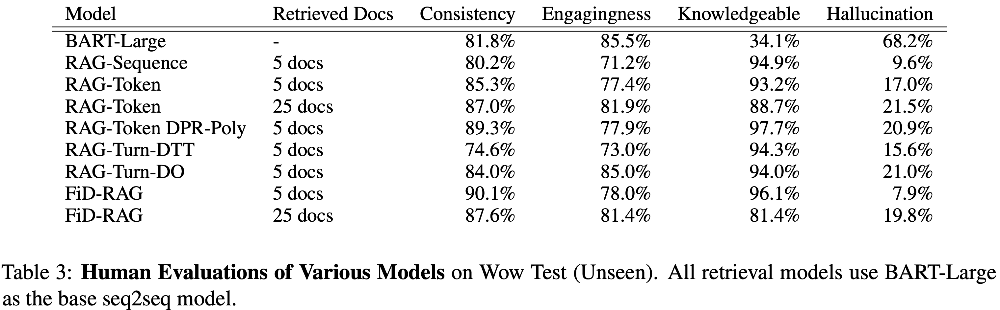
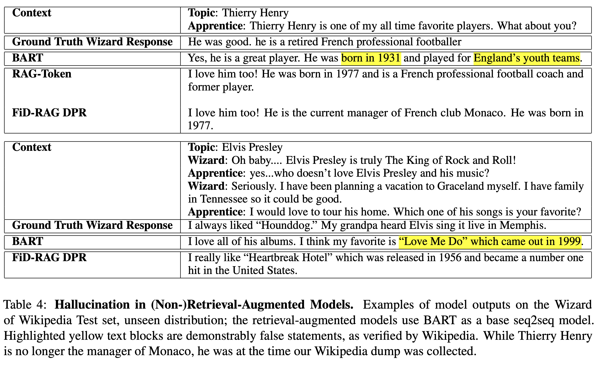

# Reducing Hallucination in Conversational Agents

### _Retrieval Augmentation Reduces Hallucination in Conversation_

Kurt Shuster, Spencer Poff, Moya Chen, Douwe Kiela\*, Jason Weston\*

\* Equal Contribution.

## Abstract

Despite showing increasingly human-like conversational abilities, state-of-the-art dialogue models often suffer from factual incorrectness and hallucination of knowledge (Roller et al., 2020). In this work we explore the use of neural-retrieval-in-the-loop architectures - recently shown to be effective in open-domain QA (Lewis et al., 2020b; Izacard and Grave, 2020) - for knowledge-grounded dialogue, a task that is arguably more challenging as it requires querying based on complex multi-turn dialogue context and generating conversationally coherent responses. We study various types of architectures with multiple components - retrievers, rankers, and encoder-decoders - with the goal of maximizing knowledgeability while retaining conversational ability. We demonstrate that our best models obtain state-of-the-art performance on two knowledge-grounded conversational tasks. The models exhibit open-domain conversational capabilities, generalize effectively to scenarios not within the training data, and, as verified by human evaluations, substantially reduce the well-known problem of knowledge hallucination in state-of-the-art chatbots.

## Paper

[Link to arXiv](https://arxiv.org/abs/2104.07567)

### Model Evaluations

### Example Model Outputs

## Tasks

### Wizard of Wikipedia (WoW)

You can access the [WoW](https://openreview.net/forum?id=r1l73iRqKm) dataset in ParlAI via the following:

    parlai dd --task wizard_of_wikipedia

### CMU Document Grounded Conversations (CMU_DoG)

You can access the [CMU_DoG](https://arxiv.org/abs/1809.07358) dataset in ParlAI via the following:

    parlai dd --task cmu_dog

To use the modified splits as described in the [paper](https://arxiv.org/abs/2104.07567), set the following flags for the seen/unseen splits, respectively:

    parlai dd --task cmu_dog --cmu-dog-split-type seen

    parlai dd --task cmu_dog --cmu-dog-split-type unseen --datatype test

## Pre-Trained Models

We provide the following 8 pre-trained models; each model, by default, uses a compressed FAISS Index for ease of use. We note the performance drop incurred by using the compressed index vs. the exact index, as well as the size and speed differences, in the table below. Note that the first three columns are with hotswapping indices with a model trained on an exact index; the fourth column measures performance when training specifically with a compressed index.

To interact with, or evaluate these models, you'll need at least 1 16gb GPU, as well as ~30 GB of RAM (as these models, by default, load the compressed indices).

### Interactive Mode

To use any of the models below, simply run the following command:

    parlai interactive -mf zoo_model_file

That's it!

### Performance as a function of index.

To specify the exact index, use `--indexer-type exact`; to specify the compressed index, use `--indexer-type compressed`. The compressed index has an important hyperparameter, `--compressed-indexer-nprobe`, that controls how exhaustive the search is within the index; the default is 64, but feel free to set higher (the maximum is 4096), bearing in mind that higher values yield slower searches.

Model | Exact Index | Compressed Index; 64 Centroids | Compressed Index; 128 Centroids | Trained on Compressed | Model Zoo File
------|------------------------:| ---------------------------------:| -------------: | ---------------------------------: | ---------------
**Size, GB** | 81 GB | 2.7 GB | 2.7 GB | 2.7 GB| |
BART RAG Token | 11.75 | 12.54 | 12.4 | 11.85 | zoo:hallucination/bart_rag_token/model |
BART RAG Sequence | 11.19 | 11.99 | 11.90 | | zoo:hallucination/bart_rag_sequence/model |
BART RAG Turn DTT | 11.87 | 12.51 | 12.45 | | zoo:hallucination/bart_rag_turn_dtt/model |
BART RAG Turn DO | 13.42 | 14.26 | 14.13 | | zoo:hallucination/bart_rag_turn_do/model |
BART RAG DPR Poly | 11.71 | 12.56 | 12.31 | | zoo:hallucination/bart_rag_dpr_poly/model |
BART FiD DPR | 14.34 | 14.68 | 14.64 | | zoo:hallucination/bart_fid_dpr/model |
BART FiD RAG | 11.59 | 12.64 | 12.37 | | zoo:hallucination/bart_fid_rag/model |
BART FiD RAG DPR Poly | 12.37 | 13.30 | 13.03 | | zoo:hallucination/bart_fid_rag_dpr_poly/model |

## Train your Own Models

The following commands demonstrate how to train some of the models above; we intentionally vary some options to demonstrate the flexibility of the methods. We note that the batchsizes specified below will work for 4x32gb GPUs; adjust them as needed for smaller storage. The default index in each of these is the compressed index from above.

#### Train a BART-Large RAG-Token model with DPR Retrieval on WoW

    parlai train_model --model rag --task wizard_of_wikipedia \
    --rag-model-type token --rag-retriever-type dpr --dpr-model-file zoo:hallucination/multiset_dpr/hf_bert_base.cp \
    --generation-model bart --init-opt arch/bart_large \
    --batchsize 16 --fp16 True --gradient-clip 0.1 --label-truncate 128 \
    --log-every-n-secs 30 --lr-scheduler reduceonplateau --lr-scheduler-patience 1 \
    --model-parallel True --optimizer adam --text-truncate 512 --truncate 512 \
    --learningrate 1e-05 --validation-metric-mode min --validation-every-n-epochs 0.25 \
    --validation-max-exs 1000 --validation-metric ppl --validation-patience 5 \
    --model-file /path/to/saved/model

#### Train a T5-Large RAG-Turn Doc-Then-Turn model with DPR Retrieval on WoW

    parlai train_model --model rag --task wizard_of_wikipedia \
    --rag-model-type turn --rag-turn-marginalize doc_then_turn --rag-retriever-type dpr \
    --generation-model t5 --t5-model-arch t5-large \
    --batchsize 8 --fp16 True --gradient-clip 0.1 --label-truncate 128 \
    --log-every-n-secs 30 --lr-scheduler reduceonplateau --lr-scheduler-patience 1 \
    --model-parallel True --optimizer adam --text-truncate 512 --truncate 512 \
    --learningrate 1e-05 --validation-metric-mode min --validation-every-n-epochs 0.25 \
    --validation-max-exs 1000 --validation-metric ppl --validation-patience 5 \
    --model-file /path/to/saved/model

#### Train a BlenderBot-2.7B RAG Sequence Model with DPR-Poly Retrieval on WoW

For the BlenderBot model, we add extra positions to the encoder, so that we can retain additional information from the retrieved documents.

    parlai train_model --model rag --task wizard_of_wikipedia \
    --rag-model-type turn --rag-turn-marginalize doc_then_turn --rag-retriever-type dpr \
    --generation-model transformer/generator --init-opt arch/blenderbot_3B \
    --n-extra-positions 128 \
    --init-model zoo:blender/blender_3B/model --dict-file zoo:blender/blender_3B/model.dict \
    --batchsize 8 --fp16 True --gradient-clip 0.1 \
    --log-every-n-secs 30 --lr-scheduler reduceonplateau --lr-scheduler-patience 1 \
    --model-parallel True --optimizer adam \
    --learningrate 1e-05 --validation-metric-mode min --validation-every-n-epochs 0.25 \
    --validation-max-exs 1000 --validation-metric ppl --validation-patience 5 \
    --model-file /path/to/saved/model

#### Train a BART-Large FiD Model, with a DPR Retriever initialized from a DPR Model trained with RAG.

This is the **BART FiD RAG** model specified above.

    parlai train_model --model fid --task wizard_of_wikipedia \
    --rag-retriever-type dpr --query-model bert_from_parlai_rag \
    --dpr-model-file zoo:hallucination/bart_rag_token/model \
    --generation-model bart --init-opt arch/bart_large \
    --batchsize 16 --fp16 True --gradient-clip 0.1 --label-truncate 128 \
    --log-every-n-secs 30 --lr-scheduler reduceonplateau --lr-scheduler-patience 1 \
    --model-parallel True --optimizer adam --text-truncate 512 --truncate 512 \
    --learningrate 1e-05 --validation-metric-mode min --validation-every-n-epochs 0.25 \
    --validation-max-exs 1000 --validation-metric ppl --validation-patience 5 \
    --model-file /path/to/saved/model

#### Train a T5-Base FiD Model, using a smaller index for debug purposes.

We provide a smaller FAISS index comprising ~3k documents, which encompasses all topics appearing in the Wizard of Wikipedia dataset.

    parlai train_model --model fid --task wizard_of_wikipedia \
    --rag-retriever-type dpr --query-model bert_from_parlai_rag \
    --dpr-model-file zoo:hallucination/bart_rag_token/model \
    --retriever-small-index exact \
    --generation-model t5 --t5-model-arch t5-base \
    --batchsize 16 --fp16 True --gradient-clip 0.1 --label-truncate 128 \
    --log-every-n-secs 30 --lr-scheduler reduceonplateau --lr-scheduler-patience 1 \
    --model-parallel True --optimizer adam --text-truncate 512 --truncate 512 \
    --learningrate 1e-05 --validation-metric-mode min --validation-every-n-epochs 0.25 \
    --validation-max-exs 1000 --validation-metric ppl --validation-patience 5 \
    --model-file /path/to/saved/model
