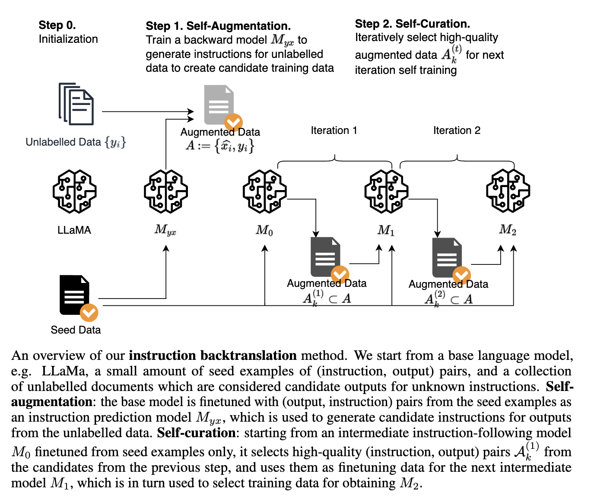
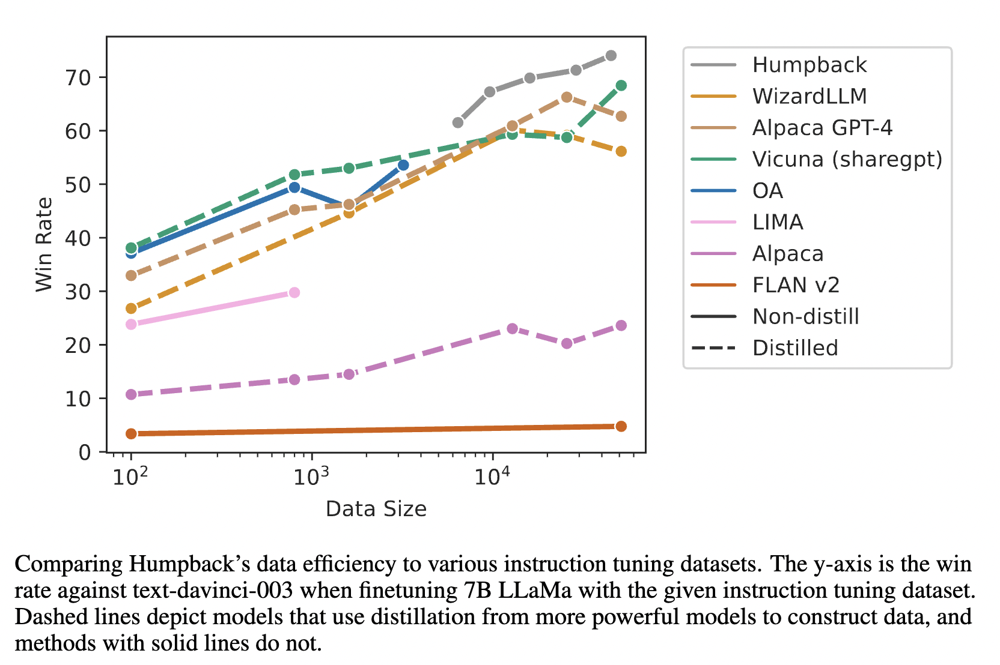
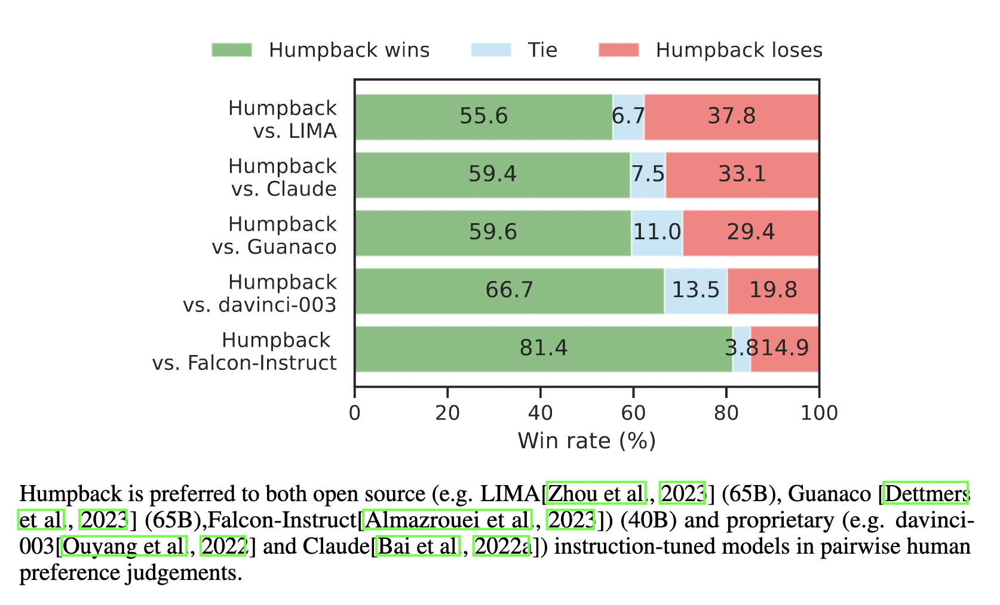
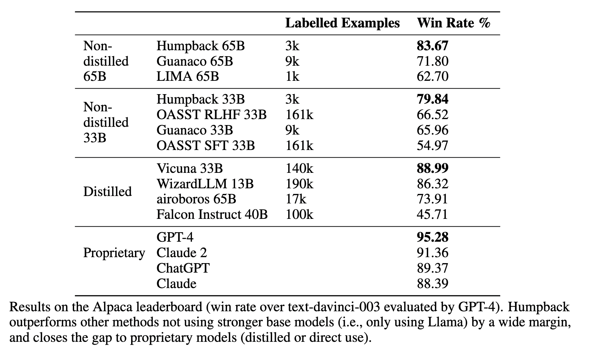
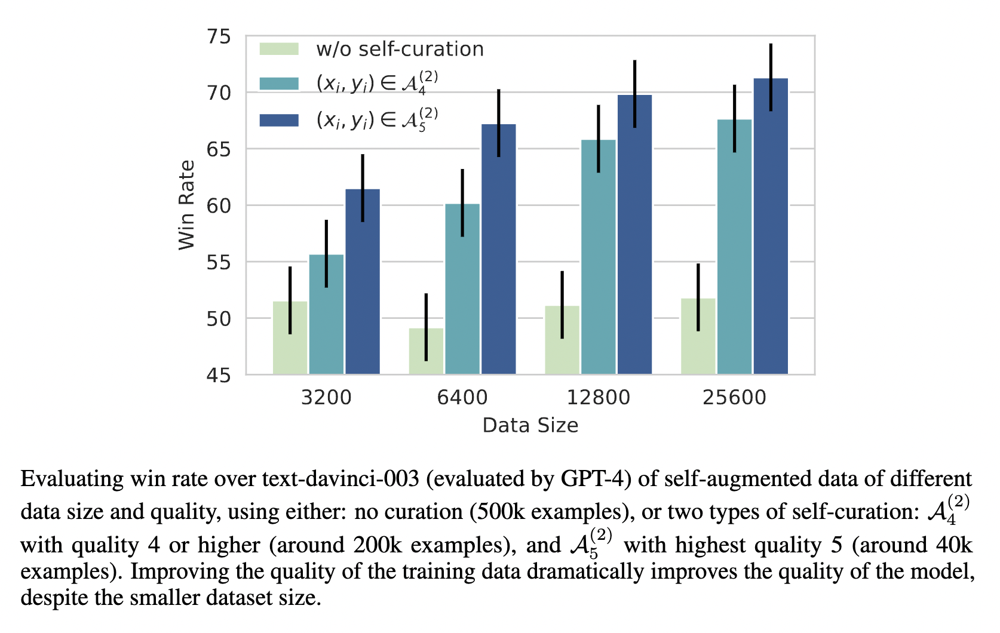

# Self-Alignment with Instruction Backtranslation
Xian Li, Ping Yu, Chunting Zhou, Timo Schick,
Luke Zettlemoyer, Omer Levy, Jason Weston, Mike Lewis

- We present a scalable method to build a high quality instruction following language model by automatically labelling human-written text with corresponding instructions. 
- Our approach, called _instruction backtranslation_, starts with a language model finetuned on a small amount of seed data, and a given web corpus.
- The seed model is used to construct training examples by generating instruction prompts for web documents (self-augmentation), and then selecting high quality examples
from among these candidates (self-curation). This data is then used to finetune a stronger model.
- Finetuning LLaMa on two iterations of our approach yields a model, _Humpback_, that outperforms all other LLaMa-based models on the Alpaca leaderboard not relying on distillation data, demonstrating highly effective self-alignment.

## Paper

- [ArXiv link to paper here](https://arxiv.org/abs/2308.06259).

## Motivation 

Aligning large language models (LLMs) to perform instruction following has become a (really!) important topic!
It typically requires finetuning on [large amounts of human-annotated instructions or preferences](https://ai.meta.com/llama/), which clearly is hard to scale.
Recent methods have shown that [distilling the outputs from more powerful models](https://crfm.stanford.edu/2023/03/13/alpaca.html) also works, but the more powerful models also rely on human annotations. Some of these datasets and models that are used are proprietary and the data is inaccessible.

We develop a method where LLMs can instead leverage large amounts of _unlabelled_ data to create their own instruction tuning dataset -- without the use
of distillation.
Recent work has shown that [the quality of training data is just as important as the quantity](https://arxiv.org/abs/2305.11206), and a key part of our method is its ability to excel in both dimensions.

## Instruction Backtranslation

Our approach, named _instruction backtranslation_, is inspired by the classic [_backtranslation_](https://aclanthology.org/W11-2138/) method from machine translation, in which human-written target sentences are automatically annotated with model-generated source sentences in another language to self-generate more translation data. 
We apply this idea to instruction following, with a few twists.

Our method starts with a language model finetuned on a small amount of seed (instruction, answer) data, and a given web corpus.

A __first key assumption__ is that there exists some
subset of this very large human-written text that would be suitable as gold generations for some user instructions. 

A __second key assumption__ is that we can predict instructions for these candidate gold
answers that can be used as high quality example pairs to train an instruction following model.

Instruction backtranslation thus consists of two steps:
- __self-augmention__: 
for each web document, it creates an instruction following training example by predicting a  prompt (instruction) that would be correctly answered by (a portion of) that document. In order to do that, the model is first fine-tuned with the seed instruction data flipped: given the _answer as input_,  predict the instruction.
This gives us a new instruction following training set to use that can be as large as the web corpus that was provided -- _potentially huge_ -- far larger than a human annotated dataset! 

- __self-curation__: Unfortunately, directly training on self-augmentation data gives poor results in our experiments, 
both because of the mixed quality of human written web text, and noise in the generated instructions.
To remedy this, we show that the same seed model can be used to filter
the set of newly created data by predicting their quality, resulting in a smaller but higher quality set. This is done using prompting, instructing
the trained model to rate the quality of a candidate pair on a 5-point scale, and keeping only those rated 5.

After completing the two steps, the model can then be trained on only the highest quality (instruction, answer) pairs, resulting in a better model.
It is actually then possible to iterate this process as the higher quality model is better at the self-alignment steps; in our experiments we do two iterations of self-curation and show this improves results further.

## Results

We used the base  LLaMA (1) model,  3200 examples from the Open Assistant dataset,  and
502k segments from the English portion of Clueweb corpus as the source of potential instruction answers.
After the self-curation step to retain only high-quality predictions (2 iterations), this results in around 42k new (instruction, answer pairs).
We then then fine-tune on this data and the seed data and call the resulting model _Humpback_.

### Strong data efficiency

We compare the win rate of Humpback (7B parameters) against using other training data sources, either distilled sources (dashed lines) or otherwise (solid lines), 
plotting against amount of training data. We find that our self-augmentation data actually outperforms a large variety of other sources thanks
to the self-curation data quality step, as we will show later.

### Head-to-head wins against other methods

We find Humpback (65B parameters) outperforms several existing systems head to head (human evaluation).

### Alpaca leaderboard results

On the [Alpaca leaderboard](https://tatsu-lab.github.io/alpaca_eval/),  Humpback (65B parameters), outperforms all other Llama-based models -- unless they use distillation from stronger base/instruction models.

### Self-curation data quality improves results

We can also see that the higher quality curated data provides a better model than using lower quality data. This is shown by comparing the
win rate against text-davinci-003 when finetuning a 7B LLaMa model in the experiments below.
Here, there are two choices of quality selecting rating "5"  or rating "4 or higher", where the higher quality (even though it is less data) is actually better.
Both self-curation choices outperform no self-curation at all (using just raw self-augmentation).

# Conclusion

We find that instruction backtranslation is a very promising method for self-alignment as shown in our experiments.
Using this method one can successfully increase training data size almost arbitrarily by using vast amounts of web (or other) data, at the cost of some inference compute,  whilst simultaneously maintaining high quality by using the self-curation step, obtaining the best of both worlds.

Future work could scale this method further, most obviously by using more unlabeled document data, and/or starting with improved base models and more seed data. 
Overall, we are excited that pushing further in this direction could provide even stronger self-aligned instruction following language models.
