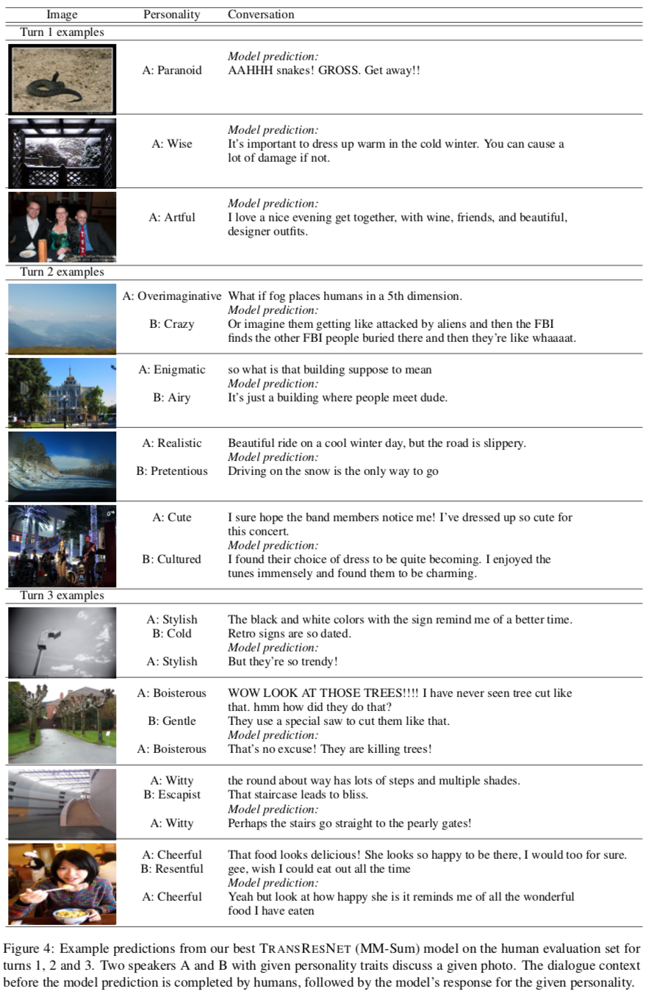

# Engaging Image Chat: Modeling Personality in Grounded Dialogue

Kurt Shuster, Samuel Humeau, Antoine Bordes, Jason Weston

Please see [Shuster et al. (2018)](https://arxiv.org/abs/1811.00945) for more details.

## Abstract

To achieve the long-term goal of machines being able to engage humans in conversation, our models should be engaging. We focus on communication grounded in images, whereby a dialogue is conducted based on a given photo, a setup that is naturally engaging to humans (Hu et al., 2014). We collect a large dataset of grounded human-human conversations, where humans are asked to play the role of a given personality, as the use of personality in conversation has also been shown to be engaging (Shuster et al., 2018). Our dataset, ImageChat, consists of 202k dialogues and 401k utterances over 202k images using 215 possible personality traits. We then design a set of natural architectures using state-of-the-art image and text representations, considering various ways to fuse the components. Automatic metrics and human evaluations show the efficacy of approach, in particular where our best performing model is preferred over human conversationalists 47.7% of the time.

## Dataset

The Image-Chat dataset can be accessed via ParlAI, with `-t image_chat`.

Additionally, the ParlAI MTurk tasks for data collection and human evaluation
are [available](https://github.com/facebookresearch/ParlAI/tree/main/parlai/mturk/README.md) in an older release of ParlAI (see the `image_chat` task).

## Leaderboards for Image-Chat Task

Model                                | Paper          | Test R@1
------------------------------------ | -------------- | --------
TransResNet MM-Sum, ResNeXt-IG-3.5B         | [Shuster et al. (2018)](https://arxiv.org/abs/1811.00945) | 50.3
TransResNet MM-Sum, ResNet152               | [Shuster et al. (2018)](https://arxiv.org/abs/1811.00945) | 40.6
TransResNet MM-Sum, No Images               | [Shuster et al. (2018)](https://arxiv.org/abs/1811.00945) | 35.4

## Pretrained Models

We provide our best model trained with ResNet152 image features. To evaluate the model, specify the following command:

      parlai eval_model \
          -bs 128 -t image_chat \
          -mf models:image_chat/transresnet_multimodal/model \
          --image-mode resnet152 \
          -dt test

Which yields the following results:

      {'exs': 29991, 'accuracy': 0.4032, 'f1': 0.4432, 'hits@1': 0.403, 'hits@5': 0.672, 'hits@10': 0.779, 'hits@100': 1.0, 'bleu': 0.3923,
      'first_round': {'hits@1/100': 0.3392, 'loss': -0.002001, 'med_rank': 3.0},
      'second_round': {'hits@1/100': 0.4558, 'loss': -0.002001, 'med_rank': 2.0},
      'third_round+': {'hits@1/100': 0.4147, 'loss': -0.002001, 'med_rank': 2.0}}

Additionally, we provide an interactive script that you can use to view outputs of our pretrained model. Simply run the following command:

      python projects/image_chat/interactive.py \
      -mf models:image_chat/transresnet_multimodal/model

## Model Examples

## Citation

If you use the dataset or models in your own work, please cite with the following BibText entry:

    @article{DBLP:journals/corr/abs-1811-00945,
    author    = {Kurt Shuster and
               Samuel Humeau and
               Antoine Bordes and
               Jason Weston},
    title     = {Engaging Image Chat: Modeling Personality in Grounded Dialogue},
    journal   = {CoRR},
    volume    = {abs/1811.00945},
    year      = {2018},
    url       = {http://arxiv.org/abs/1811.00945},
    archivePrefix = {arXiv},
    eprint    = {1811.00945},
    timestamp = {Thu, 22 Nov 2018 17:58:30 +0100},
    biburl    = {https://dblp.org/rec/bib/journals/corr/abs-1811-00945},
    bibsource = {dblp computer science bibliography, https://dblp.org}
    }
