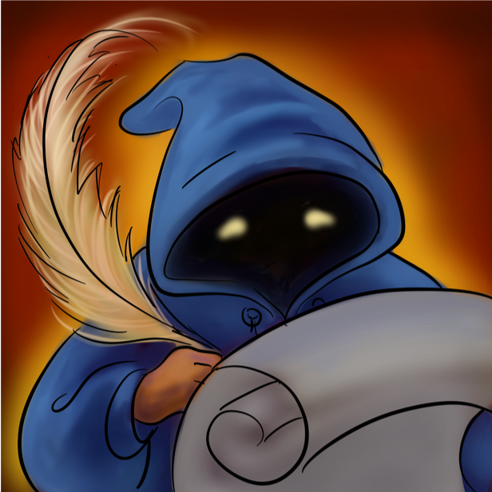
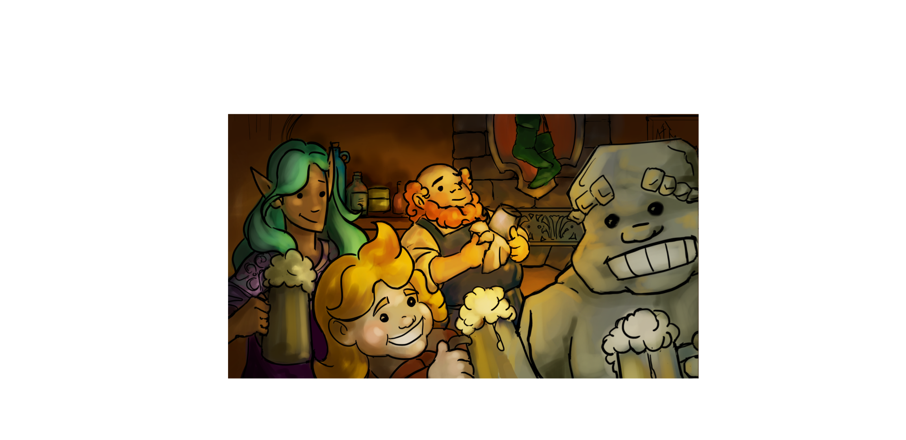
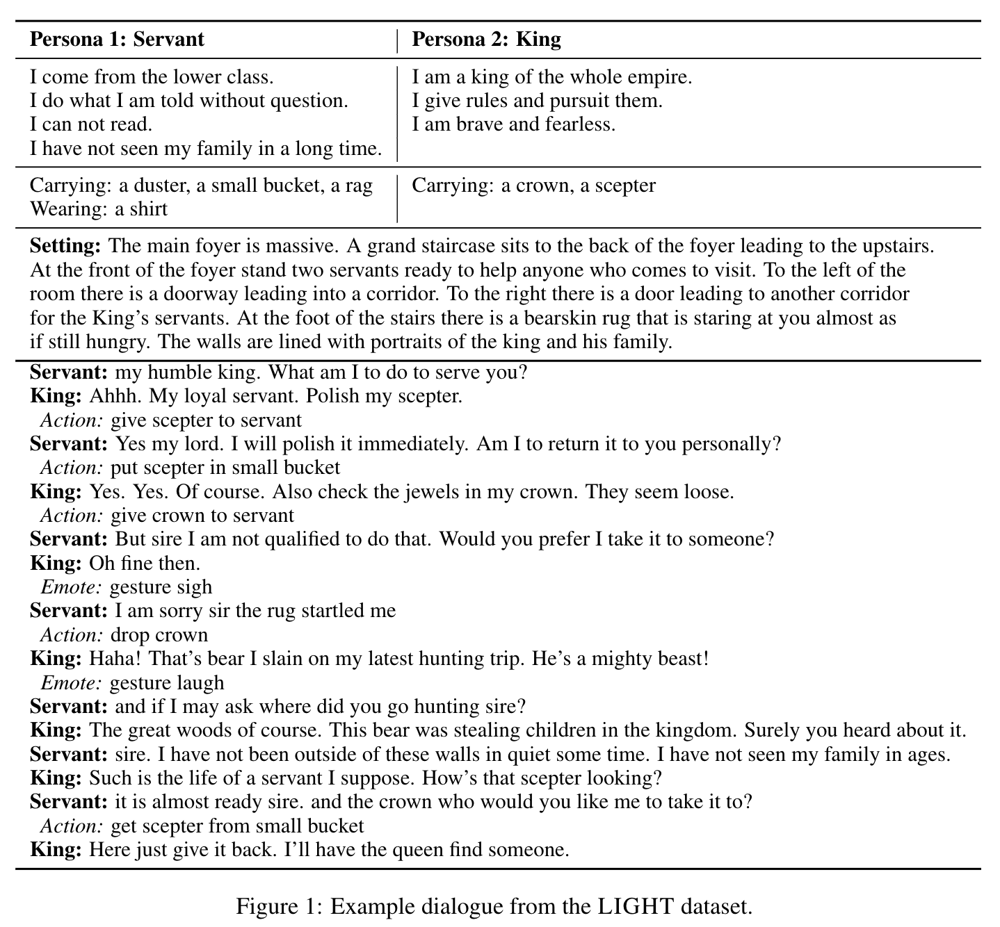

#  LIGHT

### Learning in Interactive Games with Humans and Text

The LIGHT project is a large-scale fantasy text adventure game research platform for training agents
that can both talk and act, interacting either with other models or with humans. 

## Abstract

We introduce a large-scale crowdsourced text adventure  game  as  a  research  platform for studying grounded dialogue.  In it, agents can both perceive,  emote and act whilst conducting
dialogue  with  other  agents;  models  and humans can both act as characters within the game. We describe the results of 
training state-of-the-art  generative  and  retrieval  models  in this setting. 
We show that in addition to using past dialogue, these models are able to effectively  use  the  state given  by  the
underlying world. In particular, we show that ground-ing on the details of the local environment,
including location descriptions  and  the  objects (and affordances of those objects) and characters
(and their previous actions) present within it allows better predictions of agent behavior and dialogue. 
We analyze the ingredients necessary for successful grounding in this setting, and how each of these factors
relate to agents that can talk and act successfully.

## Publications

_Original LIGHT paper_:

- **[Learning to Speak and Act in a Fantasy Text Adventure Game](https://arxiv.org/abs/1903.03094)**
Jack Urbanek, Angela Fan, Siddharth Karamcheti, Saachi Jain, Samuel Humeau, Emily Dinan, Tim Rocktäschel, Douwe Kiela, Arthur Szlam, Jason Weston. 

_ML to build the interactive world in LIGHT_:

- **[Generating Interactive Worlds with Text](https://arxiv.org/abs/1911.09194)**
Angela Fan, Jack Urbanek, Pratik Ringshia, Emily Dinan, Emma Qian, Siddharth Karamcheti, Shrimai Prabhumoye, Douwe Kiela, Tim Rocktaschel, Arthur Szlam, Jason Weston.

_RL agents in the LIGHT world to achieve open-domain goals_:

- **[I love your chain mail! Making knights smile in a fantasy game world: Open-domain goal-oriented dialogue agents](https://arxiv.org/abs/2002.02878)**
Shrimai Prabhumoye, Margaret Li, Jack Urbanek, Emily Dinan, Douwe Kiela, Jason Weston, Arthur Szlam.

_Addressing gender bias concerns in LIGHT_:

- **[Queens are Powerful too: Mitigating Gender Bias in Dialogue Generation](https://arxiv.org/abs/1911.03842)**
Emily Dinan, Angela Fan, Adina Williams, Jack Urbanek, Douwe Kiela, Jason Weston.

_Deploying the LIGHT game for lifelong learning of models_:

- **[Deploying Lifelong Open-Domain Dialogue Learning](https://arxiv.org/abs/2008.08076)**
Kurt Shuster, Jack Urbanek, Emily Dinan, Arthur Szlam, Jason Weston.

_Training situated RL agents on natural language LIGHT quests_:

- **[How to Motivate Your Dragon: Teaching Goal-driven Agents to Speak and Act in Fantasy Worlds](https://arxiv.org/abs/2010.00685)**
Prithviraj Ammanabrolu, Jack Urbanek, Margaret Li, Arthur Szlam, Tim Rocktaschel, Jason Weston.

## Datasets

The original LIGHT dataset features 663 locations, 3462 objects and 1755 character types,
described entirely in natural language. Within that game world, we collected 11,000 episodes of 
character interactions (talking and acting).

You can view the data or train your own ParlAI agent on the LIGHT tasks with
`-t light_dialog`. See the [ParlAI quickstart for help](http://parl.ai/docs/tutorial_quick.html).

An additional WILD dataset featuring 41,131 training episodes of dialogue from [deploying as a game](https://arxiv.org/abs/2008.08076)
is available, using:
`-t light_dialog_wild`. 

Data containing annotated quests used in How to Motivate Your Dragon can be found [here](http://parl.ai/downloads/light_project/quests/quest_stems.tar.gz), their completions are available as part of the WILD dataset above, and the ATOMIC-LIGHT dataset can be found [here](http://parl.ai/downloads/light_project/light_atomic/atomic_tuned.tar.gz).

## Pretrained Models

The BERT Bi-Ranker dialogue model is available e.g. via this command (which automatically downloads it):

    parlai eval_model -t light_dialog -mf models:light/biranker_dialogue/model

## Citation

If you use the dataset or models in your own work, please cite with the
following BibTex entry:

    @inproceedings{urbanek2019light,
      author={Jack Urbanek, Angela Fan, Siddharth Karamcheti, Saachi Jain, Samuel Humeau, Emily Dinan, Tim Rocktäschel, Douwe Kiela, Arthur Szlam, Jason Weston},
      title={Learning to Speak and Act in a Fantasy Text Adventure Game},
      journal={arXiv preprint arXiv:1903.03094},
      year={2019},
    }
    
 
