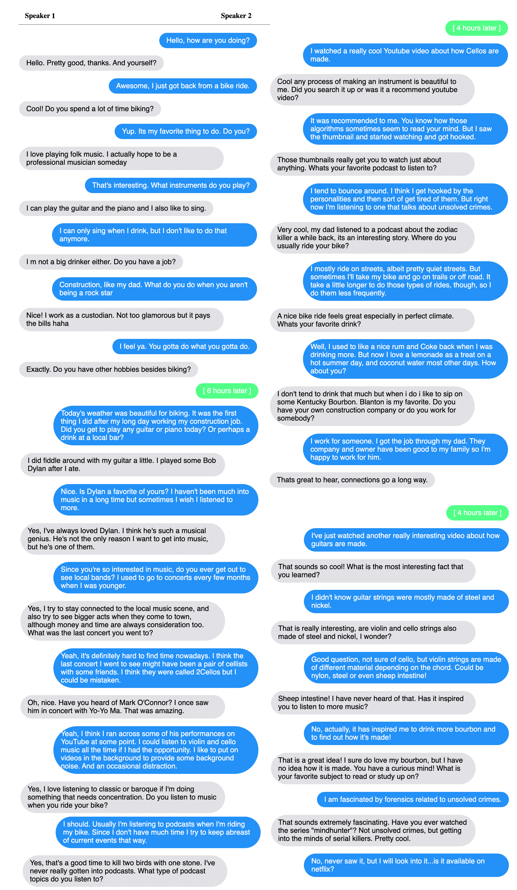

# Beyond Goldfish Memory: Long-Term Open-Domain Conversation

Jing Xu, Arthur Szlam, Jason Weston

## Abstract

Despite recent improvements in open-domain dialogue models, state of the art models are trained and evaluated on short conversations with little context.
In contrast, the long-term conversation setting has hardly been studied. In this work we collect and release a human-human dataset consisting of multiple chat sessions whereby the speaking partners learn about each other's interests and discuss the things they have learnt from past sessions. 
We show how existing models trained on existing datasets perform poorly in this long-term conversation setting in both automatic and human evaluations, and we study long-context models that can perform much better.  In particular, we find  retrieval-augmented methods and methods with an ability to summarize and recall previous conversations outperform the standard encoder-decoder architectures currently considered state of the art.

## Paper

[Link](https://arxiv.org/abs/2107.07567)

## Example Conversation Session
(Human-human conversation from the dataset)

<p align="center"></p>


## Data

We release the Multi-Session Chat and Summarization tasks at `parlai/tasks/msc`. 

To view the multi-session chat data (session 1-4, with 237k training examples and 25k valid examples), run:
```
parlai display_data -t msc 
```

To view the multi-session chat data (session 1-5, with extra 6k valid examples), run:

```
parlai display_data -t msc --include-last-session True 
```

To view the dialog summary for multi-session chat data (session 1-4, with 130k train examples and 25k valid examples), run:

```
parlai display_data -t msc:PersonaSummary --include-last-session True 
```

See the [ParlAI quickstart for help](http://www.parl.ai/docs/tutorial_quick.html).


## Models

- The model MSC2.7B (truncate 1024) can be downloaded and evaluated with the following command:
```
parlai eval_model -mf zoo:msc/msc3B_1024/model -t msc -dt valid -bs 16 --previous-persona-type raw_history
```

- The model SumMem-MSC 2.7B (Fid-RAG) can be downloaded and evaluated with the following command:
```
parlai eval_model -mf zoo:msc/summsc_fidrag3B/model -t msc -dt valid -bs 16 --previous-persona-type predsum_both
```

- The Dialogue Summarization Model (for summarizing dialogue and writing memories) can be downloaded and evaluated with the following command:
```
parlai eval_model -mf zoo:msc/dialog_summarizer/model -t msc:PersonaSummary -dt valid -bs 16
```

## Human Evaluations

Human evaluations were performed using the Mephisto task [given here](https://github.com/facebookresearch/ParlAI/tree/master/parlai/crowdsourcing/tasks/model_chat).
