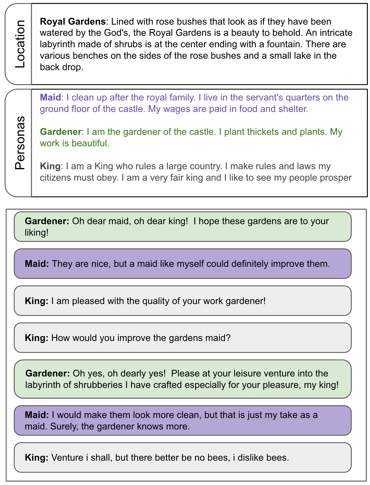

# Multi-Party Chat: Conversational Agents in Group Settings with Humans and Models

Jimmy Wei, Kurt Shuster, Arthur Szlam, Jason Weston, Jack Urbanek, Mojtaba Komeili

## Abstract

Current dialogue research primarily studies pairwise (two-party) conversations, and does not address the everyday setting where more than two speakers converse together. In this work, we both collect and evaluate multi-party conversations to study this more general case. We use the LIGHT environment to construct grounded conversations, where each participant has an assigned character to role-play. We thus evaluate the ability of language models to act as one or more characters in such conversations. Models require two skills that pairwise-trained models appear to lack: (1) being able to decide when to talk; (2) producing coherent utterances grounded on multiple characters. We compare models trained on our new dataset to existing pairwise-trained dialogue models, as well as large language models with few-shot prompting. We find that our new dataset, MultiLIGHT, which we will publicly release, can help bring significant improvements in the group setting.

## Paper

[Link](https://arxiv.org/abs/2304.13835)


## Data

There are three types of teachers in this task. Two of them focus on the utterances and conversation content, the other one on predicting the next speaker.

1. Utterances from all the characters:
```.sh
parlai dd -t light_multiparty --add-location-to-context true --add-personas-to-context true
```

2. Utterances from a single character only:
```.sh
parlai dd -t light_multiparty:FirstSpeakerTeacher --add-location-to-context true --add-personas-to-context true
```

3. Predicting the speaker for the next turn:
```.sh
parlai dd -t light_multiparty:SpeakerPredictionTeacher --add-location-to-context true --add-personas-to-context true
```

See the [agent](https://github.com/facebookresearch/ParlAI/blob/main/parlai/tasks/light_multiparty/agents.py) for up-to-date details on available teachers and flags.

### Rendered sample
<p align="center"></p>

## Models

We released three models from this project:

* `zoo:multilight/utterance_3B/model`: the best performing *Utterance only* model trained on LIGHT, LIGHT Wild and MultiLIGHT, multi-tasked (3B parameters size).
* `zoo:multilight/utterance_400m/model`: the best performing *Utterance only* model trained on LIGHT, LIGHT Wild and MultiLIGHT, multi-tasked (400m parameters size).
* `zoo:multilight/speaker/model`: predicts the next speaker.

`zoo:multilight/utterance_3B/model` and `zoo:multilight/speaker/model` were used in our human evals as reported in the paper.

### Running models

You can run these models with the existing ParlAI dataset, for example
```.sh
parlai eval_model -mf zoo:multilight/utterance_3B/model \
--task light_multiparty --add-location-to-context true --add-personas-to-context true
```

Utterance models performance on all character teachers:

| utterance model                     | PPL   |
|-------------------------------------|-------|
| zoo:multilight/utterance_3B/model   | 13.25 |
| zoo:multilight/utterance_400m/model | 15.08 |
