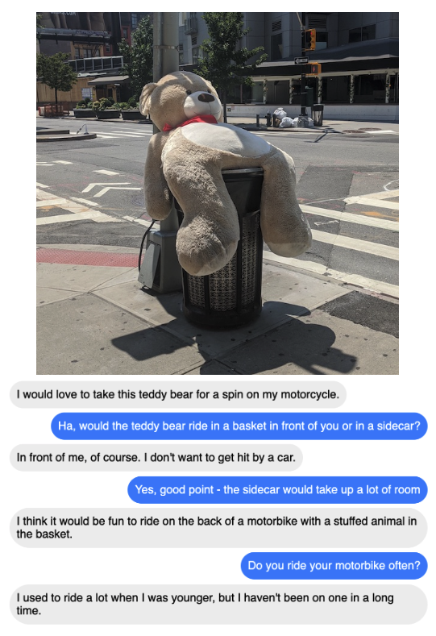
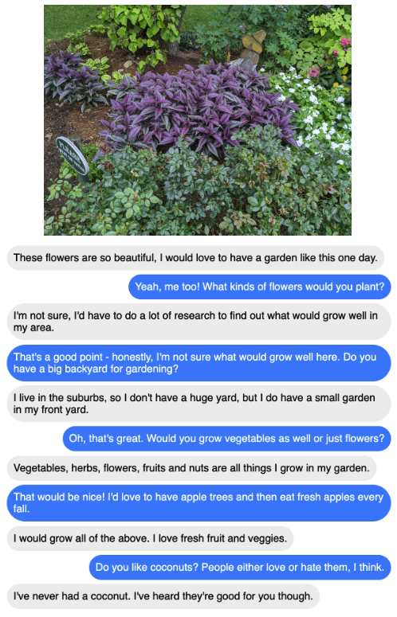

# Multi-Modal Open-Domain Dialogue

Kurt Shuster<sup>∗</sup>, Eric Michael Smith<sup>∗</sup>, Da Ju, Jason Weston

## Abstract

Recent work in open-domain conversational agents has demonstrated that significant improvements in model engagingness and humanness metrics can be achieved via massive scaling in both pre-training data and model size  ([Adiwardana et al., 2020](https://arxiv.org/abs/2001.09977); [Roller et al., 2020](https://arxiv.org/abs/2004.13637)). However, if we want to build agents with human-like abilities, we must expand beyond handling just text. A particularly important topic is the ability to see images and  communicate about what is perceived. With the goal of engaging humans in multi-modal dialogue, we investigate combining components from state-of-the-art open-domain dialogue agents with those from state-of-the-art vision models. We study incorporating different image fusion schemes and domain-adaptive pre-training and fine-tuning strategies, and show that our best resulting model outperforms strong existing models in multi-modal dialogue while simultaneously performing as well as its predecessor (text-only) BlenderBot ([Roller et al., 2020](https://arxiv.org/abs/2004.13637))  in text-based conversation.

## Paper

[Link](https://arxiv.org/abs/2010.01082)

## Example conversations

<p align="center"></p>
<hr />
<p align="center"></p>

## Code and models

See the [model card](https://github.com/facebookresearch/ParlAI/blob/master/parlai/zoo/multimodal_blenderbot/README.md) for details.

## Citation

If you use the models in your own work, please cite with the following BibTex entry:

```
@misc{shuster2020multimodal,
      title={Multi-Modal Open-Domain Dialogue}, 
      author={Kurt Shuster and Eric Michael Smith and Da Ju and Jason Weston},
      year={2020},
      eprint={2010.01082},
      archivePrefix={arXiv},
      primaryClass={cs.CL}
}
```
