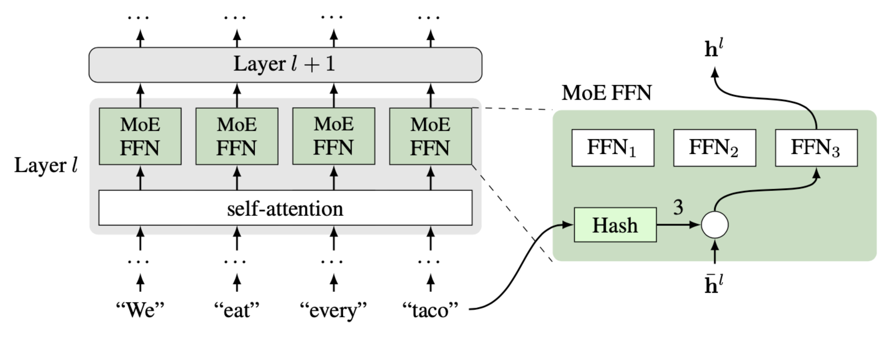
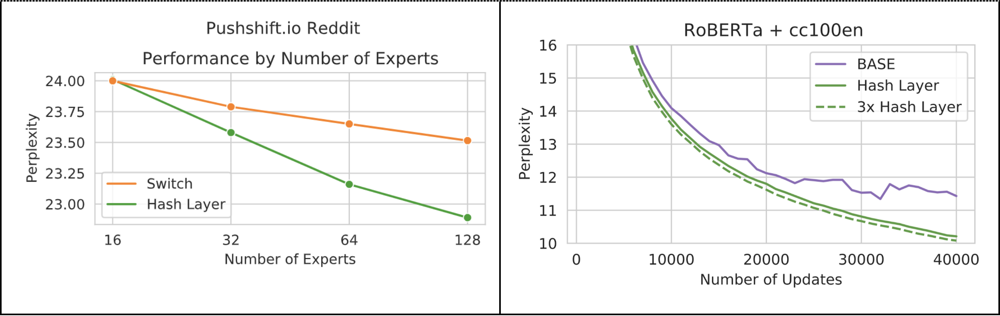
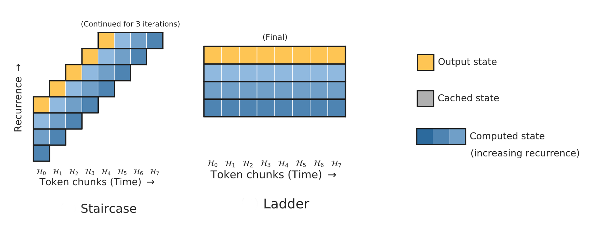
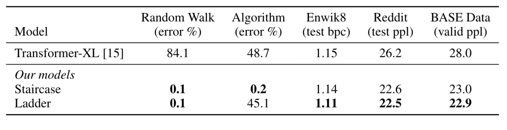
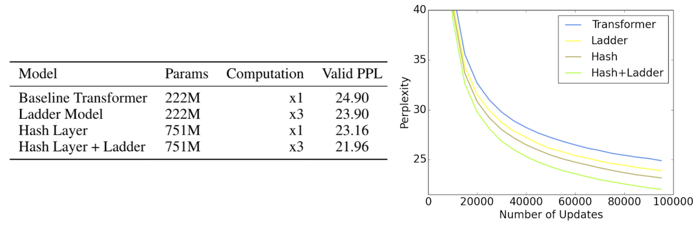

# Which one is more important: more parameters or more computation?

When we talk about the power of a deep learning model, often the only metric we pay attention to is its size, which is measured by the number parameters in that model. However, the amount of computation to run that model is an important metric too, but it is often overlooked because it is usually tied to the model size. Practitioners can then tend to think of those two metrics as a single thing. This is true most of the time, as each parameter participates in computation only once per input. So if a model has 1 million parameters, then it will take roughly 1 million floating point operations to process an input. This applies to feedforward models, recurrent models, and even Transformers.

We are announcing the publication of two new methods that together help study this important question further -- and show that the computation of a model should be considered separately from the model size. Firstly, we can increase the model size without using more computation and improve its performance. The [first paper](https://arxiv.org/abs/2106.04426) proposes a simple, elegant method to achieve that by proposing hash layers. The [second paper](https://arxiv.org/abs/2106.04279) shows that the opposite is also true. We can increase the amount of computation without adding any new parameters to the model, which can improve performance significantly. A new family of staircase attention models is proposed that achieves this feat. Taken together, we believe these results open up a new way of thinking about deep learning models, requiring us to disentangle the concepts of parameters and computation. Thinking in this way, we believe we can arrive at more powerful models that are architected with regard to the resources available. 

## Hash Layers

In recent years, a trend emerged of making Transformer models bigger and bigger as a way of achieving impressive results on language tasks. The number of parameters in those models extend to [billions](https://arxiv.org/abs/2005.14165), and even a [trillion](https://arxiv.org/abs/2105.15082). While this shows the potential of deep learning, the bigger models require more computation that makes them less practical. 

One way to make big models use less computation is a [sparse mixture-of-experts](https://arxiv.org/abs/1701.06538) (MoE) approach. Each expert has its own parameters, which are only used for a small part of the input. Each input is routed to only some of the experts, meaning only some of the parameters need to be used, resulting in less computation. Indeed, [recent works](https://arxiv.org/abs/2006.16668) showed that Transformers can be made bigger efficiently this way. The key element of MoE is a router that decides which expert to use on which data. 
In [our paper](https://arxiv.org/abs/2106.04426), we propose a routing mechanism based on hashing of input tokens. Unlike previous works, the hashing MoE is much simpler as it does not require any learning or change in objective function. Each word in the dictionary is simply assigned to a fixed expert, which is either chosen at random or assigned such that the distribution is balanced. Despite its simplicity, the method works well on a number of challenging tasks in language and dialogue.
 

On the pushshift.io Reddit language modeling task, our hashing mechanism outperforms the learning-based [Switch](https://arxiv.org/abs/2101.03961) baseline, especially when there are more experts. The largest models here have 1.28 billion parameters, but only 17% of them are used for any particular input. We go further by training 4.5 billion parameter models on larger data, where we see the hashing outperforms another competitive sparse MoE model, [BASE](https://arxiv.org/abs/2103.16716). The natural balancing of the expert assignment also means that training is efficient and scalable across a cluster, compared to those existing approaches. In our experiments this gives an improvement of about 11% in updates-per-second compared to BASE, and as the number of expert layers increases, we expect this difference to become more exaggerated.

## Staircase Attention

While adding more parameters to Transformers for better performance is a popular topic of study, increasing its computation is underexplored. One reason for that is that the standard Transformer interlocks computation and parameters with the architecture choice, making this impossible.  In [our paper](https://arxiv.org/abs/2106.04279), we introduce an alternative family of architectures which detaches these concepts, and show that adding more computation is an alternate route to improving the performance. In particular, we propose a family of models with recurrent applications of Transformers, called Staircase and Ladder models. 

The Ladder model simply stacks the same Transformer multiple times. This means a parameter in the Transformer will participate in the computation multiple times, increasing the amount of computation while keeping the model size fixed. This straightforward modification brings a significant performance improvement to real-world tasks such as language modeling and dialogue. Furthermore, it indicates that increasing computation -- thus adding more power per parameter -- is a compelling research direction for better performance.

The Staircase model stacks Transformers, like Ladder, but shifts each Transformer multiple time steps forward. This change makes it possible to continue stacking Transformers as long as inputs continue, forming a model shaped like a staircase. Unlike Transformers, this continuation makes Staircase recurrent in time, which is crucial for maintaining an internal state for tracking changes. On simple constructed tasks where the model just needs to maintain an internal state and update it with incoming information, feedforward models like Transformer and Ladder struggle, but Staircase can solve them with ease. In addition, Staircase models also enjoy the same performance boost as Ladder models on language modeling tasks because they have more compute per parameter.

## Why not both?

A natural question after introducing these two methods is -- can we combine then? The answer is -- yes! The improvements gained from the two approaches appear to be orthogonal, and we observe significant gains from a Hash Layer + Ladder model compared to either alone. Taken together, these two methods give a fine-grained control over the parameter size and computation size, leading to these improvements.

In summary, our work has examined the issues of computation vs. parameter size, and shown that these two concepts should be treated quite differently when thinking about new methods -- rather than tying them together as in many standard machine learning models. In particular, we present two new types of architecture that explore these tradeoffs -- either increasing the parameter size, or the computation amount -- and showing how their ideas can be combined together. We believe this way of thinking, and the use of our new methods in particular, can be a fruitful way forward for machine learning research.

To get more into the details read the [Hash Layers](https://arxiv.org/abs/2106.04426)
and [Staircase Attention](https://arxiv.org/abs/2106.04279) papers.

Code is available [here](https://github.com/facebookresearch/ParlAI/tree/main/projects/params_vs_compute/hash_ladder).
