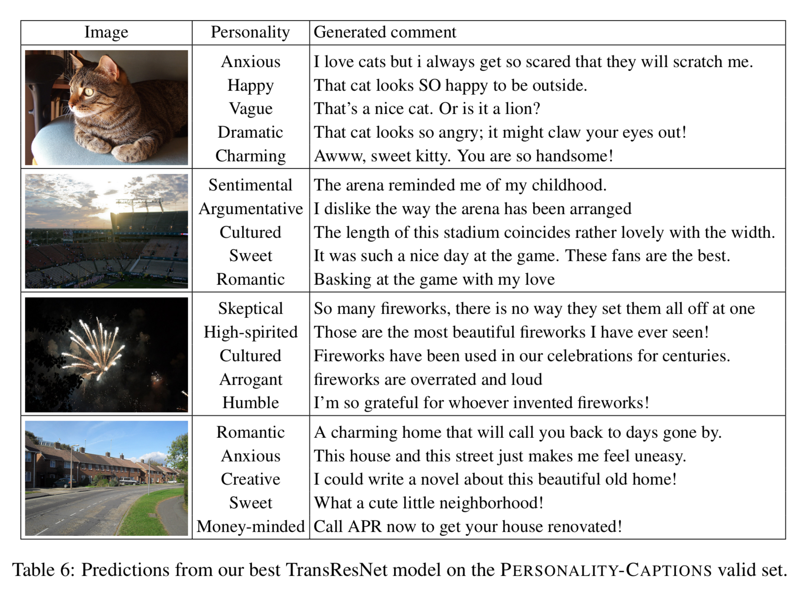

# Engaging Image Captioning via Personality

Kurt Shuster, Samuel Humeau, Hexiang Hu, Antoine Bordes, Jason Weston

Please see [Shuster et al. (CVPR 2019)](https://arxiv.org/abs/1810.10665) for more details.

## Abstract

Standard image captioning tasks such as COCO and Flickr30k are factual, neutral in tone and (to a human) state the obvious (e.g., "a man playing a guitar"). While such tasks are useful to verify that a machine understands the content of an image, they are not engaging to humans as captions. With this in mind we define a new task, Personality-Captions, where the goal is to be as engaging to humans as possible by incorporating controllable style and personality traits. We collect and release a large dataset of 201,858 of such captions conditioned over 215 possible traits. We build models that combine existing work from (i) sentence representations (Mazare et al., 2018) with Transformers trained on 1.7 billion dialogue examples; and (ii) image representations (Mahajan et al., 2018) with ResNets trained on 3.5 billion social media images. We obtain state-of-the-art performance on Flickr30k and COCO, and strong performance on our new task. Finally, online evaluations validate that our task and models are engaging to humans, with our best model close to human performance.

## Dataset

The Personality-Captions dataset can be accessed via ParlAI, with `-t personality_captions`. 
See the [ParlAI quickstart for help](http://www.parl.ai/docs/tutorial_quick.html).

Additionally, the ParlAI MTurk tasks for data collection and human evaluation
are [available](https://github.com/facebookresearch/ParlAI/tree/main/parlai/mturk/README.md) in an older release of ParlAI (see the `personality_captions` task).

## Leaderboards for Personality-Captions Task

### Retrieval Models

Model                                | Paper          | Test R@1
------------------------------------ | -------------- | --------
TransResNet, ResNeXt-IG-3.5B         | [Shuster et al. (2019)](https://arxiv.org/abs/1810.10665) | 77.5
TransResNet, ResNet152               | [Shuster et al. (2019)](https://arxiv.org/abs/1810.10665) | 51.7
TransResNet, No Images               | [Shuster et al. (2019)](https://arxiv.org/abs/1810.10665) | 25.8

### Generative Models

Model                                | Paper          | BLEU1 | BLEU4 | ROUGE-L | CIDEr | SPICE
------------------------------------ | -------------- | ----- | ----- | ------- | ----- | -----
UpDown, ResNeXt-IG-3.5B              | [Shuster et al. (2019)](https://arxiv.org/abs/1810.10665) | 44.0 | 8.0 | 27.4 | 16.5 | 5.2
ShowAttTell, ResNeXt-IG-3.5B         | [Shuster et al. (2019)](https://arxiv.org/abs/1810.10665) | 43.3 | 7.1 | 27.0 | 12.6 | 3.6
ShotTell, ResNeXt-IG-3.5B            | [Shuster et al. (2019)](https://arxiv.org/abs/1810.10665) | 38.4 | 7.3 | 24.3 | 9.6 | 1.6

## Pretrained Models

We provide our best model trained with ResNet152 image features. To evaluate the model, specify the following command:

      parlai eval_model \
          -bs 128 -t personality_captions
          -mf models:personality_captions/transresnet/model
          --num-test-labels 5 -dt test

Which yields the following results:

      {'exs': 10000, 'accuracy': 0.5113, 'f1': 0.5951, 'hits@1': 0.511, 'hits@5': 0.816,
      'hits@10': 0.903, 'hits@100': 0.998, 'bleu': 0.4999, 'hits@1/100': 1.0,
      'loss': -0.002, 'med_rank': 1.0}

Additionally, we provide an interactive script that you can use to view outputs of our pretrained model.
Simply run the following command:

      python projects/personality_captions/interactive.py \
      -mf models:personality_captions/transresnet/model

Which will allow you to upload an image and choose a personality for the model to use.

## Model Examples

## Citation

If you use the dataset or models in your own work, please cite with the following BibText entry:

        @InProceedings{Shuster_2019_CVPR,
        author = {Shuster, Kurt and Humeau, Samuel and Hu, Hexiang and Bordes, Antoine and Weston, Jason},
        title = {Engaging Image Captioning via Personality},
        booktitle = {The IEEE Conference on Computer Vision and Pattern Recognition (CVPR)},
        month = {June},
        year = {2019}
        }
