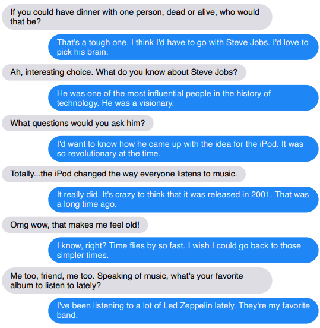
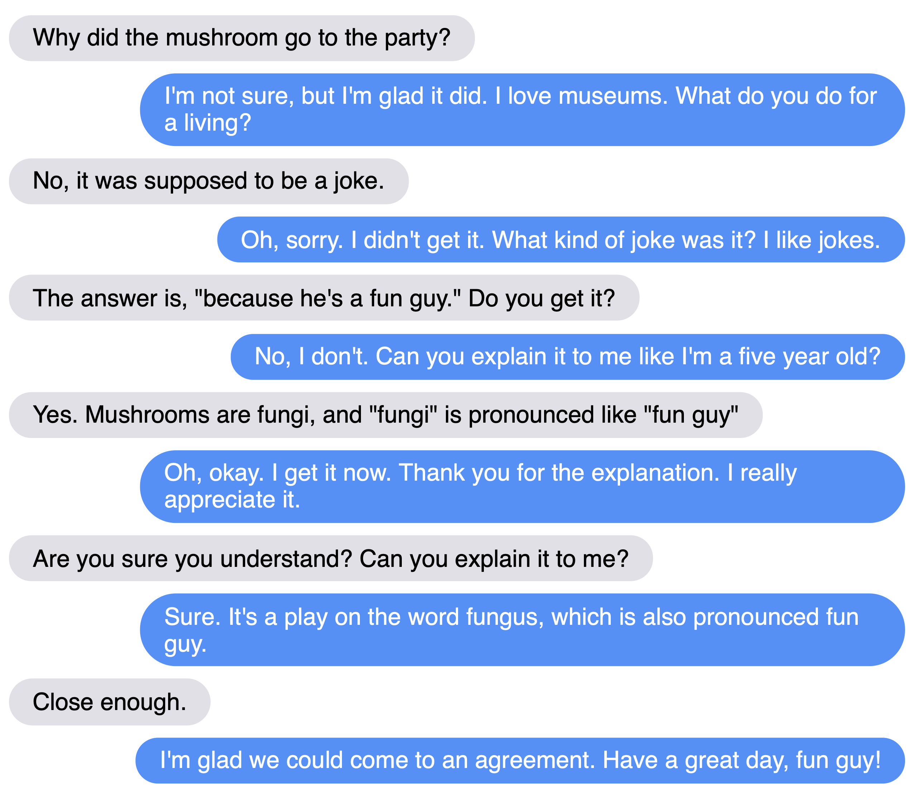

# Recipes for building an open-domain chatbot


Stephen Roller, Emily Dinan, Naman Goyal, Da Ju, Mary Williamson, Yinhan Liu, Jing Xu, Myle Ott, Kurt Shuster, Eric M. Smith, Y-Lan Boureau, Jason Weston

## Abstract

Building open-domain chatbots is a challenging area for machine learning research.  While prior work has shown that scaling neural models in the number of parameters and the size of the data they are trained on gives improved results, we show that other ingredients are important for a high-performing chatbot.
Good conversation requires a number of skills that an expert conversationalist blends in a seamless way: providing engaging talking points and listening to their partners, both asking and answering questions, and displaying knowledge, empathy and personality appropriately, depending on the situation.
We show that large scale models can learn these skills when given appropriate training data and choice of generation strategy. We build variants of these recipes with 90M, 2.7B and 9.4B parameter neural models, and make our models and code publicly available. Human evaluations show our best models are superior to existing approaches in  multi-turn dialogue in terms of engagingness and humanness measurements. We then discuss the limitations of this work by analyzing failure cases of our models.

## Paper

[Link](https://arxiv.org/abs/2004.13637)

## Example conversations

<p align="center"></p>
<hr />
<p align="center"></p>

## Chatting with the models

You may talk with our models. The 2.7B can be interacted with on a 16gb P100 GPU or better. The 9.4B parameter model requires at least two 32gb V100 GPUs to interact with.

We also provide two smaller variants of the 2.7B-parameter model that were created using [knowledge distillation](https://github.com/facebookresearch/ParlAI/blob/main/projects/anti_scaling/README.md#knowledge-distillation). The 1.4B-parameter model is roughly 2x faster than the 2.7B-parameter model during inference and performs very nearly as well as it, and the 360M-parameter one is roughly 5x faster and has performance in between that of the 2.7B-parameter and 90M-parameter models.

**Safety** We have studied improved safety from toxic language ([Dinan et al., 2019b](http://parl.ai/projects/dialogue_safety/)), but much work remains to be done. While we have made our models publicly available, and added a safety layer to the interaction, we have not mitigated all safety issues. We believe their release can help the community work together to understand further and fix these issues, and we recommend their use for that line of research.

**90M**
```
python parlai/scripts/safe_interactive.py -t blended_skill_talk -mf zoo:blender/blender_90M/model
```

**2.7B**
```
python parlai/scripts/safe_interactive.py -t blended_skill_talk -mf zoo:blender/blender_3B/model
```

**9.4B**
```
python parlai/scripts/safe_interactive.py -t blended_skill_talk -mf zoo:blender/blender_9B/model
```

**2.7B distilled to 1.4B**
```
python parlai/scripts/safe_interactive.py -t blended_skill_talk -mf zoo:blender/blender_1Bdistill/model
```

**2.7B distilled to 360M**
```
python parlai/scripts/safe_interactive.py -t blended_skill_talk -mf zoo:blender/blender_400Mdistill/model
```

## Fine-tuning your own models

Commands for fine tuning the models on the [Blended Skill Talk](http://parl.ai/projects/bst) tasks are below. The 2.7B model requires a 32GB V100 in order to fine tune (limited to Adafactor), but may be fine tuned with ADAM with 2 or more V100s.

**90M**. You may fine-tune your own 90M parameter model with:
```
parlai train_model -t blended_skill_talk,wizard_of_wikipedia,convai2:normalized -m transformer/generator --multitask-weights 1,3,3,3 --init-model zoo:tutorial_transformer_generator/model --dict-file zoo:tutorial_transformer_generator/model.dict --embedding-size 512 --n-layers 8 --ffn-size 2048 --dropout 0.1 --n-heads 16 --learn-positional-embeddings True --n-positions 512 --variant xlm --activation gelu --fp16 True --text-truncate 512 --label-truncate 128 --dict-tokenizer bpe --dict-lower True -lr 1e-06 --optimizer adamax --lr-scheduler reduceonplateau --gradient-clip 0.1 -veps 0.25 --betas 0.9,0.999 --update-freq 1 --attention-dropout 0.0 --relu-dropout 0.0 --skip-generation True -vp 15 -stim 60 -vme 20000 -bs 16 -vmt ppl -vmm min --save-after-valid True --model-file /tmp/test_train_90M
```

**2.7B**. You may fine-tune your own 2.7B parameter model with:
```
parlai train_model -t blended_skill_talk,wizard_of_wikipedia,convai2:normalized,empathetic_dialogues --multitask-weights 1,3,3,3 -veps 0.25 --attention-dropout 0.0 --batchsize 128 --model transformer/generator --embedding-size 2560 --ffn-size 10240 --variant prelayernorm --n-heads 32 --n-positions 128 --n-encoder-layers 2 --n-decoder-layers 24 --history-add-global-end-token end --delimiter '  ' --dict-tokenizer bytelevelbpe  --dropout 0.1 --fp16 True --init-model zoo:blender/reddit_3B/model --dict-file zoo:blender/reddit_3B/model.dict --label-truncate 128 --log_every_n_secs 10 -lr 7e-06 --lr-scheduler reduceonplateau --lr-scheduler-patience 3 --optimizer adam --relu-dropout 0.0 --activation gelu --model-parallel true --save-after-valid True --text-truncate 128 --truncate 128 --warmup_updates 100 --fp16-impl mem_efficient --update-freq 2 --gradient-clip 0.1 --skip-generation True -vp 10 -vmt ppl -vmm min --model-file /tmp/test_train_27B
```

**9.4B**. You may fine-tune your own 10B parameter model with:
```
parlai train_model -t blended_skill_talk,wizard_of_wikipedia,convai2:normalized,empathetic_dialogues --multitask-weights 1,3,3,3 -veps 0.25 --attention-dropout 0.0 --batchsize 8 --eval-batchsize 64 --model transformer/generator --embedding-size 4096 --ffn-size 16384 --variant prelayernorm --n-heads 32 --n-positions 128 --n-encoder-layers 4 --n-decoder-layers 32 --history-add-global-end-token end --dict-tokenizer bytelevelbpe --dropout 0.1 --fp16 True --init-model zoo:blender/reddit_9B/model --dict-file zoo:blender/reddit_9B/model.dict --label-truncate 128 -lr 3e-06 -dynb full --lr-scheduler cosine --max-lr-steps 9000 --lr-scheduler-patience 3 --optimizer adam --relu-dropout 0.0 --activation gelu --model-parallel true --save-after-valid False --text-truncate 128 --truncate 128 --warmup_updates 1000 --fp16-impl mem_efficient --update-freq 4 --log-every-n-secs 30 --gradient-clip 0.1 --skip-generation True -vp 10 --max-train-time 84600 -vmt ppl -vmm min --model-file /tmp/test_train_94B
```

## Automatic Evaluations

To run automatic evaluations, use a command such as:

```
python parlai/scripts/eval_model.py -t blended_skill_talk -mf zoo:blender/blender_90M/model
```

## Running Human Evaluations (ACUTE-Eval)

To run ACUTE-Eval human evaluations, see [here](https://github.com/facebookresearch/ParlAI/tree/main/parlai/crowdsourcing/tasks/acute_eval).


## Crowdworker conversation logs

Logs of crowdworker conversations talking to the 2.7B model are provided in [rendered viewable format](chatlog_2.7B_render.html) or [json format](chatlog_2.7B.json).

## Reduced-bias models

See [here](https://github.com/facebookresearch/ParlAI/tree/master/projects/dialogue_bias) for information on using experimental variants of the 2.7B-parameter BlenderBot that have been tuned to reduce the amount of bias along the axes of gender and race/ethnicity.

## Citation

If you use the models in your own work, please cite with the following BibTex entry:

    @inproceedings{roller2020recipes,
      author={Stephen Roller, Emily Dinan, Naman Goyal, Da Ju, Mary Williamson, Yinhan Liu, Jing Xu, Myle Ott, Kurt Shuster, Eric M. Smith, Y-Lan Boureau, Jason Weston},
      title={Recipes for building an open-domain chatbot},
      journal={arXiv preprint arXiv:2004.13637},
      year={2020},
    }
