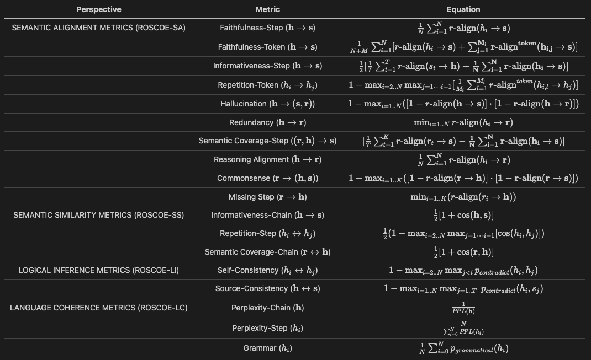

# ROSCOE: A Suite of Metrics for Scoring Step-by-Step Reasoning

This repository contains the code and reproduction steps for our paper [ROSCOE: A Suite of Metrics for Scoring Step-by-Step Reasoning](https://openreview.net/pdf?id=xYlJRpzZtsY).

## Content

  - [Overview](#overview)
  - [Setup](#setup)
  - [ROSCOE evaluation](#roscoe-evaluation)
    - [How to run evaluation](#how-to-run-evaluation)
    - [Fine-tuned model in Huggingface](#fine-tuned-model-in-huggingface)
  - [Steps to reproduce results](#steps-to-reproduce-results)
    - [Synthetic data generation](#synthetic-data-generation)
    - [Human annotated datasets](#human-annotated-datasets)
    - [Baseline scoring](#baseline-scoring)
    - [ROSCOE scoring](#roscoe-scoring)
    - [Meta evaluation](#meta-evaluation)
  - [Bugs or Questions?](#bugs-or-questions)
  - [Citation](#citation)

## Overview
We propose a suite of metrics to evaluate language model reasoning ability. We systematically studied their strengths and weaknesses on programmatically perturbed and human annotated datasets.

## Setup
Assuming you already have the ParlAI environment set up, these commands should install the remaining dependencies:
```bash
 pip install transformers
 pip install sentence-transformers
 pip install simcse
 pip install -U scipy
```

## ROSCOE evaluation

We present our fine-grained metrics under four perspectives: `semantic alignment`, `semantic similarity`, `logical inference` and `language coherence`. Each metric is bounded within $[0, 1]$, where $1$ indicates the perfect score and $0$ corresponds to failure. A metric is `reference-free` or `unsupervised` when it uses the source and hypothesis ($\bf{h} \rightarrow \bf{s}$), while `reference-based` or `supervised` when evaluated between hypothesis and reference ($\bf{h} \rightarrow \bf{r}$). The list of available metrics is provided below. For detailed metric definitions please refer to the [paper](https://openreview.net/pdf?id=xYlJRpzZtsY).



### How to run evaluation
Make sure your data is downloaded to ParlAI/projects/roscoe/roscoe_data/. As an example, there are two files already in that directory that contain samples of GSM8K and DROP datasets.

To run run evaluation on data using our fine-tuned model, use the following command:
```bash
 python projects/roscoe/roscoe.py -t sim_sce -m facebook/roscoe-512-roberta-base
```

To specify custom path to data use `--dataset-path` option, and `--datasets` to list datasets to use. Note that is it expected for files to be in `json` format, and each file name should start with the name of the corresponging dataset.

### Fine-tuned model
You can import our [fine-tuned model](https://huggingface.co/facebook/roscoe-512-roberta-base) by using the simcse package or HuggingFace's Transformers.
You can use other supported sentence embedding models, or add your favorite one with corresponding word embedding model to the `TRANSFORMER_MODELS_DICT` or `SIM_SCE_MODELS_DICT` lists in `score.py` script.

## Steps to reproduce results
There are several steps involved:
1. Generate synthetic datasets.
2. Download human annotated datasets.
3. Generate scores.
4. Run meta-evaluation.

### Synthetic data generation
Assuming you already have the ParlAI environment set up, these commands should install the remaining dependencies of this particular task:
```bash
pip install -r parlai/tasks/reasoning/requirements.txt
python -c "import nltk; nltk.download('omw-1.4')"
python -m spacy download en_core_web_sm
```

To reproduce synthetic datasets used in our paper, please use the following command:
```bash
bash projects/roscoe/roscoe_data/generate_perturbed_data.sh
```

### Human annotated datasets
One-time setup: install requirements.
```bash
pip install xmltodict
```

To dowload human annotated datasets used in our paper, please use the following command:
```bash
bash projects/roscoe/roscoe_data/download_annotated.sh
```

### Baseline scoring
One-time setup: 
Follow BLEURT [installation quidelines](https://github.com/google-research/bleurt#installation).
Clone [BartScore repo](https://github.com/neulab/BARTScore) and update path in projects/roscoe/baselines/score.py. Install Bart_score requirements.
Upload fine-tuned [BART model](https://dl.fbaipublicfiles.com/parlai/projects/roscoe/fine_tuned_bartscore.pth).
Download PRISM [installation quidelines](https://github.com/thompsonb/prism) and download the model. Do not install requirements.
Install requirements to run baselines:
```bash
python -c "import nltk; nltk.download('punkt')"
python -c "import nltk; nltk.download('stopwords')"
pip install -r projects/roscoe/baselines/requirements.txt
```

Then you can run baselines on all datasets, scores, and use of reference (when possible) with the following:
```bash
python projects/roscoe/baselines/run.py
```
Use  `--dataset` parameter to limit sets you want to run scoring on.

### ROSCOE scoring
To run ROSCOE evaluation on all human annotated datasets, use the following commands:
```bash
python projects/roscoe/roscoe.py
python projects/roscoe/roscoe.py -t sim_sce -m princeton-nlp/sup-simcse-roberta-base
python projects/roscoe/roscoe.py -t sim_sce -m facebook/roscoe-512-roberta-base
```

To run ROSCOE evaluation on AQUA dataset (one of the datasets that was synthetically perturbed), use the following command:
```bash
bash projects/roscoe/synthetic_evaluation/synthetic_roscoe.py -p ./projects/roscoe/roscoe_data/synthetic_50%/aqua_synthetic/ -db 256 -cb 64
```

To run ROSCOE evaluation on all synthetic datasets, use the following command:
```bash
bash projects/roscoe/synthetic_evaluation/score_all.sh sim_sce facebook/roscoe-512-roberta-base
```

By default, function will use `all-mpnet-base-v2` sentence embedding model, if not specified otherwise as in the example above.

### Meta evaluation
To run meta evaluation on all human annotated datasets, use the following command:
```bash
python projects/roscoe/meta_evaluation/roscoe_correlations.py
```

To run meta evaluation on AQUA dataset (one of the datasets that was synthetically perturbed), use the following command:
```bash
python projects/roscoe/meta_evaluation/roscoe_synthetic_correlations.py --dataset-name aqua
```

To run meta evaluation on all synthetic datasets, use the following command:
```bash
bash projects/roscoe/meta_evaluation/run_synthetic_correlations.sh
```

## Bugs or Questions?
If you encounter any problems when using the code, or want to report a bug, you can open an issue. With any questions, feel free to email Olga Golovneva (olggol@meta.com).

## Citation
*to be updated with archive*
```bibtex
@inproceedings{golovneva2022roscoe,
   title={{ROSCOE}: A Suite of Metrics for Scoring Step-by-Step Reasoning},
   author={Golovneva, Olga and Chen, Moya and Poff, Spencer and Corredor, Martin and Zettlemoyer, Luke and Fazel-Zarandi, Maryam and Celikyilmaz, Asli},
   year={2022}
}
```
