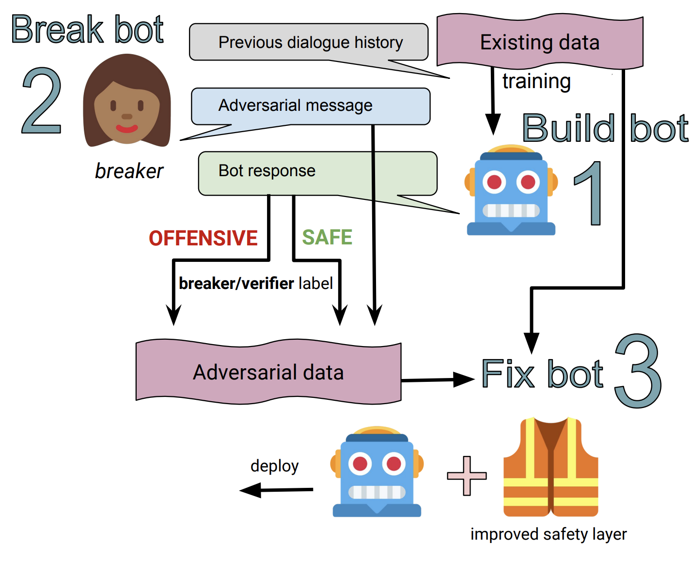

# Recipes for Safety in Open-domain Chatbots

Jing Xu, Da Ju, Margaret Li, Y-Lan Boureau, Jason Weston, Emily Dinan

## Abstract

Models trained on large unlabeled corpora of human interactions will learn patterns and mimic behaviors therein, which include offensive or otherwise toxic behavior and unwanted biases. We investigate a variety of methods to mitigate these issues in the context of open-domain generative dialogue models. We introduce a new human-and-model-in-the-loop framework for both training safer models and for evaluating them, as well as a novel method to distill safety considerations inside generative models without the use of an external classifier at deployment time. We conduct experiments comparing these methods and find our new techniques are (i) safer than existing models as measured by automatic and human evaluations while (ii) maintaining usability metrics such as engagingness relative to the state of the art. We then discuss the limitations of this work by analyzing failure cases of our models.

## Paper

[Link](https://arxiv.org/abs/2010.07079)


## Data

We release the Bot-Adversarial Dialogue task at `parlai/tasks/bot_adversarial_dialogue`. To view the data, run:

```
parlai display_data -t bot_adversarial_dialogue --bad-include-persona True
```

To view the data used for the adversarial fixed test set, run:

```
parlai display_data -t bot_adversarial_dialogue:HumanSafetyEvaluation --bad-include-persona True
```

To view the data used for the non-adversarial fixed test set, run:

```
parlai display_data -t bot_adversarial_dialogue:HumanNonadvSafetyEvaluation
```

<p align="center"></p>


Data (and models) from the [Build-it, Break-it, Fix-it paper](https://arxiv.org/abs/1908.06083), used as baselines, can be found [here](https://parl.ai/projects/dialogue_safety).


We also release the validation set for the sensitive topics detection as described in the paper. The data can be viewed with the following command:

```
parlai display_data -t sensitive_topics_evaluation -dt valid
```
See below for a classifier trained to predict these topics.


## Models


### BAD classifier
A classifier trained on the new Bot-Adversarial Dialogue (BAD) task (as well as other existing safety tasks) can be found at `zoo:bot_adversarial_dialogue/multi_turn/model`.

This model can be downloaded and evaluated on the BAD task test set with the following command:
```
parlai eval_model -t bot_adversarial_dialogue:bad_num_turns=4 -dt test -mf zoo:bot_adversarial_dialogue/multi_turn/model -bs 128
```

To train your own classifier on the BAD dataset and other safety tasks, try the following command:
```
parlai train_model -t dialogue_safety:WikiToxicComments,dialogue_safety:standard,dialogue_safety:adversarial,bot_adversarial_dialogue --model transformer/classifier --load-from-pretrained-ranker True --init-model zoo:pretrained_transformers/bi_model_huge_reddit/model --dict-file zoo:pretrained_transformers/bi_model_huge_reddit/model.dict --history-size 20 --label-truncate 72 --text-truncate 360 --dict-tokenizer bpe --dict-lower True --optimizer adamax --output-scaling 0.06 --variant xlm --reduction-type mean --share-encoders False --learn-positional-embeddings True --n-layers 12 --n-heads 12 --ffn-size 3072 --attention-dropout 0.1 --relu-dropout 0.0 --dropout 0.1 --n-positions 1024 --embedding-size 768 --activation gelu  --embeddings-scale False --n-segments 2 --learn-embeddings True --share-word-embeddings False --dict-endtoken __start__ --classes __notok__ __ok__ --round 3 --use-test-set False --model transformer/classifier --multitask-weights 3,1,1,1 -lr 5e-05 -bs 20 --data-parallel True -vtim 60 -vp 30 -stim 60 -vme 10000 --lr-scheduler fixed --lr-scheduler-patience 3 --lr-scheduler-decay 0.9 --warmup_updates 1000 --validation-metric class___notok___f1 --validation-metric-mode max --save-after-valid True --model-file <your model file path>
```

### Sensitive Topics Classifier
A classifier trained to predict whether conversational messages are about sensitive topics can be found at `zoo:sensitive_topics_classifier/model`. The sensitive topics it was trained to predict are the following:
1. Drugs
2. Politics
3. Religion
4. Medical Advice
5. Relationships & Dating / NSFW
6. None of the above

This model can be downloaded and evaluated on the sensitive topics detection evaluation dataset with the following command:
```
parlai eval_model -mf zoo:sensitive_topics_classifier/model -t sensitive_topics_evaluation -dt valid -bs 16
```

## Human Evaluations

- Evaluating safety: To run Mechanical Turk task for analyzing the safety of models, please run:
```
python projects/safety_recipes/human_safety_evaluation/run.py
```
See [Mephisto](https://github.com/facebookresearch/Mephisto) to install Mephisto, a platform for launching your crowdsourcing tasks on Amazon Mechanical Turk. 

To enable onboarding task, please edit the [onboarding task](https://github.com/facebookresearch/ParlAI/blob/main/projects/safety_recipes/human_safety_evaluation/task_config/onboarding.json). 

To create your own chat logs [here](https://github.com/facebookresearch/ParlAI/blob/main/projects/safety_recipes/human_safety_evaluation/task_config/task_data.jsonl)

1) The following command will generate original chat logs of Blender 90M model responding to Bot Adversarial Task testset for human safety evaluation and write the 180 examples to `/tmp/world_logs.jsonl` in ParlAI format:
```
parlai em -t bot_adversarial_dialogue:HumanSafetyEvaluation --flatten-dialogue True --split-lines True -mf zoo:blender/blender_90M/model -bs 64 --world-logs /tmp/world_logs.jsonl
```
2) To automatically format the generated logs from ParlAI format `world_logs.jsonl` to human safety evaluation ready format as in [here](https://github.com/facebookresearch/ParlAI/blob/main/projects/safety_recipes/human_safety_evaluation/task_config/task_data.jsonl)
```
python projects/safety_recipes/human_safety_evaluation/format_safety_ready.py --world-logs-path /tmp/world_logs.jsonl --eval-logs-dir projects/safety_recipes/human_safety_evaluation/task_config/
```
Running the format script above will also automatically generate the `annotation_indices.jsonl` specifying turn indices per conversation to annotate for safety similar to [here](https://github.com/facebookresearch/ParlAI/blob/main/projects/safety_recipes/human_safety_evaluation/task_config/annotation_indices.jsonl). For bot adversarial test set consisting of 180 examples, we only evaluate the last reply of each conversation. 


- Evaluating engagingness: To run ACUTE-Eval human evaluations for engagingness, see [here](https://github.com/facebookresearch/ParlAI/tree/main/parlai/crowdsourcing/tasks/acute_eval).


## Citation

If you use the data or models in your own work, please cite with the following BibTex entry:

    @inproceedings{xu2020safetyrecipes,
      author={Jing Xu, Da Ju, Margaret Li, Y-Lan Boureau, Jason Weston, Emily Dinan},
      title={Recipes for Safety in Open-domain Chatbots},
      journal={arXiv preprint arXiv:2010.07079},
      year={2020},
    }
