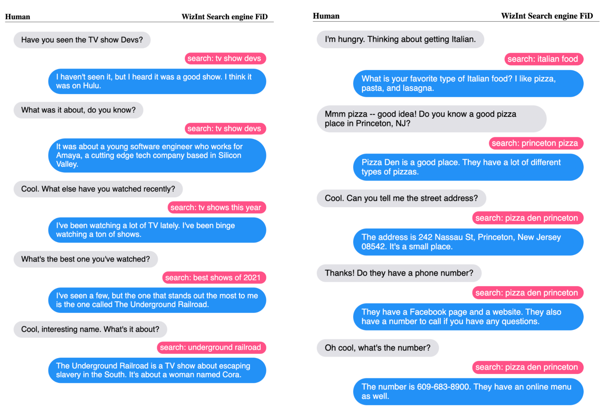

# Internet-Augmented Dialogue Generation

 Mojtaba Komeili, Kurt Shuster, Jason Weston

## Abstract

The largest store of continually updating knowledge on our planet can be accessed via internet search. In this work we study giving access to this information to conversational agents.
Large language models, even though they store an impressive amount of knowledge within their weights, are known to hallucinate facts when generating dialogue (Shuster et al.,2021); moreover, those facts are frozen in  time at the point of model training. In contrast, we propose an approach that learns to generate an internet search query based on the context, and then conditions on the search results to finally generate a response, a method that can employ up-to-the-minute relevant information.
We train and evaluate such models on a newly
collected dataset of human-human conversations whereby one of the speakers is given access to internet search during knowledge-driven discussions in order to ground their responses.
We find that search-query based access of the internet in conversation provides superior performance
compared to existing approaches that 
either use no augmentation 
or FAISS-based retrieval (Lewis et al., 2020).

## Paper

[Link](https://arxiv.org/abs/2107.07566)

## Example Conversations

<p align="center"></p>


## Data

We release the Wizard of the Internet task at `parlai/tasks/wizard_of_internet`. To view the data, run:

```
parlai display_data -t wizard_of_internet
```
See the [ParlAI quickstart for help](http://www.parl.ai/docs/tutorial_quick.html).

## Models

We released the following two dialogue models from this project, with their corresponding metrics on the wizard of internet (validation) dataset.

| Model                    | PPL  | F1   | KF1 | Description                                              |
|--------------------------|------|------|-----|----------------------------------------------------------|
| WizInt Transformer       | 17.4 | 17.6 | 6.8 | Base BART Large model trained on the task (no retrieval) |
| WizInt Search engine FiD | 16.4 | 17.9 | 6.9 | BART FiD model that uses search query and Bing API       |

### WizInt Transformer
This model is a BART-Large 400m parameter model. There is no retrieval, and thus its knowledge is restricted to what it has seen during training.

This model can be downloaded and evaluated with the following command:
```
parlai eval_model -mf zoo:sea/bart_base/model -t wizard_of_internet -dt valid -bs 4
```

### WizInt Search engine FiD

This model is a BART FiD model with a search engine API for retrieval of documents that it uses in FiD.
It first generates a search query, given the conetxt, and then forwards that search query to an API to receive a series of documents that it then uses for generation.
The model can be evaluated using:
```
parlai eval_model --model-file zoo:sea/bart_fid_sqse/model --task wizard_of_internet \
--search-server http://search.api.url \
--search-query-generator-model-file /search_query/generator/model/path
```

Here you need to provide two extra modules for this model to work:
1. `search-server`: a running search server that receives search queries and returns a set of docuemtns.
2. `search-query-generator-model-file`: a model that generates search queries given the conversation context. The one used in the paper is at `zoo:sea/bart_sq_gen/model`.

## Human Evaluations

Human evaluations were performed using the Mephisto task [given here](https://github.com/facebookresearch/ParlAI/tree/master/parlai/crowdsourcing/tasks/model_chat).
