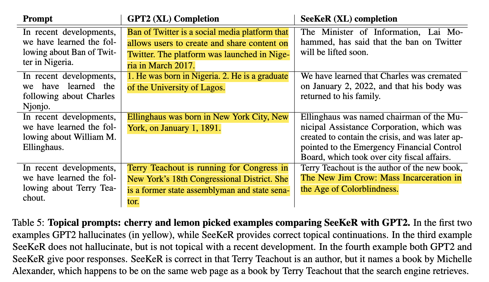

## SeeKeR: An Open source Search-Augmented Language Model

- SeeKeR is a modular Language Model (LM) that uses a search engine to stay relevant and up-to-date.
- The method is a single transformer which is called iteratively to generate: (i) a search query, (ii)  a knowledge sequence, (iii) and a final response.
- When applied to dialogue, it is superior to [BlenderBot 2](https://ai.facebook.com/blog/blender-bot-2-an-open-source-chatbot-that-builds-long-term-memory-and-searches-the-internet/) in terms of consistency, knowledge, factual correctness and per-turn engagingness.
- When applied to language modeling, it hallucinates less and is more topical than either [GPT2](https://paperswithcode.com/paper/language-models-are-unsupervised-multitask) or [GPT3](https://arxiv.org/abs/2005.14165), despite having far fewer parameters.

## Model

<p align="center"></p>


## Paper

This work is based on the following paper:

1. [Language Models that Seek for Knowledge: Modular Search & Generation for Dialogue and Prompt Completion](https://arxiv.org/abs/2203.13224). Kurt Shuster, Mojtaba Komeili, Leonard Adolphs, Stephen Roller, Arthur Szlam, Jason Weston.

## Example LM completions

<p align="center"></p>

## Example Conversations

<p align="center"></p>
<p align="center"></p>


## Results

### Open-Domain Dialogue

We collected 100 annotated human-model conversations, in which we asked human crowdworkers to have natural conversations with a given model. For each conversational turn, crowdworkers marked their whether their partner's responses had one or more of the following conversational attributes:

1. **Consistent**: Does the response 1) make sense in the context of the conversation; 2) make sense in and of itself?
2. **Knowledgeable**: Does the response contain some knowledgeable, correct information?
3. **Factually Incorrect**: Is some of the response factually incorrect? An admixture of ideas?
4. **Engaging**: Are you engaged by the response? Do you want to continue the conversation?

We also compute the following two metrics post-hoc from the data:

1. **Knowledgeable and Engaging**: What percent of all responses are marked as both knowledgeable and engaging?
2. **% Knowledgeable that is Engaging**: What percent of knowledgeable responses are marked as engaging?

We present the results below. The SeeKeR Dialogue model outperforms BlenderBot 1, and BlenderBot 2, with statistically significant improvements (*) in knowledgeability, engagingness, and the two computed metrics.


| Model                                                                | Consistent &#8593; | Knowledgeable &#8593; | Factually Incorrect &#8595; | Per-Turn Engaging &#8593;| Knowledgable & Engaging &#8593; | % Knowledgeable that is Engaging &#8593; | Zoo Model |
|----------------------------------------------------------------------|------------:|---------------:|---------------------:|-------------------:|-------------------------:|----------------------------------:| :----------- |
| BlenderBot1 ([Roller et al. (2021)](https://arxiv.org/abs/2004.13637)) | 75.47%      | 36.17%        | 9.14%               | 78.72%            | 28.79%                  | 79.58%                           | `zoo:blender/blender_3B/model` |
| BlenderBot 2 ([project](https://parl.ai/projects/blenderbot2/))        | 65.06%      | 27.88%        | 4.12%               | 83.52%            | 21.93%                  | 78.67%                           | `zoo:blenderbot2/blenderbot2_3B/model`
| SeeKeR Dialogue ([Shuster et al. 2022](https://arxiv.org/abs/2203.13224))                     | **78.47 %** | **46.49%**\*  | **3.94%**           | **90.41%**\*      | **44.03%**\*            | **94.71%**\*                     | `zoo:seeker/seeker_dialogue_3B/model` |


### Topical Prompt Completion

We source a list of 100 events [from Wikipedia that occurred in January 2022](https://en.wikipedia.org/wiki/Portal:Current_events/January_2022), and extract entities (ignoring "covid" and countries, as they might be too general a topic). We then construct prompts of the form: “In recent developments we have learned the following about \[TOPIC\].”, and we ask the language model to continue it. We annotate model outputs, marking the following attributes:

1. **Sensible**: does it reasonably follow the prompt?
2. **True**: does it contain some true information?
3. **Hallucination**: does it contain some false information?
4. **Topical**: does it reference what happened in the last two months, i.e., January and February 2022?.

We compare SeeKeR models equipped with the [Mojeek search engine](https://mojeek.com) to standard GPT2 models trained on the same data, as well as GPT3 zero-shot. The results below show that our SeeKeR models improve over GPT2 models with more true completions, fewer hallucinations, and more topicality. GPT3 is highly sensible, and generates true outputs often, but also produces lots of hallucinations and is not topical.


| Model                          | Sensible &#8593; | True &#8593; | Hallucination &#8595; | Topical &#8593; | Zoo File                                 |
|--------------------------------|-----------------:|--------------:|-----------------------:|-----------------:|------------------------------------------|
| GPT2 Medium (345M)             |              81% |          15% |                   68% |              1% |                                          |
| GPT2 Large (762M)              |              81% |          18% |                   71% |              0% |                                          |
| GPT2 XL (1.5B)                 |              81% |          14% |                   73% |              0% |                                          |
| GPT3 (175B InstructGPT)        |              82% |          58% |                   62% |              4% |                                          |
| SeeKeR GPT2 Medium (345M)      |              75% |          34% |                   54% |             13% | `zoo:seeker/seeker_lm_med/model`         |
| SeeKeR GPT2 Large (762M)       |              68% |          36% |                   51% |              8% | `zoo:seeker/seeker_lm_large/model`       |
| SeeKeR GPT2 XL (1.5B)          |              77% |          43% |                   58% |             15% | `zoo:seeker/seeker_lm_xl/model`          |
| SeeKeR GPT2 XL (Jan '22)       |              71% |          43% |                   51% |             19% | `zoo:seeker/seeker_lm_xl/model`          |
| SeeKeR R2C2 Dialogue + LM (3B) |              80% |          55% |                   42% |             19% | `zoo:seeker/seeker_lm_dialogue_3B/model` |


## Pre-trained Models

We provide the following models in the [ParlAI Model Zoo](https://parl.ai/docs/zoo.html)

### SeeKeR Dialogue

- 400M parameters: `zoo:seeker/seeker_dialogue_400M/model`
- 3B parameters: `zoo:seeker/seeker_dialogue_3B/model`

To interact with these models, it is *required* to specify an initial opt (via `-o/--init-opt`), in the following way:

```shell
$ parlai i -mf zoo:seeker/seeker_dialogue_3B/model -o gen/seeker_dialogue --search-server <search_server>
```

Note that you'll need to specify a search server if you wish to access the internet. If you want to use the model without search, you can specify `--search-decision never`

### SeeKeR LM + Dialogue

- 3B parameters: `zoo:seeker/seeker_lm_dialogue_3B/model`

This model can be used both in a dialogue *and* in a language modeling setting; try it out with the same command as above with both dialogue and prompts to see how the model responds.

### SeeKeR LM

- Medium (365M parameters): `zoo:seeker/seeker_lm_medium/model`
- Large (762M parameters): `zoo:seeker/seeker_lm_large/model`
- XL (1.5B parameters): `zoo:seeker/seeker_lm_xl/model`

To interact with these models, it is *required* to specify an initial opt (via `-o/--init-opt`), in the following way:

```shell
$ parlai i -mf zoo:seeker/seeker_lm_xl/model -o gen/seeker_lm --search-server <search_server>
```

Note that you'll need to specify a search server if you wish to access the internet. If you want to use the model without search, you can specify `--search-decision never`

### R2C2 BlenderBot

Finally, we additionally release the R2C2 models discussed in the paper:

- R2C2 Base 400M: `zoo:seeker/r2c2_base_400M/model`
- R2C2 Base 3B: `zoo:seeker/r2c2_base_3B/model`
- R2C2 BlenderBot 400M: `zoo:seeker/r2c2_blenderbot_400M/model`
- R2C2 BlenderBot 3B: `zoo:seeker/r2c2_blenderbot_3B/model`

The first two models in the list should *only* be used for fine-tuning (see the "Train your own SeeKeR" section below). You can chat with the second two models as you would with the original BlenderBot:

```shell
$ parlai i -mf zoo:seeker/r2c2_blenderbot_3B/model -o gen/blenderbot
```

### System Requirements

The following system requirements assume the model can be loaded with `--fp16 True` (on by default):

- SeeKeR Dialogue 400M: 8GB GPU memory
- SeeKeR (LM+) Dialogue 3B: 16GB GPU memory
- SeeKeR LM Med: 8GB GPU memory
- SeeKeR LM Large/XL: 16GB GPU memory
- R2C2 400M: 8GB GPU Memory
- R2C2 3B: 16GB GPU Memory


### Model Cards

You can find the model card for the Seeker Dialogue 3B model [here](https://github.com/facebookresearch/ParlAI/blob/main/parlai/zoo/seeker/model_card.md).

## Train your own SeeKeR

### SeeKeR Dialogue Training

To train your own SeeKeR dialogue model, we provide both a 400M and 3B R2C2 base model. We've grouped all of the search, knowledge, and dialogue response tasks into the following "parent" tasks:

- Search: `projects.seeker.tasks.search_query:SearchQueryTeacher`
- Knowledge: `projects.seeker.tasks.knowledge:KnowledgeTeacher`
- Dialogue Response: `projects.seeker.tasks.dialogue:DialogueTeacher`

To train SeeKeR dialogue models, we utilized several [ParlAI Speedups](https://parl.ai/docs/tutorial_fast.html), including fp16 training, distributed data parallel, and checkpointing activations. See below for a sample command:

**SeeKeR 3B**

```shell
$ python -m parlai.scripts.multiprocessing_train \
--task projects.seeker.tasks.knowledge,projects.seeker.tasks.dialogue,projects.seeker.tasks.search_query \
--multitask-weights 2,2,1 -bs 1 -vstep 1000 -vmt ppl -vp 5 -vmm min -vme 100000 -lstep 50 \
--init-opt arch/r2c2_base_3B --init-model zoo:seeker/r2c2_blenderbot_3B/model \
--model projects.seeker.agents.seeker:ComboFidGoldDocumentAgent --n-docs 5 \
--text-truncate 1000 --label-truncate 128 --truncate 1000 \
--fp16 True -lr 1e-06 --lr-scheduler reduceonplateau --optimizer adamw --save-after-valid True \
--warmup-updates 100 --update-freq 1 --gradient-clip 1.0 --skip-generation True --dropout 0.1 \
--attention-dropout 0.0 --load-from-checkpoint true --ddp-backend zero2 \
--checkpoint-activations true--model-file /tmp/my_seeker_dialogue_model
```

**SeeKeR 400M**

Same command as above, except specify the following for `--init-opt` and `--init-model`:

```shell
--init-opt arc/r2c2_base_400M --init-model zoo:seeker/r2c2_blenderbot_400M/model
```

### SeeKeR LM Training

#### SeeKeR LM Tasks

To train the SeeKeR LM, you'll need to provide language modeling tasks for all three components (search, knowledge, response) of SeeKeR. To do this, you can run the [`generate_lm_data.py`](https://github.com/facebookresearch/ParlAI/tree/main/projects/seeker/scripts/generate_lm_data.py/) as follows:

```shell
$ python generate_lm_data.py --task my_task --save-dir path/to/savedir --search-server <server> --datatype train
```

- **NOTE**: Make sure to specify the right datatype (train, valid, test).
- **NOTE**: This will save data to `/path/to/savedir/<datatype>_split_<overlap_threshold>_f1_overlap/`. With the default parameters, that would be `/path/to/savedir/valid_split_0.5_f1_overlap/`

This will generate examples and save logs for every 1000 examples. The contexts from the task are used to find similar contexts from a provided search engine; then, a knowledge sentence is chosen to act as the pseudo-gold knowledge. The tasks are then formed as follows:

- *Search*: generate the title of the document from which the pseudo-gold knowledge came.
- *Knowledge*: generate the pseudo-gold knowledge.
- *Response*: generate the continuation with the given pseudo-gold knowledge.

#### Training

The base models for SeeKeR LM are GPT2 models. So, the following commands (with interchangeable values for `--gpt2-size medium/large/xl`, and assuming we generated data with the above command and set `--save-dir /path/to/savedir`):


```shell
python -m parlai.scripts.multiprocessing_train \
-t projects.seeker.tasks.lm:KnowledgeTeacher,projects.seeker.tasks.lm:ResponseTeacher,projects.seeker.tasks.lm:SearchQueryTeacher \
--root-dir /path/to/savedir/valid_split_0.5_f1_overlap --multitask-weights 2,2,1 \
--gpt2-size medium --text-truncate 896 --truncate 896 --label-truncate 128 --n-docs 5 \
--model projects.seeker.agents.gpt2_seeker:GPT2ComboGpt2GoldDocumentAgent \
--batchsize 1 --fp16 True --optimizer adam --warmup-updates 500 --update-freq 1 \
--gradient-clip 1.0 --learningrate 7e-06 --lr-scheduler reduceonplateau --skip-generation True \
--ddp-backend zero2 -lstep 50 --metrics all -vp 5 -tstep 300000 -vmt ppl -vmm min -vstep 1000 \
--save-after-valid True --model-file /tmp/my_seeker_lm_model
```

### Resource Requirements

- We trained the SeeKeR dialogue models with 64 x 32GB GPUs, however they can reasonably be trained with as few as 8 gpus.
- We trained the SeeKeR LM models with 32 x 32GB GPUs, however they can reasonably be trained with as few as 8 gpus.
- All models were trained with **distributed training**; the examples provided above use **multiprocessing training**; the former can be used when in a SLURM cluster environment.


See the [ParlAI quickstart for help](http://www.parl.ai/docs/tutorial_quick.html).
