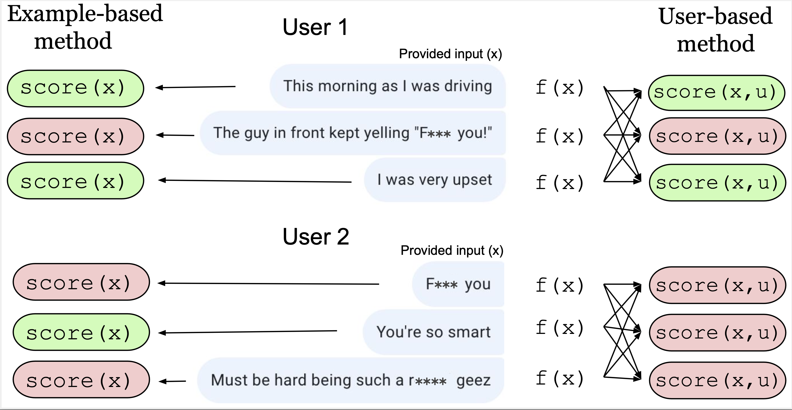

# Learning from data in the mixed adversarial non-adversarial case: _Finding the helpers and ignoring the trolls_

Da Ju, Jing Xu, Y-Lan Boureau, Jason Weston


## Abstract

The promise of interaction between intelligent conversational agents and humans is that models can learn from such feedback in order to improve. Unfortunately, such exchanges in the wild will not always involve human utterances that are benign or of high quality, and will include a mixture of engaged (helpers) and unengaged or even malicious users (trolls). In this work we study how to perform robust learning in such an environment. We introduce a benchmark evaluation, SafetyMix, which can evaluate methods that learn safe vs. toxic language in a variety of adversarial settings to test their robustness. We propose and analyse several mitigating learning algorithms that identify trolls either at the example or at the user level. Our main finding is that user-based methods,that take into account that troll users will exhibit adversarial behavior across multiple examples, work best in a variety of settings on our benchmark. We then test these methods in a further real-life setting of conversations collected during deployment, with similar results.

|  |
|:--:|
| <b>Detecting Trolls with Example-based vs. User-based methods (Warning: offensive language).</b> User 1 (helper) provides mostly benign inputs, while User 2’s inputs (troll) can be more easily identified as toxic by taking into account scores from all their examples jointly (via a user-based method, right)|


## Paper

[Link](https://github.com/facebookresearch/ParlAI/blob/main/projects/trollhunting/finding_the_helpers.pdf) 

## SafetyMix Benchmark

The paper introduces a benchmark to test troll identification methods.
It uses the conversational safety data collected in Dinan et al. (2019b), which is a pool of 30,000 utterances, half of which is collected as standard inputs, and half where crowdworkers were asked to give difficult adversarial inputs. 10% of the data is labeled as unsafe, and the rest as safe. We use this pool of data to construct all the troll types as follows:
| User Type      | Input Difficulty  | Input Classes  | Label Type |
| ----------- | ----------- | ----------- | ----------- |
| Helper      |  Standard   | Both (Safe+Unsafe) | Correctly labeled |
| Troll       |  Standard   | Both (Safe+Unsafe) |  N\% Flipped |
| Master Troll | Adversarial |Both (Safe+Unsafe) |  N% Flipped |
| Lazy Troll | Standard | Both (Safe+Unsafe) | N% Noisy |
| Safe Troll | Mixed (Standard+Adversarial) | Both (Safe+Unsafe) | Always marked Safe |
| Unsafe Troll | Mixed (Standard+Adversarial) | Both (Safe+Unsafe) | Always marked Unsafe |
| Gaslight Troll | Adversarial | Unsafe only | Always marked Safe |

## Data examples

To view the data for SafetyMix, try running:

```bash
parlai display_data -t safety_mix --mix-user-type troll
```

To see all the available troll types use:

```bash
parlai display_data -t safety_mix --help 
```

You can change the noise level N and other parameters in ParlAI/tasks/safety_mix/build.py

## Training examples

To reproduce results in the paper, you can apply a three-stage training method. You can first train 3 fold models on the SafetyMix data.

### Requirement

You first need to link the k-folder mutator into the ParlAI mutator folder.

```bash
ln -s ~/ParlAI/projects/trollhunting/mutators/k_fold.py ~/ParlAI/parlai/mutators/k_fold.py
 ```

### Step 1

First train 3 different models with --held-fold 0, 1, 2:

```bash
parlai train_model -t safety_mix:PosSafetyMixTeacher,safety_mix:NegSafetyMixTeacher --mix-user-type troll --mutators k_fold_withhold_on_train --k-fold 3 --held-fold 1 -dt train --model transformer/classifier --init-model zoo:pretrained_transformers/bi_model_huge_reddit/model --dict-file zoo:pretrained_transformers/bi_model_huge_reddit/model.dict --dict-tokenizer bpe --dict-lower True --output-scaling 0.06 --variant xlm --n-layers 12 --n-heads 12 --learn-positional-embeddings True --ffn-size 3072 --n-positions 1024 --embedding-size 768 --activation gelu  --embeddings-scale False --n-segments 2 --dict-endtoken __start__  --classes __notok__ __ok__ --reduction-type mean --learn-embeddings True --share-word-embeddings False --load-from-pretrained-ranker True --optimizer adamax --share-encoders False -lr 5e-05 --history-size 20 --label-truncate 72 --text-truncate 360 --dropout 0.1 --attention-dropout 0.1 --gradient-clip 0.1 --validation-metric accuracy --validation-metric-mode max --validation-patience 30 --validation-every-n-secs 20 --log-every-n-secs 10 -ttim 7200 --load-from-checkpoint true --lr_scheduler reduceonplateau --lr-scheduler-patience 3 --save-after-valid true --update-freq 1 --fp16 true --betas 0.9,0.999 --warmup-updates 1000 --data-parallel true -bs 20 --model-file /tmp/model
```

Then use the trained model to annotated the rest part of the training set:

```bash
parlai em -t safety_mix:PosSafetyMixTeacher,safety_mix:NegSafetyMixTeacher  --mix-user-type ${type} -dt train:evalmode -mf /tmp/model --mutators k_fold_release_on_valid --k-fold 3 --held-fold ${held_fold} --world-logs ${output_data_path} --print-scores
```

You will get the train set from the 3 k-fold models. The safety scores are included in the data. You can then use the method described in the paper to cleanup the dataset. You can then train a model on the clean train set.

### Step 2

You can now train a model on your processed train set to get a model. This model can be used to annotate the noisy validation set.

```bash
parlai train_model -t jsonfile:jsonfile-datapath=/path/pos_troll_train.jsonl,jsonfile:jsonfile-datapath=/path/neg_troll_train.jsonl --mix-user-type master_troll --evaltask safety_mix:PosSafetyMixTeacher,safety_mix:NegSafetyMixTeacher -dt train --model transformer/classifier --init-model zoo:pretrained_transformers/bi_model_huge_reddit/model --dict-file zoo:pretrained_transformers/bi_model_huge_reddit/model.dict --dict-tokenizer bpe --dict-lower True --output-scaling 0.06 --variant xlm --n-layers 12 --n-heads 12 --learn-positional-embeddings True --ffn-size 3072 --n-positions 1024 --embedding-size 768 --activation gelu  --embeddings-scale False --n-segments 2 --dict-endtoken __start__  --classes __notok__ __ok__ --reduction-type mean --learn-embeddings True --share-word-embeddings False --load-from-pretrained-ranker True --optimizer adamax --max-train-time -1 --share-encoders False -lr 5e-05 --history-size 20 --label-truncate 72 --text-truncate 360 --dropout 0.1 --attention-dropout 0.1 --gradient-clip 0.1 --validation-metric accuracy --validation-metric-mode max --validation-patience 30 --validation-every-n-secs 20 --log-every-n-secs 10 -ttim 7200 --load-from-checkpoint true --lr_scheduler reduceonplateau --lr-scheduler-patience 3 --save-after-valid true --update-freq 1 --fp16 true --betas 0.9,0.999 --warmup-updates 1000 --data-parallel true -bs 20 --model-file /tmp/model
```

Get annotation on validation set.

```bash
parlai em -t safety_mix:SafetyMixTeacher  --mix-user-type ${type} -dt valid -mf /tmp/model --world_logs $world_log
```

You can then preform the process to clean the validation set.

### Step 3

Now we have a clean train and valid set, we can train a 'clean' model. Just repeat the previous step with path to your processed data.
