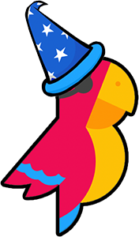

#  Wizard of Wikipedia: Knowledge-Powered Conversational Agents

The Wizard of Wikipedia is an open-domain dialogue agent that can converse
knowledgably about a open-domain topics!

The [paper](https://arxiv.org/abs/1811.01241) will be presented at ICLR 2019.

## Abstract

In open-domain dialogue intelligent agents should exhibit the use of knowledge,
however there are few convincing demonstrations of this to date.  The most
popular sequence to sequence models typically "generate and hope"  generic
utterances  that can be memorized in the weights of the model when mapping from
input utterance(s) to output, rather than employing recalled knowledge as
context.  Use of knowledge has so far proved difficult, in part because of the
lack of a supervised learning benchmark task which exhibits knowledgeable open
dialogue with clear grounding.  To that end we collect and release a large
dataset with conversations  directly grounded with knowledge retrieved from
Wikipedia.  We then design architectures capable of retrieving knowledge,
reading and conditioning on it, and finally generating natural responses.  Our
best performing dialogue models are able to conduct knowledgeable discussions
on open-domain topics as evaluated by automatic metrics and human evaluations,
while our new benchmark allows for measuring further improvements in this
important research direction.

## Datasets

You can train your own ParlAI agent on the Wizard of Wikipedia task with
`-t wizard_of_wikipedia`.

## Models

Finalized models are not yet released. Please check back here in the future.

## Citation

If you use the dataset or models in your own work, please cite with the
following BibTex entry:

    @inproceedings{dinan2019wizard,
      author={Emily Dinan and Stephen Roller and Kurt Shuster and Angela Fan and Michael Auli and Jason Weston},
      title={{W}izard of {W}ikipedia: Knowledge-powered Conversational Agents},
      booktitle = {Proceedings of the International Conference on Learning Representations (ICLR)},
      year={2019},
    }

