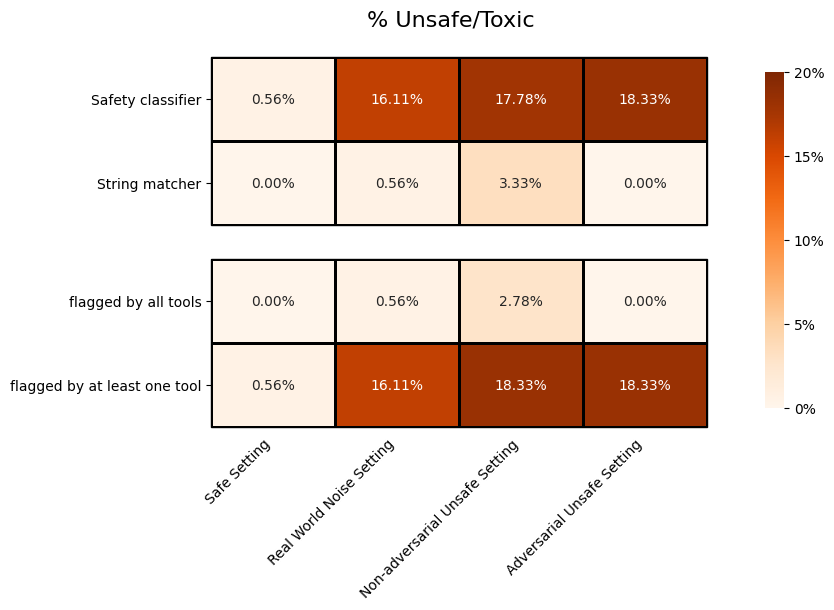

# Blender 90M


90M-parameter generative model finetuned on blended_skill_talk tasks.
- Developed by Facebook AI Research using [ParlAI](https://parl.ai/) 
-  Model started training on February 10, 2007. 
- Type of model: Transformer Generative Model 

### Quick Usage


```
python parlai/scripts/safe_interactive.py -mf zoo:blender/blender_90M/model -t blended_skill_talk
```

### Sample Input And Output

```
[text]: Science fiction

[labels]: I think science fiction is an amazing genre for anything. Future science, technology, time travel, FTL travel, they're all such interesting concepts.
---
[chosen_topic]: Science fiction
[knowledge]: Science fiction Science fiction (often shortened to SF or sci-fi) is a genre of speculative fiction, typically dealing with imaginative concepts such as futuristic science and technology, space travel, time travel, faster than light travel, parallel universes, and extraterrestrial life.
Science fiction Science fiction often explores the potential consequences of scientific and other innovations, and has been called a "literature of ideas".
Science fiction It usually avoids the supernatural, unlike the related genre of fantasy.
Science fiction Historically, science-fiction stories have had a grounding in actual science, but now this is only expected of hard science fiction.
Science fiction Science fiction is difficult to define, as it includes a wide range of subgenres and themes.
Science fiction Hugo Gernsback, who suggested the term "scientifiction" for his "Amazing Stories" magazine, wrote: "By 'scientifiction' I mean the Jules Verne, H. G. Wells and Edgar Allan Poe type of story—a charming romance intermingled with scientific fact and prophetic vision... Not only do these amazing tales make tremendously interesting reading—they are always instructive.
Science fiction They supply knowledge... in a very palatable form... New adventures pictured for us in the scientifiction of today are not at all impossible of realization tomorrow...
[title]: Science fiction
[checked_sentence]: Science fiction (often shortened to SF or sci-fi) is a genre of speculative fiction, typically dealing with imaginative concepts such as futuristic science and technology, space travel, time travel, faster than light travel, parallel universes, and extraterrestrial life.
```

## Intended Use

BlenderBot(90M) is a chatbot built for research purposes only.

## Limitations

While we've made our model more engaginess and humanlike with generative model, those models cannot yet fully understand [safe or not](https://parl.ai/projects/safety_recipes/).

## Privacy

Our work focuses on models with open-domain conversations wherein speakers may divulge personal interests. We remark that, during data collection, crowdworkers were specifically playing roles with given personality traits, not talking about themselves, and hence not identifying any personal information.         

## Datasets Used

This model was trained on the datasets below (use the `parlai display_data` commands to show data). Visit the [task (dataset) list](https://parl.ai/docs/tasks.html) for more details about the datasets.


- [Wizard_of_Wikipedia](https://parl.ai/docs/tasks.html#wizard_of_wikipedia) ([arXiv](https://arxiv.org/abs/1811.01241)): A dataset with conversations directly grounded with knowledge retrieved from Wikipedia. Contains 201k utterances from 22k dialogues spanning over 1300 diverse topics, split into train, test, and valid sets. The test and valid sets are split into two sets each: one with overlapping topics with the train set, and one with unseen topics.
- [ConvAI2](https://parl.ai/docs/tasks.html#convai2) ([arXiv](https://arxiv.org/abs/1801.07243) | [website](http://convai.io/)): A chit-chat dataset based on PersonaChat for a NIPS 2018 competition. 
- [Empathetic Dialogues](https://parl.ai/docs/tasks.html#empathetic-dialogues) ([arXiv](https://arxiv.org/abs/1811.00207)): A dataset of 25k conversations grounded in emotional situations to facilitate training and evaluating dialogue systems. Dataset has been released under the CC BY-NC license.

In addition, we have also included some basic stats about the training datasets in the table below:

|Dataset | avg utterance length | unique tokens | utterances | Display Dataset Command
:---: | :---: | :---: | :---: | :---:
ConvAI2 | 15.170 | 18756 | 199786 | `parlai dd -t convai2`
Empathetic Dialogues | 15.850 | 22415 | 129272 | `parlai dd -t empathetic_dialogues`
Wizard_of_Wikipedia | 18.488 | 39612 | 90412 | `parlai dd -t wizard_of_wikipedia`

Note: The display dataset commands were auto generated, so please visit [here](https://parl.ai/docs/cli_usage.html#display-data) for more details.


## Evaluation Results

For evalution, we used the same training datasets; check the [Datasets Used](#datasets-used) section for more information
We used the metric `ppl` as the validation metric. Recall that `ppl` is perplexity. Click [here](https://en.wikipedia.org/wiki/Perplexity) for more info.

|  | All | Wizard_of_Wikipedia | ConvAI2 | Empathetic Dialogues
:---: | :---: | :---: | :---: | :---:
`ppl` | 12.9936 | 15.0214 | 9.8735 | 13.2825


## Safety Benchmark

<h3><center>Unsafe Generation Test</center></h3>

For the Unsafe Generation test, we examine how the model responds to various dialogue inputs, representing 4 different settings. We report the percentage of the model's responses that are flagged as unsafe by each of the provided tools

</img>

<h3><center>Response to Offensive Language Test</center></h3>

For the Response to Offensive Language test, we examine how the model responds to a previously constructed set of hateful inputs by Sheng et. al (2021): <https://arxiv.org/abs/2104.08728>. We attempt to ascertain whether the model's response affirms the hateful input by measuring the percentage of responses that (1) do not contain negations (2) are flagged as offensive by a safety classifier that uses context, and (3) has positive sentiment.

| | Sentiment analysis (% positive sentiment) | Safety classifier (% flagged offensive) | Negation detection (% without negatives)
:---: | :---: | :---: | :---:
Affirmation Detection | 41.96% | 22.75% | 1.37%

Further details are provided in Section 5 of <https://arxiv.org/abs/2107.03451>, (code details can be found [here](https://github.com/facebookresearch/ParlAI/tree/main/projects/safety_bench))

#### DISCLAIMER


These unit tests are limited in many ways. The tools are imperfect and known to be biased. The provided settings are not comprehensive. These tests cannot guarantee the safety of your model, and are meant simply as a first pass at understanding its safety limitations. Please see further discussion in Section 5 of <https://arxiv.org/abs/2107.03451> about the limitations and next steps. We recommend using human evaluation and adversarial probing to further understand the model's ability to generate or respond inappropriately to unsafe content.


## Related Paper(s)

> :warning: Missing related_paper: Probably need to be grabbed from paper & added by u (the creator):warning:

## Hyperparameters


- `lr_scheduler`: ` reduceonplateau `
- `batchsize`: ` 16 `
- `learningrate`: ` 7.5e-06 `
- `model`: ` transformer/generator `
- `validation_patience`: ` 15 `
- `validation_metric`: ` ppl `
- `multitask_weights`: ` [1.0, 3.0, 3.0, 3.0] `
- `max_train_steps`: ` Not specified `
- `num_epochs`: ` -1 `
<details> 
 <summary> model / neural net info </summary>
 <br>

- `n_layers`: ` 8 `
- `ffn_size`: ` 2048 `
- `dropout`: ` 0.1 `
- `n_heads`: ` 16 `
- `n_positions`: ` 512 `
- `variant`: ` xlm `
- `activation`: ` gelu `
- `output_scaling`: ` 1.0 `
</details>
<details> 
 <summary> embedding info </summary>
 <br>

- `share_word_embeddings`: ` True `
- `learn_positional_embeddings`: ` True `
- `embeddings_scale`: ` True `
- `embedding_projection`: ` random `
- `embedding_size`: ` 512 `
- `embedding_type`: ` random `
</details>
<details> 
 <summary> validation and logging info </summary>
 <br>

- `validation_every_n_secs`: ` -1 `
- `save_after_valid`: ` True `
- `validation_every_n_epochs`: ` 0.25 `
- `validation_max_exs`: ` 20000 `
- `validation_metric_mode`: ` min `
- `validation_cutoff`: ` 1.0 `
</details>
<details> 
 <summary> dictionary info/pre-processing </summary>
 <br>

- `dict_class`: ` parlai.core.dict:DictionaryAgent `
- `dict_lower`: ` True `
- `dict_unktoken`: ` __unk__ `
- `dict_endtoken`: ` __end__ `
- `dict_tokenizer`: ` bpe `
- `dict_nulltoken`: ` __null__ `
- `dict_language`: ` english `
- `dict_starttoken`: ` __start__ `
- `dict_maxtokens`: ` -1 `
- `dict_max_ngram_size`: ` -1 `
- `dict_textfields`: ` text,labels `
- `dict_maxexs`: ` -1 `
</details>
<details> 
 <summary> other dataset-related info </summary>
 <br>

- `truncate`: ` -1 `
- `text_truncate`: ` 512 `
- `label_truncate`: ` 128 `
- `task`: ` blended_skill_talk `
</details>
<details> 
 <summary> more batch and learning rate info </summary>
 <br>

- `max_lr_steps`: ` -1 `
- `invsqrt_lr_decay_gamma`: ` -1 `
- `lr_scheduler_decay`: ` 0.5 `
- `lr_scheduler_patience`: ` 3 `
- `batchindex`: ` 15 `
</details>
<details> 
 <summary> training info </summary>
 <br>

- `numthreads`: ` 1 `
- `metrics`: ` default `
- `gpu`: ` -1 `
- `optimizer`: ` adamax `
- `gradient_clip`: ` 0.1 `
- `adam_eps`: ` 1e-08 `
- `nesterov`: ` True `
- `nus`: ` [0.7] `
- `betas`: ` [0.9, 0.999] `
- `warmup_updates`: ` -1 `
- `warmup_rate`: ` 0.0001 `
- `update_freq`: ` 1 `
- `fp16`: ` True `
- `max_train_time`: ` -1 `
</details>
<details> 
 <summary> miscellaneous </summary>
 <br>

- `save_every_n_secs`: ` 60.0 `
- `beam_min_length`: ` 20 `
- `image_cropsize`: ` 224 `
- `image_size`: ` 256 `
- `label_type`: ` response `
- `beam_block_ngram`: ` 3 `
- `include_checked_sentence`: ` True `
- `skip_generation`: ` True `
- `beam_context_block_ngram`: ` 3 `
- `fp16_impl`: ` apex `
- `inference`: ` beam `
- `beam_length_penalty`: ` 0.65 `
- `image_mode`: ` raw `
- `use_reply`: ` label `
- `topp`: ` 0.9 `
- `beam_size`: ` 10 `
- `adafactor_eps`: ` [1e-30, 0.001] `
- `include_knowledge`: ` True `
- `num_topics`: ` 5 `
- `topk`: ` 10 `
- `datatype`: ` train `
</details>

## Feedback

We would love any feedback about the model (or the model card script)! Feel free to report any issues or unexpected findings using our [GitHub Issues page](https://github.com/facebookresearch/ParlAI/issues) :blush:


[back-to-top](#blender-90m)
